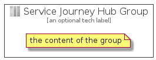

# ServiceJourneyHub


```text
azure-4/Item/General/ServiceJourneyHub
```

```text
include('azure-4/Item/General/ServiceJourneyHub')
```


| Illustration | ServiceJourneyHub | ServiceJourneyHubCard | ServiceJourneyHubGroup |
| :---: | :---: | :---: | :---: |
|  |  |  |  |


## ServiceJourneyHub

### Load remotely
```plantuml
@startuml
' configures the library
!global $LIB_BASE_LOCATION="https://github.com/tmorin/plantuml-libs/distribution"

' loads the library's bootstrap
!include $LIB_BASE_LOCATION/bootstrap.puml

' loads the package bootstrap
include('azure-4/bootstrap')

' loads the Item which embeds the element ServiceJourneyHub
include('azure-4/Item/General/ServiceJourneyHub')

' renders the element
ServiceJourneyHub('ServiceJourneyHub', 'Service Journey Hub', 'an optional tech label')
@enduml
```

### Load locally
```plantuml
@startuml
' configures the library
!global $INCLUSION_MODE="local"
!global $LIB_BASE_LOCATION="../../.."

' loads the library's bootstrap
!include $LIB_BASE_LOCATION/bootstrap.puml

' loads the package bootstrap
include('azure-4/bootstrap')

' loads the Item which embeds the element ServiceJourneyHub
include('azure-4/Item/General/ServiceJourneyHub')

' renders the element
ServiceJourneyHub('ServiceJourneyHub', 'Service Journey Hub', 'an optional tech label')
@enduml
```

## ServiceJourneyHubCard

### Load remotely
```plantuml
@startuml
' configures the library
!global $LIB_BASE_LOCATION="https://github.com/tmorin/plantuml-libs/distribution"

' loads the library's bootstrap
!include $LIB_BASE_LOCATION/bootstrap.puml

' loads the package bootstrap
include('azure-4/bootstrap')

' loads the Item which embeds the element ServiceJourneyHubCard
include('azure-4/Item/General/ServiceJourneyHub')

' renders the element
ServiceJourneyHubCard('ServiceJourneyHubCard', 'Service Journey Hub Card', 'an optional description')
@enduml
```

### Load locally
```plantuml
@startuml
' configures the library
!global $INCLUSION_MODE="local"
!global $LIB_BASE_LOCATION="../../.."

' loads the library's bootstrap
!include $LIB_BASE_LOCATION/bootstrap.puml

' loads the package bootstrap
include('azure-4/bootstrap')

' loads the Item which embeds the element ServiceJourneyHubCard
include('azure-4/Item/General/ServiceJourneyHub')

' renders the element
ServiceJourneyHubCard('ServiceJourneyHubCard', 'Service Journey Hub Card', 'an optional description')
@enduml
```

## ServiceJourneyHubGroup

### Load remotely
```plantuml
@startuml
' configures the library
!global $LIB_BASE_LOCATION="https://github.com/tmorin/plantuml-libs/distribution"

' loads the library's bootstrap
!include $LIB_BASE_LOCATION/bootstrap.puml

' loads the package bootstrap
include('azure-4/bootstrap')

' loads the Item which embeds the element ServiceJourneyHubGroup
include('azure-4/Item/General/ServiceJourneyHub')

' renders the element
ServiceJourneyHubGroup('ServiceJourneyHubGroup', 'Service Journey Hub Group', 'an optional tech label') {
    note as note
        the content of the group
    end note
}
@enduml
```

### Load locally
```plantuml
@startuml
' configures the library
!global $INCLUSION_MODE="local"
!global $LIB_BASE_LOCATION="../../.."

' loads the library's bootstrap
!include $LIB_BASE_LOCATION/bootstrap.puml

' loads the package bootstrap
include('azure-4/bootstrap')

' loads the Item which embeds the element ServiceJourneyHubGroup
include('azure-4/Item/General/ServiceJourneyHub')

' renders the element
ServiceJourneyHubGroup('ServiceJourneyHubGroup', 'Service Journey Hub Group', 'an optional tech label') {
    note as note
        the content of the group
    end note
}
@enduml
```

