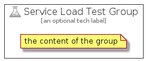

# ServiceLoadTest


```text
azure-4/Item/General/ServiceLoadTest
```

```text
include('azure-4/Item/General/ServiceLoadTest')
```


| Illustration | ServiceLoadTest | ServiceLoadTestCard | ServiceLoadTestGroup |
| :---: | :---: | :---: | :---: |
|  |  |  |  |


## ServiceLoadTest

### Load remotely
```plantuml
@startuml
' configures the library
!global $LIB_BASE_LOCATION="https://github.com/tmorin/plantuml-libs/distribution"

' loads the library's bootstrap
!include $LIB_BASE_LOCATION/bootstrap.puml

' loads the package bootstrap
include('azure-4/bootstrap')

' loads the Item which embeds the element ServiceLoadTest
include('azure-4/Item/General/ServiceLoadTest')

' renders the element
ServiceLoadTest('ServiceLoadTest', 'Service Load Test', 'an optional tech label')
@enduml
```

### Load locally
```plantuml
@startuml
' configures the library
!global $INCLUSION_MODE="local"
!global $LIB_BASE_LOCATION="../../.."

' loads the library's bootstrap
!include $LIB_BASE_LOCATION/bootstrap.puml

' loads the package bootstrap
include('azure-4/bootstrap')

' loads the Item which embeds the element ServiceLoadTest
include('azure-4/Item/General/ServiceLoadTest')

' renders the element
ServiceLoadTest('ServiceLoadTest', 'Service Load Test', 'an optional tech label')
@enduml
```

## ServiceLoadTestCard

### Load remotely
```plantuml
@startuml
' configures the library
!global $LIB_BASE_LOCATION="https://github.com/tmorin/plantuml-libs/distribution"

' loads the library's bootstrap
!include $LIB_BASE_LOCATION/bootstrap.puml

' loads the package bootstrap
include('azure-4/bootstrap')

' loads the Item which embeds the element ServiceLoadTestCard
include('azure-4/Item/General/ServiceLoadTest')

' renders the element
ServiceLoadTestCard('ServiceLoadTestCard', 'Service Load Test Card', 'an optional description')
@enduml
```

### Load locally
```plantuml
@startuml
' configures the library
!global $INCLUSION_MODE="local"
!global $LIB_BASE_LOCATION="../../.."

' loads the library's bootstrap
!include $LIB_BASE_LOCATION/bootstrap.puml

' loads the package bootstrap
include('azure-4/bootstrap')

' loads the Item which embeds the element ServiceLoadTestCard
include('azure-4/Item/General/ServiceLoadTest')

' renders the element
ServiceLoadTestCard('ServiceLoadTestCard', 'Service Load Test Card', 'an optional description')
@enduml
```

## ServiceLoadTestGroup

### Load remotely
```plantuml
@startuml
' configures the library
!global $LIB_BASE_LOCATION="https://github.com/tmorin/plantuml-libs/distribution"

' loads the library's bootstrap
!include $LIB_BASE_LOCATION/bootstrap.puml

' loads the package bootstrap
include('azure-4/bootstrap')

' loads the Item which embeds the element ServiceLoadTestGroup
include('azure-4/Item/General/ServiceLoadTest')

' renders the element
ServiceLoadTestGroup('ServiceLoadTestGroup', 'Service Load Test Group', 'an optional tech label') {
    note as note
        the content of the group
    end note
}
@enduml
```

### Load locally
```plantuml
@startuml
' configures the library
!global $INCLUSION_MODE="local"
!global $LIB_BASE_LOCATION="../../.."

' loads the library's bootstrap
!include $LIB_BASE_LOCATION/bootstrap.puml

' loads the package bootstrap
include('azure-4/bootstrap')

' loads the Item which embeds the element ServiceLoadTestGroup
include('azure-4/Item/General/ServiceLoadTest')

' renders the element
ServiceLoadTestGroup('ServiceLoadTestGroup', 'Service Load Test Group', 'an optional tech label') {
    note as note
        the content of the group
    end note
}
@enduml
```

