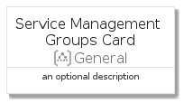
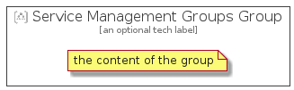

# ServiceManagementGroups


```text
azure-4/Item/General/ServiceManagementGroups
```

```text
include('azure-4/Item/General/ServiceManagementGroups')
```


| Illustration | ServiceManagementGroups | ServiceManagementGroupsCard | ServiceManagementGroupsGroup |
| :---: | :---: | :---: | :---: |
|  |  |  |  |


## ServiceManagementGroups

### Load remotely
```plantuml
@startuml
' configures the library
!global $LIB_BASE_LOCATION="https://raw.githubusercontent.com/tmorin/plantuml-libs/master/distribution"

' loads the library's bootstrap
!include $LIB_BASE_LOCATION/bootstrap.puml

' loads the package bootstrap
include('azure-4/bootstrap')

' loads the Item which embeds the element ServiceManagementGroups
include('azure-4/Item/General/ServiceManagementGroups')

' renders the element
ServiceManagementGroups('ServiceManagementGroups', 'Service Management Groups', 'an optional tech label')
@enduml
```

### Load locally
```plantuml
@startuml
' configures the library
!global $INCLUSION_MODE="local"
!global $LIB_BASE_LOCATION="../../.."

' loads the library's bootstrap
!include $LIB_BASE_LOCATION/bootstrap.puml

' loads the package bootstrap
include('azure-4/bootstrap')

' loads the Item which embeds the element ServiceManagementGroups
include('azure-4/Item/General/ServiceManagementGroups')

' renders the element
ServiceManagementGroups('ServiceManagementGroups', 'Service Management Groups', 'an optional tech label')
@enduml
```

## ServiceManagementGroupsCard

### Load remotely
```plantuml
@startuml
' configures the library
!global $LIB_BASE_LOCATION="https://raw.githubusercontent.com/tmorin/plantuml-libs/master/distribution"

' loads the library's bootstrap
!include $LIB_BASE_LOCATION/bootstrap.puml

' loads the package bootstrap
include('azure-4/bootstrap')

' loads the Item which embeds the element ServiceManagementGroupsCard
include('azure-4/Item/General/ServiceManagementGroups')

' renders the element
ServiceManagementGroupsCard('ServiceManagementGroupsCard', 'Service Management Groups Card', 'an optional description')
@enduml
```

### Load locally
```plantuml
@startuml
' configures the library
!global $INCLUSION_MODE="local"
!global $LIB_BASE_LOCATION="../../.."

' loads the library's bootstrap
!include $LIB_BASE_LOCATION/bootstrap.puml

' loads the package bootstrap
include('azure-4/bootstrap')

' loads the Item which embeds the element ServiceManagementGroupsCard
include('azure-4/Item/General/ServiceManagementGroups')

' renders the element
ServiceManagementGroupsCard('ServiceManagementGroupsCard', 'Service Management Groups Card', 'an optional description')
@enduml
```

## ServiceManagementGroupsGroup

### Load remotely
```plantuml
@startuml
' configures the library
!global $LIB_BASE_LOCATION="https://raw.githubusercontent.com/tmorin/plantuml-libs/master/distribution"

' loads the library's bootstrap
!include $LIB_BASE_LOCATION/bootstrap.puml

' loads the package bootstrap
include('azure-4/bootstrap')

' loads the Item which embeds the element ServiceManagementGroupsGroup
include('azure-4/Item/General/ServiceManagementGroups')

' renders the element
ServiceManagementGroupsGroup('ServiceManagementGroupsGroup', 'Service Management Groups Group', 'an optional tech label') {
    note as note
        the content of the group
    end note
}
@enduml
```

### Load locally
```plantuml
@startuml
' configures the library
!global $INCLUSION_MODE="local"
!global $LIB_BASE_LOCATION="../../.."

' loads the library's bootstrap
!include $LIB_BASE_LOCATION/bootstrap.puml

' loads the package bootstrap
include('azure-4/bootstrap')

' loads the Item which embeds the element ServiceManagementGroupsGroup
include('azure-4/Item/General/ServiceManagementGroups')

' renders the element
ServiceManagementGroupsGroup('ServiceManagementGroupsGroup', 'Service Management Groups Group', 'an optional tech label') {
    note as note
        the content of the group
    end note
}
@enduml
```

