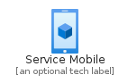
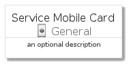
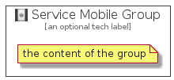

# ServiceMobile


```text
azure-4/Item/General/ServiceMobile
```

```text
include('azure-4/Item/General/ServiceMobile')
```


| Illustration | ServiceMobile | ServiceMobileCard | ServiceMobileGroup |
| :---: | :---: | :---: | :---: |
|  |  |  |  |


## ServiceMobile

### Load remotely
```plantuml
@startuml
' configures the library
!global $LIB_BASE_LOCATION="https://github.com/tmorin/plantuml-libs/distribution"

' loads the library's bootstrap
!include $LIB_BASE_LOCATION/bootstrap.puml

' loads the package bootstrap
include('azure-4/bootstrap')

' loads the Item which embeds the element ServiceMobile
include('azure-4/Item/General/ServiceMobile')

' renders the element
ServiceMobile('ServiceMobile', 'Service Mobile', 'an optional tech label')
@enduml
```

### Load locally
```plantuml
@startuml
' configures the library
!global $INCLUSION_MODE="local"
!global $LIB_BASE_LOCATION="../../.."

' loads the library's bootstrap
!include $LIB_BASE_LOCATION/bootstrap.puml

' loads the package bootstrap
include('azure-4/bootstrap')

' loads the Item which embeds the element ServiceMobile
include('azure-4/Item/General/ServiceMobile')

' renders the element
ServiceMobile('ServiceMobile', 'Service Mobile', 'an optional tech label')
@enduml
```

## ServiceMobileCard

### Load remotely
```plantuml
@startuml
' configures the library
!global $LIB_BASE_LOCATION="https://github.com/tmorin/plantuml-libs/distribution"

' loads the library's bootstrap
!include $LIB_BASE_LOCATION/bootstrap.puml

' loads the package bootstrap
include('azure-4/bootstrap')

' loads the Item which embeds the element ServiceMobileCard
include('azure-4/Item/General/ServiceMobile')

' renders the element
ServiceMobileCard('ServiceMobileCard', 'Service Mobile Card', 'an optional description')
@enduml
```

### Load locally
```plantuml
@startuml
' configures the library
!global $INCLUSION_MODE="local"
!global $LIB_BASE_LOCATION="../../.."

' loads the library's bootstrap
!include $LIB_BASE_LOCATION/bootstrap.puml

' loads the package bootstrap
include('azure-4/bootstrap')

' loads the Item which embeds the element ServiceMobileCard
include('azure-4/Item/General/ServiceMobile')

' renders the element
ServiceMobileCard('ServiceMobileCard', 'Service Mobile Card', 'an optional description')
@enduml
```

## ServiceMobileGroup

### Load remotely
```plantuml
@startuml
' configures the library
!global $LIB_BASE_LOCATION="https://github.com/tmorin/plantuml-libs/distribution"

' loads the library's bootstrap
!include $LIB_BASE_LOCATION/bootstrap.puml

' loads the package bootstrap
include('azure-4/bootstrap')

' loads the Item which embeds the element ServiceMobileGroup
include('azure-4/Item/General/ServiceMobile')

' renders the element
ServiceMobileGroup('ServiceMobileGroup', 'Service Mobile Group', 'an optional tech label') {
    note as note
        the content of the group
    end note
}
@enduml
```

### Load locally
```plantuml
@startuml
' configures the library
!global $INCLUSION_MODE="local"
!global $LIB_BASE_LOCATION="../../.."

' loads the library's bootstrap
!include $LIB_BASE_LOCATION/bootstrap.puml

' loads the package bootstrap
include('azure-4/bootstrap')

' loads the Item which embeds the element ServiceMobileGroup
include('azure-4/Item/General/ServiceMobile')

' renders the element
ServiceMobileGroup('ServiceMobileGroup', 'Service Mobile Group', 'an optional tech label') {
    note as note
        the content of the group
    end note
}
@enduml
```

