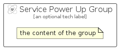

# ServicePowerUp


```text
azure-4/Item/General/ServicePowerUp
```

```text
include('azure-4/Item/General/ServicePowerUp')
```


| Illustration | ServicePowerUp | ServicePowerUpCard | ServicePowerUpGroup |
| :---: | :---: | :---: | :---: |
|  |  |  |  |


## ServicePowerUp

### Load remotely
```plantuml
@startuml
' configures the library
!global $LIB_BASE_LOCATION="https://raw.githubusercontent.com/tmorin/plantuml-libs/master/distribution"

' loads the library's bootstrap
!include $LIB_BASE_LOCATION/bootstrap.puml

' loads the package bootstrap
include('azure-4/bootstrap')

' loads the Item which embeds the element ServicePowerUp
include('azure-4/Item/General/ServicePowerUp')

' renders the element
ServicePowerUp('ServicePowerUp', 'Service Power Up', 'an optional tech label')
@enduml
```

### Load locally
```plantuml
@startuml
' configures the library
!global $INCLUSION_MODE="local"
!global $LIB_BASE_LOCATION="../../.."

' loads the library's bootstrap
!include $LIB_BASE_LOCATION/bootstrap.puml

' loads the package bootstrap
include('azure-4/bootstrap')

' loads the Item which embeds the element ServicePowerUp
include('azure-4/Item/General/ServicePowerUp')

' renders the element
ServicePowerUp('ServicePowerUp', 'Service Power Up', 'an optional tech label')
@enduml
```

## ServicePowerUpCard

### Load remotely
```plantuml
@startuml
' configures the library
!global $LIB_BASE_LOCATION="https://raw.githubusercontent.com/tmorin/plantuml-libs/master/distribution"

' loads the library's bootstrap
!include $LIB_BASE_LOCATION/bootstrap.puml

' loads the package bootstrap
include('azure-4/bootstrap')

' loads the Item which embeds the element ServicePowerUpCard
include('azure-4/Item/General/ServicePowerUp')

' renders the element
ServicePowerUpCard('ServicePowerUpCard', 'Service Power Up Card', 'an optional description')
@enduml
```

### Load locally
```plantuml
@startuml
' configures the library
!global $INCLUSION_MODE="local"
!global $LIB_BASE_LOCATION="../../.."

' loads the library's bootstrap
!include $LIB_BASE_LOCATION/bootstrap.puml

' loads the package bootstrap
include('azure-4/bootstrap')

' loads the Item which embeds the element ServicePowerUpCard
include('azure-4/Item/General/ServicePowerUp')

' renders the element
ServicePowerUpCard('ServicePowerUpCard', 'Service Power Up Card', 'an optional description')
@enduml
```

## ServicePowerUpGroup

### Load remotely
```plantuml
@startuml
' configures the library
!global $LIB_BASE_LOCATION="https://raw.githubusercontent.com/tmorin/plantuml-libs/master/distribution"

' loads the library's bootstrap
!include $LIB_BASE_LOCATION/bootstrap.puml

' loads the package bootstrap
include('azure-4/bootstrap')

' loads the Item which embeds the element ServicePowerUpGroup
include('azure-4/Item/General/ServicePowerUp')

' renders the element
ServicePowerUpGroup('ServicePowerUpGroup', 'Service Power Up Group', 'an optional tech label') {
    note as note
        the content of the group
    end note
}
@enduml
```

### Load locally
```plantuml
@startuml
' configures the library
!global $INCLUSION_MODE="local"
!global $LIB_BASE_LOCATION="../../.."

' loads the library's bootstrap
!include $LIB_BASE_LOCATION/bootstrap.puml

' loads the package bootstrap
include('azure-4/bootstrap')

' loads the Item which embeds the element ServicePowerUpGroup
include('azure-4/Item/General/ServicePowerUp')

' renders the element
ServicePowerUpGroup('ServicePowerUpGroup', 'Service Power Up Group', 'an optional tech label') {
    note as note
        the content of the group
    end note
}
@enduml
```

