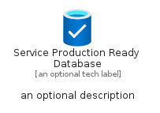
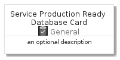
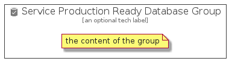

# ServiceProductionReadyDatabase


```text
azure-4/Item/General/ServiceProductionReadyDatabase
```

```text
include('azure-4/Item/General/ServiceProductionReadyDatabase')
```


| Illustration | ServiceProductionReadyDatabase | ServiceProductionReadyDatabaseCard | ServiceProductionReadyDatabaseGroup |
| :---: | :---: | :---: | :---: |
|  |  |  |  |


## ServiceProductionReadyDatabase

### Load remotely
```plantuml
@startuml
' configures the library
!global $LIB_BASE_LOCATION="https://github.com/tmorin/plantuml-libs/distribution"

' loads the library's bootstrap
!include $LIB_BASE_LOCATION/bootstrap.puml

' loads the package bootstrap
include('azure-4/bootstrap')

' loads the Item which embeds the element ServiceProductionReadyDatabase
include('azure-4/Item/General/ServiceProductionReadyDatabase')

' renders the element
ServiceProductionReadyDatabase('ServiceProductionReadyDatabase', 'Service Production Ready Database', 'an optional tech label')
@enduml
```

### Load locally
```plantuml
@startuml
' configures the library
!global $INCLUSION_MODE="local"
!global $LIB_BASE_LOCATION="../../.."

' loads the library's bootstrap
!include $LIB_BASE_LOCATION/bootstrap.puml

' loads the package bootstrap
include('azure-4/bootstrap')

' loads the Item which embeds the element ServiceProductionReadyDatabase
include('azure-4/Item/General/ServiceProductionReadyDatabase')

' renders the element
ServiceProductionReadyDatabase('ServiceProductionReadyDatabase', 'Service Production Ready Database', 'an optional tech label')
@enduml
```

## ServiceProductionReadyDatabaseCard

### Load remotely
```plantuml
@startuml
' configures the library
!global $LIB_BASE_LOCATION="https://github.com/tmorin/plantuml-libs/distribution"

' loads the library's bootstrap
!include $LIB_BASE_LOCATION/bootstrap.puml

' loads the package bootstrap
include('azure-4/bootstrap')

' loads the Item which embeds the element ServiceProductionReadyDatabaseCard
include('azure-4/Item/General/ServiceProductionReadyDatabase')

' renders the element
ServiceProductionReadyDatabaseCard('ServiceProductionReadyDatabaseCard', 'Service Production Ready Database Card', 'an optional description')
@enduml
```

### Load locally
```plantuml
@startuml
' configures the library
!global $INCLUSION_MODE="local"
!global $LIB_BASE_LOCATION="../../.."

' loads the library's bootstrap
!include $LIB_BASE_LOCATION/bootstrap.puml

' loads the package bootstrap
include('azure-4/bootstrap')

' loads the Item which embeds the element ServiceProductionReadyDatabaseCard
include('azure-4/Item/General/ServiceProductionReadyDatabase')

' renders the element
ServiceProductionReadyDatabaseCard('ServiceProductionReadyDatabaseCard', 'Service Production Ready Database Card', 'an optional description')
@enduml
```

## ServiceProductionReadyDatabaseGroup

### Load remotely
```plantuml
@startuml
' configures the library
!global $LIB_BASE_LOCATION="https://github.com/tmorin/plantuml-libs/distribution"

' loads the library's bootstrap
!include $LIB_BASE_LOCATION/bootstrap.puml

' loads the package bootstrap
include('azure-4/bootstrap')

' loads the Item which embeds the element ServiceProductionReadyDatabaseGroup
include('azure-4/Item/General/ServiceProductionReadyDatabase')

' renders the element
ServiceProductionReadyDatabaseGroup('ServiceProductionReadyDatabaseGroup', 'Service Production Ready Database Group', 'an optional tech label') {
    note as note
        the content of the group
    end note
}
@enduml
```

### Load locally
```plantuml
@startuml
' configures the library
!global $INCLUSION_MODE="local"
!global $LIB_BASE_LOCATION="../../.."

' loads the library's bootstrap
!include $LIB_BASE_LOCATION/bootstrap.puml

' loads the package bootstrap
include('azure-4/bootstrap')

' loads the Item which embeds the element ServiceProductionReadyDatabaseGroup
include('azure-4/Item/General/ServiceProductionReadyDatabase')

' renders the element
ServiceProductionReadyDatabaseGroup('ServiceProductionReadyDatabaseGroup', 'Service Production Ready Database Group', 'an optional tech label') {
    note as note
        the content of the group
    end note
}
@enduml
```

