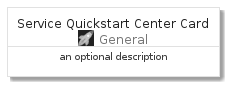
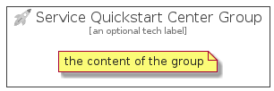

# ServiceQuickstartCenter


```text
azure-4/Item/General/ServiceQuickstartCenter
```

```text
include('azure-4/Item/General/ServiceQuickstartCenter')
```


| Illustration | ServiceQuickstartCenter | ServiceQuickstartCenterCard | ServiceQuickstartCenterGroup |
| :---: | :---: | :---: | :---: |
|  |  |  |  |


## ServiceQuickstartCenter

### Load remotely
```plantuml
@startuml
' configures the library
!global $LIB_BASE_LOCATION="https://github.com/tmorin/plantuml-libs/distribution"

' loads the library's bootstrap
!include $LIB_BASE_LOCATION/bootstrap.puml

' loads the package bootstrap
include('azure-4/bootstrap')

' loads the Item which embeds the element ServiceQuickstartCenter
include('azure-4/Item/General/ServiceQuickstartCenter')

' renders the element
ServiceQuickstartCenter('ServiceQuickstartCenter', 'Service Quickstart Center', 'an optional tech label')
@enduml
```

### Load locally
```plantuml
@startuml
' configures the library
!global $INCLUSION_MODE="local"
!global $LIB_BASE_LOCATION="../../.."

' loads the library's bootstrap
!include $LIB_BASE_LOCATION/bootstrap.puml

' loads the package bootstrap
include('azure-4/bootstrap')

' loads the Item which embeds the element ServiceQuickstartCenter
include('azure-4/Item/General/ServiceQuickstartCenter')

' renders the element
ServiceQuickstartCenter('ServiceQuickstartCenter', 'Service Quickstart Center', 'an optional tech label')
@enduml
```

## ServiceQuickstartCenterCard

### Load remotely
```plantuml
@startuml
' configures the library
!global $LIB_BASE_LOCATION="https://github.com/tmorin/plantuml-libs/distribution"

' loads the library's bootstrap
!include $LIB_BASE_LOCATION/bootstrap.puml

' loads the package bootstrap
include('azure-4/bootstrap')

' loads the Item which embeds the element ServiceQuickstartCenterCard
include('azure-4/Item/General/ServiceQuickstartCenter')

' renders the element
ServiceQuickstartCenterCard('ServiceQuickstartCenterCard', 'Service Quickstart Center Card', 'an optional description')
@enduml
```

### Load locally
```plantuml
@startuml
' configures the library
!global $INCLUSION_MODE="local"
!global $LIB_BASE_LOCATION="../../.."

' loads the library's bootstrap
!include $LIB_BASE_LOCATION/bootstrap.puml

' loads the package bootstrap
include('azure-4/bootstrap')

' loads the Item which embeds the element ServiceQuickstartCenterCard
include('azure-4/Item/General/ServiceQuickstartCenter')

' renders the element
ServiceQuickstartCenterCard('ServiceQuickstartCenterCard', 'Service Quickstart Center Card', 'an optional description')
@enduml
```

## ServiceQuickstartCenterGroup

### Load remotely
```plantuml
@startuml
' configures the library
!global $LIB_BASE_LOCATION="https://github.com/tmorin/plantuml-libs/distribution"

' loads the library's bootstrap
!include $LIB_BASE_LOCATION/bootstrap.puml

' loads the package bootstrap
include('azure-4/bootstrap')

' loads the Item which embeds the element ServiceQuickstartCenterGroup
include('azure-4/Item/General/ServiceQuickstartCenter')

' renders the element
ServiceQuickstartCenterGroup('ServiceQuickstartCenterGroup', 'Service Quickstart Center Group', 'an optional tech label') {
    note as note
        the content of the group
    end note
}
@enduml
```

### Load locally
```plantuml
@startuml
' configures the library
!global $INCLUSION_MODE="local"
!global $LIB_BASE_LOCATION="../../.."

' loads the library's bootstrap
!include $LIB_BASE_LOCATION/bootstrap.puml

' loads the package bootstrap
include('azure-4/bootstrap')

' loads the Item which embeds the element ServiceQuickstartCenterGroup
include('azure-4/Item/General/ServiceQuickstartCenter')

' renders the element
ServiceQuickstartCenterGroup('ServiceQuickstartCenterGroup', 'Service Quickstart Center Group', 'an optional tech label') {
    note as note
        the content of the group
    end note
}
@enduml
```

