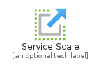
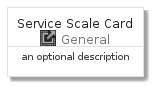
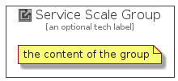

# ServiceScale


```text
azure-4/Item/General/ServiceScale
```

```text
include('azure-4/Item/General/ServiceScale')
```


| Illustration | ServiceScale | ServiceScaleCard | ServiceScaleGroup |
| :---: | :---: | :---: | :---: |
|  |  |  |  |


## ServiceScale

### Load remotely
```plantuml
@startuml
' configures the library
!global $LIB_BASE_LOCATION="https://github.com/tmorin/plantuml-libs/distribution"

' loads the library's bootstrap
!include $LIB_BASE_LOCATION/bootstrap.puml

' loads the package bootstrap
include('azure-4/bootstrap')

' loads the Item which embeds the element ServiceScale
include('azure-4/Item/General/ServiceScale')

' renders the element
ServiceScale('ServiceScale', 'Service Scale', 'an optional tech label')
@enduml
```

### Load locally
```plantuml
@startuml
' configures the library
!global $INCLUSION_MODE="local"
!global $LIB_BASE_LOCATION="../../.."

' loads the library's bootstrap
!include $LIB_BASE_LOCATION/bootstrap.puml

' loads the package bootstrap
include('azure-4/bootstrap')

' loads the Item which embeds the element ServiceScale
include('azure-4/Item/General/ServiceScale')

' renders the element
ServiceScale('ServiceScale', 'Service Scale', 'an optional tech label')
@enduml
```

## ServiceScaleCard

### Load remotely
```plantuml
@startuml
' configures the library
!global $LIB_BASE_LOCATION="https://github.com/tmorin/plantuml-libs/distribution"

' loads the library's bootstrap
!include $LIB_BASE_LOCATION/bootstrap.puml

' loads the package bootstrap
include('azure-4/bootstrap')

' loads the Item which embeds the element ServiceScaleCard
include('azure-4/Item/General/ServiceScale')

' renders the element
ServiceScaleCard('ServiceScaleCard', 'Service Scale Card', 'an optional description')
@enduml
```

### Load locally
```plantuml
@startuml
' configures the library
!global $INCLUSION_MODE="local"
!global $LIB_BASE_LOCATION="../../.."

' loads the library's bootstrap
!include $LIB_BASE_LOCATION/bootstrap.puml

' loads the package bootstrap
include('azure-4/bootstrap')

' loads the Item which embeds the element ServiceScaleCard
include('azure-4/Item/General/ServiceScale')

' renders the element
ServiceScaleCard('ServiceScaleCard', 'Service Scale Card', 'an optional description')
@enduml
```

## ServiceScaleGroup

### Load remotely
```plantuml
@startuml
' configures the library
!global $LIB_BASE_LOCATION="https://github.com/tmorin/plantuml-libs/distribution"

' loads the library's bootstrap
!include $LIB_BASE_LOCATION/bootstrap.puml

' loads the package bootstrap
include('azure-4/bootstrap')

' loads the Item which embeds the element ServiceScaleGroup
include('azure-4/Item/General/ServiceScale')

' renders the element
ServiceScaleGroup('ServiceScaleGroup', 'Service Scale Group', 'an optional tech label') {
    note as note
        the content of the group
    end note
}
@enduml
```

### Load locally
```plantuml
@startuml
' configures the library
!global $INCLUSION_MODE="local"
!global $LIB_BASE_LOCATION="../../.."

' loads the library's bootstrap
!include $LIB_BASE_LOCATION/bootstrap.puml

' loads the package bootstrap
include('azure-4/bootstrap')

' loads the Item which embeds the element ServiceScaleGroup
include('azure-4/Item/General/ServiceScale')

' renders the element
ServiceScaleGroup('ServiceScaleGroup', 'Service Scale Group', 'an optional tech label') {
    note as note
        the content of the group
    end note
}
@enduml
```

