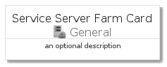
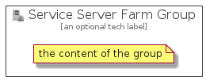

# ServiceServerFarm


```text
azure-4/Item/General/ServiceServerFarm
```

```text
include('azure-4/Item/General/ServiceServerFarm')
```


| Illustration | ServiceServerFarm | ServiceServerFarmCard | ServiceServerFarmGroup |
| :---: | :---: | :---: | :---: |
|  |  |  |  |


## ServiceServerFarm

### Load remotely
```plantuml
@startuml
' configures the library
!global $LIB_BASE_LOCATION="https://github.com/tmorin/plantuml-libs/distribution"

' loads the library's bootstrap
!include $LIB_BASE_LOCATION/bootstrap.puml

' loads the package bootstrap
include('azure-4/bootstrap')

' loads the Item which embeds the element ServiceServerFarm
include('azure-4/Item/General/ServiceServerFarm')

' renders the element
ServiceServerFarm('ServiceServerFarm', 'Service Server Farm', 'an optional tech label')
@enduml
```

### Load locally
```plantuml
@startuml
' configures the library
!global $INCLUSION_MODE="local"
!global $LIB_BASE_LOCATION="../../.."

' loads the library's bootstrap
!include $LIB_BASE_LOCATION/bootstrap.puml

' loads the package bootstrap
include('azure-4/bootstrap')

' loads the Item which embeds the element ServiceServerFarm
include('azure-4/Item/General/ServiceServerFarm')

' renders the element
ServiceServerFarm('ServiceServerFarm', 'Service Server Farm', 'an optional tech label')
@enduml
```

## ServiceServerFarmCard

### Load remotely
```plantuml
@startuml
' configures the library
!global $LIB_BASE_LOCATION="https://github.com/tmorin/plantuml-libs/distribution"

' loads the library's bootstrap
!include $LIB_BASE_LOCATION/bootstrap.puml

' loads the package bootstrap
include('azure-4/bootstrap')

' loads the Item which embeds the element ServiceServerFarmCard
include('azure-4/Item/General/ServiceServerFarm')

' renders the element
ServiceServerFarmCard('ServiceServerFarmCard', 'Service Server Farm Card', 'an optional description')
@enduml
```

### Load locally
```plantuml
@startuml
' configures the library
!global $INCLUSION_MODE="local"
!global $LIB_BASE_LOCATION="../../.."

' loads the library's bootstrap
!include $LIB_BASE_LOCATION/bootstrap.puml

' loads the package bootstrap
include('azure-4/bootstrap')

' loads the Item which embeds the element ServiceServerFarmCard
include('azure-4/Item/General/ServiceServerFarm')

' renders the element
ServiceServerFarmCard('ServiceServerFarmCard', 'Service Server Farm Card', 'an optional description')
@enduml
```

## ServiceServerFarmGroup

### Load remotely
```plantuml
@startuml
' configures the library
!global $LIB_BASE_LOCATION="https://github.com/tmorin/plantuml-libs/distribution"

' loads the library's bootstrap
!include $LIB_BASE_LOCATION/bootstrap.puml

' loads the package bootstrap
include('azure-4/bootstrap')

' loads the Item which embeds the element ServiceServerFarmGroup
include('azure-4/Item/General/ServiceServerFarm')

' renders the element
ServiceServerFarmGroup('ServiceServerFarmGroup', 'Service Server Farm Group', 'an optional tech label') {
    note as note
        the content of the group
    end note
}
@enduml
```

### Load locally
```plantuml
@startuml
' configures the library
!global $INCLUSION_MODE="local"
!global $LIB_BASE_LOCATION="../../.."

' loads the library's bootstrap
!include $LIB_BASE_LOCATION/bootstrap.puml

' loads the package bootstrap
include('azure-4/bootstrap')

' loads the Item which embeds the element ServiceServerFarmGroup
include('azure-4/Item/General/ServiceServerFarm')

' renders the element
ServiceServerFarmGroup('ServiceServerFarmGroup', 'Service Server Farm Group', 'an optional tech label') {
    note as note
        the content of the group
    end note
}
@enduml
```

