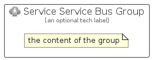

# ServiceServiceBus


```text
azure-4/Item/General/ServiceServiceBus
```

```text
include('azure-4/Item/General/ServiceServiceBus')
```


| Illustration | ServiceServiceBus | ServiceServiceBusCard | ServiceServiceBusGroup |
| :---: | :---: | :---: | :---: |
|  |  |  |  |


## ServiceServiceBus

### Load remotely
```plantuml
@startuml
' configures the library
!global $LIB_BASE_LOCATION="https://raw.githubusercontent.com/tmorin/plantuml-libs/master/distribution"

' loads the library's bootstrap
!include $LIB_BASE_LOCATION/bootstrap.puml

' loads the package bootstrap
include('azure-4/bootstrap')

' loads the Item which embeds the element ServiceServiceBus
include('azure-4/Item/General/ServiceServiceBus')

' renders the element
ServiceServiceBus('ServiceServiceBus', 'Service Service Bus', 'an optional tech label', 'an optional description')
@enduml
```

### Load locally
```plantuml
@startuml
' configures the library
!global $INCLUSION_MODE="local"
!global $LIB_BASE_LOCATION="../../.."

' loads the library's bootstrap
!include $LIB_BASE_LOCATION/bootstrap.puml

' loads the package bootstrap
include('azure-4/bootstrap')

' loads the Item which embeds the element ServiceServiceBus
include('azure-4/Item/General/ServiceServiceBus')

' renders the element
ServiceServiceBus('ServiceServiceBus', 'Service Service Bus', 'an optional tech label', 'an optional description')
@enduml
```

## ServiceServiceBusCard

### Load remotely
```plantuml
@startuml
' configures the library
!global $LIB_BASE_LOCATION="https://raw.githubusercontent.com/tmorin/plantuml-libs/master/distribution"

' loads the library's bootstrap
!include $LIB_BASE_LOCATION/bootstrap.puml

' loads the package bootstrap
include('azure-4/bootstrap')

' loads the Item which embeds the element ServiceServiceBusCard
include('azure-4/Item/General/ServiceServiceBus')

' renders the element
ServiceServiceBusCard('ServiceServiceBusCard', 'Service Service Bus Card', 'an optional description')
@enduml
```

### Load locally
```plantuml
@startuml
' configures the library
!global $INCLUSION_MODE="local"
!global $LIB_BASE_LOCATION="../../.."

' loads the library's bootstrap
!include $LIB_BASE_LOCATION/bootstrap.puml

' loads the package bootstrap
include('azure-4/bootstrap')

' loads the Item which embeds the element ServiceServiceBusCard
include('azure-4/Item/General/ServiceServiceBus')

' renders the element
ServiceServiceBusCard('ServiceServiceBusCard', 'Service Service Bus Card', 'an optional description')
@enduml
```

## ServiceServiceBusGroup

### Load remotely
```plantuml
@startuml
' configures the library
!global $LIB_BASE_LOCATION="https://raw.githubusercontent.com/tmorin/plantuml-libs/master/distribution"

' loads the library's bootstrap
!include $LIB_BASE_LOCATION/bootstrap.puml

' loads the package bootstrap
include('azure-4/bootstrap')

' loads the Item which embeds the element ServiceServiceBusGroup
include('azure-4/Item/General/ServiceServiceBus')

' renders the element
ServiceServiceBusGroup('ServiceServiceBusGroup', 'Service Service Bus Group', 'an optional tech label') {
    note as note
        the content of the group
    end note
}
@enduml
```

### Load locally
```plantuml
@startuml
' configures the library
!global $INCLUSION_MODE="local"
!global $LIB_BASE_LOCATION="../../.."

' loads the library's bootstrap
!include $LIB_BASE_LOCATION/bootstrap.puml

' loads the package bootstrap
include('azure-4/bootstrap')

' loads the Item which embeds the element ServiceServiceBusGroup
include('azure-4/Item/General/ServiceServiceBus')

' renders the element
ServiceServiceBusGroup('ServiceServiceBusGroup', 'Service Service Bus Group', 'an optional tech label') {
    note as note
        the content of the group
    end note
}
@enduml
```

