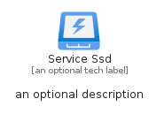
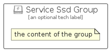

# ServiceSsd


```text
azure-4/Item/General/ServiceSsd
```

```text
include('azure-4/Item/General/ServiceSsd')
```


| Illustration | ServiceSsd | ServiceSsdCard | ServiceSsdGroup |
| :---: | :---: | :---: | :---: |
|  |  |  |  |


## ServiceSsd

### Load remotely
```plantuml
@startuml
' configures the library
!global $LIB_BASE_LOCATION="https://raw.githubusercontent.com/tmorin/plantuml-libs/master/distribution"

' loads the library's bootstrap
!include $LIB_BASE_LOCATION/bootstrap.puml

' loads the package bootstrap
include('azure-4/bootstrap')

' loads the Item which embeds the element ServiceSsd
include('azure-4/Item/General/ServiceSsd')

' renders the element
ServiceSsd('ServiceSsd', 'Service Ssd', 'an optional tech label')
@enduml
```

### Load locally
```plantuml
@startuml
' configures the library
!global $INCLUSION_MODE="local"
!global $LIB_BASE_LOCATION="../../.."

' loads the library's bootstrap
!include $LIB_BASE_LOCATION/bootstrap.puml

' loads the package bootstrap
include('azure-4/bootstrap')

' loads the Item which embeds the element ServiceSsd
include('azure-4/Item/General/ServiceSsd')

' renders the element
ServiceSsd('ServiceSsd', 'Service Ssd', 'an optional tech label')
@enduml
```

## ServiceSsdCard

### Load remotely
```plantuml
@startuml
' configures the library
!global $LIB_BASE_LOCATION="https://raw.githubusercontent.com/tmorin/plantuml-libs/master/distribution"

' loads the library's bootstrap
!include $LIB_BASE_LOCATION/bootstrap.puml

' loads the package bootstrap
include('azure-4/bootstrap')

' loads the Item which embeds the element ServiceSsdCard
include('azure-4/Item/General/ServiceSsd')

' renders the element
ServiceSsdCard('ServiceSsdCard', 'Service Ssd Card', 'an optional description')
@enduml
```

### Load locally
```plantuml
@startuml
' configures the library
!global $INCLUSION_MODE="local"
!global $LIB_BASE_LOCATION="../../.."

' loads the library's bootstrap
!include $LIB_BASE_LOCATION/bootstrap.puml

' loads the package bootstrap
include('azure-4/bootstrap')

' loads the Item which embeds the element ServiceSsdCard
include('azure-4/Item/General/ServiceSsd')

' renders the element
ServiceSsdCard('ServiceSsdCard', 'Service Ssd Card', 'an optional description')
@enduml
```

## ServiceSsdGroup

### Load remotely
```plantuml
@startuml
' configures the library
!global $LIB_BASE_LOCATION="https://raw.githubusercontent.com/tmorin/plantuml-libs/master/distribution"

' loads the library's bootstrap
!include $LIB_BASE_LOCATION/bootstrap.puml

' loads the package bootstrap
include('azure-4/bootstrap')

' loads the Item which embeds the element ServiceSsdGroup
include('azure-4/Item/General/ServiceSsd')

' renders the element
ServiceSsdGroup('ServiceSsdGroup', 'Service Ssd Group', 'an optional tech label') {
    note as note
        the content of the group
    end note
}
@enduml
```

### Load locally
```plantuml
@startuml
' configures the library
!global $INCLUSION_MODE="local"
!global $LIB_BASE_LOCATION="../../.."

' loads the library's bootstrap
!include $LIB_BASE_LOCATION/bootstrap.puml

' loads the package bootstrap
include('azure-4/bootstrap')

' loads the Item which embeds the element ServiceSsdGroup
include('azure-4/Item/General/ServiceSsd')

' renders the element
ServiceSsdGroup('ServiceSsdGroup', 'Service Ssd Group', 'an optional tech label') {
    note as note
        the content of the group
    end note
}
@enduml
```

