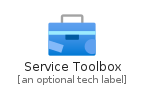
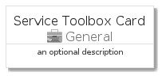
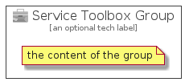

# ServiceToolbox


```text
azure-4/Item/General/ServiceToolbox
```

```text
include('azure-4/Item/General/ServiceToolbox')
```


| Illustration | ServiceToolbox | ServiceToolboxCard | ServiceToolboxGroup |
| :---: | :---: | :---: | :---: |
|  |  |  |  |


## ServiceToolbox

### Load remotely
```plantuml
@startuml
' configures the library
!global $LIB_BASE_LOCATION="https://github.com/tmorin/plantuml-libs/distribution"

' loads the library's bootstrap
!include $LIB_BASE_LOCATION/bootstrap.puml

' loads the package bootstrap
include('azure-4/bootstrap')

' loads the Item which embeds the element ServiceToolbox
include('azure-4/Item/General/ServiceToolbox')

' renders the element
ServiceToolbox('ServiceToolbox', 'Service Toolbox', 'an optional tech label')
@enduml
```

### Load locally
```plantuml
@startuml
' configures the library
!global $INCLUSION_MODE="local"
!global $LIB_BASE_LOCATION="../../.."

' loads the library's bootstrap
!include $LIB_BASE_LOCATION/bootstrap.puml

' loads the package bootstrap
include('azure-4/bootstrap')

' loads the Item which embeds the element ServiceToolbox
include('azure-4/Item/General/ServiceToolbox')

' renders the element
ServiceToolbox('ServiceToolbox', 'Service Toolbox', 'an optional tech label')
@enduml
```

## ServiceToolboxCard

### Load remotely
```plantuml
@startuml
' configures the library
!global $LIB_BASE_LOCATION="https://github.com/tmorin/plantuml-libs/distribution"

' loads the library's bootstrap
!include $LIB_BASE_LOCATION/bootstrap.puml

' loads the package bootstrap
include('azure-4/bootstrap')

' loads the Item which embeds the element ServiceToolboxCard
include('azure-4/Item/General/ServiceToolbox')

' renders the element
ServiceToolboxCard('ServiceToolboxCard', 'Service Toolbox Card', 'an optional description')
@enduml
```

### Load locally
```plantuml
@startuml
' configures the library
!global $INCLUSION_MODE="local"
!global $LIB_BASE_LOCATION="../../.."

' loads the library's bootstrap
!include $LIB_BASE_LOCATION/bootstrap.puml

' loads the package bootstrap
include('azure-4/bootstrap')

' loads the Item which embeds the element ServiceToolboxCard
include('azure-4/Item/General/ServiceToolbox')

' renders the element
ServiceToolboxCard('ServiceToolboxCard', 'Service Toolbox Card', 'an optional description')
@enduml
```

## ServiceToolboxGroup

### Load remotely
```plantuml
@startuml
' configures the library
!global $LIB_BASE_LOCATION="https://github.com/tmorin/plantuml-libs/distribution"

' loads the library's bootstrap
!include $LIB_BASE_LOCATION/bootstrap.puml

' loads the package bootstrap
include('azure-4/bootstrap')

' loads the Item which embeds the element ServiceToolboxGroup
include('azure-4/Item/General/ServiceToolbox')

' renders the element
ServiceToolboxGroup('ServiceToolboxGroup', 'Service Toolbox Group', 'an optional tech label') {
    note as note
        the content of the group
    end note
}
@enduml
```

### Load locally
```plantuml
@startuml
' configures the library
!global $INCLUSION_MODE="local"
!global $LIB_BASE_LOCATION="../../.."

' loads the library's bootstrap
!include $LIB_BASE_LOCATION/bootstrap.puml

' loads the package bootstrap
include('azure-4/bootstrap')

' loads the Item which embeds the element ServiceToolboxGroup
include('azure-4/Item/General/ServiceToolbox')

' renders the element
ServiceToolboxGroup('ServiceToolboxGroup', 'Service Toolbox Group', 'an optional tech label') {
    note as note
        the content of the group
    end note
}
@enduml
```

