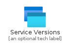
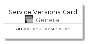
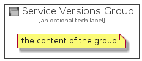

# ServiceVersions


```text
azure-4/Item/General/ServiceVersions
```

```text
include('azure-4/Item/General/ServiceVersions')
```


| Illustration | ServiceVersions | ServiceVersionsCard | ServiceVersionsGroup |
| :---: | :---: | :---: | :---: |
|  |  |  |  |


## ServiceVersions

### Load remotely
```plantuml
@startuml
' configures the library
!global $LIB_BASE_LOCATION="https://github.com/tmorin/plantuml-libs/distribution"

' loads the library's bootstrap
!include $LIB_BASE_LOCATION/bootstrap.puml

' loads the package bootstrap
include('azure-4/bootstrap')

' loads the Item which embeds the element ServiceVersions
include('azure-4/Item/General/ServiceVersions')

' renders the element
ServiceVersions('ServiceVersions', 'Service Versions', 'an optional tech label')
@enduml
```

### Load locally
```plantuml
@startuml
' configures the library
!global $INCLUSION_MODE="local"
!global $LIB_BASE_LOCATION="../../.."

' loads the library's bootstrap
!include $LIB_BASE_LOCATION/bootstrap.puml

' loads the package bootstrap
include('azure-4/bootstrap')

' loads the Item which embeds the element ServiceVersions
include('azure-4/Item/General/ServiceVersions')

' renders the element
ServiceVersions('ServiceVersions', 'Service Versions', 'an optional tech label')
@enduml
```

## ServiceVersionsCard

### Load remotely
```plantuml
@startuml
' configures the library
!global $LIB_BASE_LOCATION="https://github.com/tmorin/plantuml-libs/distribution"

' loads the library's bootstrap
!include $LIB_BASE_LOCATION/bootstrap.puml

' loads the package bootstrap
include('azure-4/bootstrap')

' loads the Item which embeds the element ServiceVersionsCard
include('azure-4/Item/General/ServiceVersions')

' renders the element
ServiceVersionsCard('ServiceVersionsCard', 'Service Versions Card', 'an optional description')
@enduml
```

### Load locally
```plantuml
@startuml
' configures the library
!global $INCLUSION_MODE="local"
!global $LIB_BASE_LOCATION="../../.."

' loads the library's bootstrap
!include $LIB_BASE_LOCATION/bootstrap.puml

' loads the package bootstrap
include('azure-4/bootstrap')

' loads the Item which embeds the element ServiceVersionsCard
include('azure-4/Item/General/ServiceVersions')

' renders the element
ServiceVersionsCard('ServiceVersionsCard', 'Service Versions Card', 'an optional description')
@enduml
```

## ServiceVersionsGroup

### Load remotely
```plantuml
@startuml
' configures the library
!global $LIB_BASE_LOCATION="https://github.com/tmorin/plantuml-libs/distribution"

' loads the library's bootstrap
!include $LIB_BASE_LOCATION/bootstrap.puml

' loads the package bootstrap
include('azure-4/bootstrap')

' loads the Item which embeds the element ServiceVersionsGroup
include('azure-4/Item/General/ServiceVersions')

' renders the element
ServiceVersionsGroup('ServiceVersionsGroup', 'Service Versions Group', 'an optional tech label') {
    note as note
        the content of the group
    end note
}
@enduml
```

### Load locally
```plantuml
@startuml
' configures the library
!global $INCLUSION_MODE="local"
!global $LIB_BASE_LOCATION="../../.."

' loads the library's bootstrap
!include $LIB_BASE_LOCATION/bootstrap.puml

' loads the package bootstrap
include('azure-4/bootstrap')

' loads the Item which embeds the element ServiceVersionsGroup
include('azure-4/Item/General/ServiceVersions')

' renders the element
ServiceVersionsGroup('ServiceVersionsGroup', 'Service Versions Group', 'an optional tech label') {
    note as note
        the content of the group
    end note
}
@enduml
```

