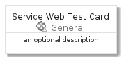
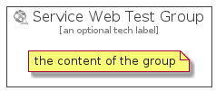

# ServiceWebTest


```text
azure-4/Item/General/ServiceWebTest
```

```text
include('azure-4/Item/General/ServiceWebTest')
```


| Illustration | ServiceWebTest | ServiceWebTestCard | ServiceWebTestGroup |
| :---: | :---: | :---: | :---: |
|  |  |  |  |


## ServiceWebTest

### Load remotely
```plantuml
@startuml
' configures the library
!global $LIB_BASE_LOCATION="https://github.com/tmorin/plantuml-libs/distribution"

' loads the library's bootstrap
!include $LIB_BASE_LOCATION/bootstrap.puml

' loads the package bootstrap
include('azure-4/bootstrap')

' loads the Item which embeds the element ServiceWebTest
include('azure-4/Item/General/ServiceWebTest')

' renders the element
ServiceWebTest('ServiceWebTest', 'Service Web Test', 'an optional tech label')
@enduml
```

### Load locally
```plantuml
@startuml
' configures the library
!global $INCLUSION_MODE="local"
!global $LIB_BASE_LOCATION="../../.."

' loads the library's bootstrap
!include $LIB_BASE_LOCATION/bootstrap.puml

' loads the package bootstrap
include('azure-4/bootstrap')

' loads the Item which embeds the element ServiceWebTest
include('azure-4/Item/General/ServiceWebTest')

' renders the element
ServiceWebTest('ServiceWebTest', 'Service Web Test', 'an optional tech label')
@enduml
```

## ServiceWebTestCard

### Load remotely
```plantuml
@startuml
' configures the library
!global $LIB_BASE_LOCATION="https://github.com/tmorin/plantuml-libs/distribution"

' loads the library's bootstrap
!include $LIB_BASE_LOCATION/bootstrap.puml

' loads the package bootstrap
include('azure-4/bootstrap')

' loads the Item which embeds the element ServiceWebTestCard
include('azure-4/Item/General/ServiceWebTest')

' renders the element
ServiceWebTestCard('ServiceWebTestCard', 'Service Web Test Card', 'an optional description')
@enduml
```

### Load locally
```plantuml
@startuml
' configures the library
!global $INCLUSION_MODE="local"
!global $LIB_BASE_LOCATION="../../.."

' loads the library's bootstrap
!include $LIB_BASE_LOCATION/bootstrap.puml

' loads the package bootstrap
include('azure-4/bootstrap')

' loads the Item which embeds the element ServiceWebTestCard
include('azure-4/Item/General/ServiceWebTest')

' renders the element
ServiceWebTestCard('ServiceWebTestCard', 'Service Web Test Card', 'an optional description')
@enduml
```

## ServiceWebTestGroup

### Load remotely
```plantuml
@startuml
' configures the library
!global $LIB_BASE_LOCATION="https://github.com/tmorin/plantuml-libs/distribution"

' loads the library's bootstrap
!include $LIB_BASE_LOCATION/bootstrap.puml

' loads the package bootstrap
include('azure-4/bootstrap')

' loads the Item which embeds the element ServiceWebTestGroup
include('azure-4/Item/General/ServiceWebTest')

' renders the element
ServiceWebTestGroup('ServiceWebTestGroup', 'Service Web Test Group', 'an optional tech label') {
    note as note
        the content of the group
    end note
}
@enduml
```

### Load locally
```plantuml
@startuml
' configures the library
!global $INCLUSION_MODE="local"
!global $LIB_BASE_LOCATION="../../.."

' loads the library's bootstrap
!include $LIB_BASE_LOCATION/bootstrap.puml

' loads the package bootstrap
include('azure-4/bootstrap')

' loads the Item which embeds the element ServiceWebTestGroup
include('azure-4/Item/General/ServiceWebTest')

' renders the element
ServiceWebTestGroup('ServiceWebTestGroup', 'Service Web Test Group', 'an optional tech label') {
    note as note
        the content of the group
    end note
}
@enduml
```

