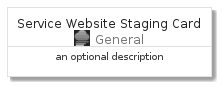

# ServiceWebsiteStaging


```text
azure-4/Item/General/ServiceWebsiteStaging
```

```text
include('azure-4/Item/General/ServiceWebsiteStaging')
```


| Illustration | ServiceWebsiteStaging | ServiceWebsiteStagingCard | ServiceWebsiteStagingGroup |
| :---: | :---: | :---: | :---: |
|  |  |  |  |


## ServiceWebsiteStaging

### Load remotely
```plantuml
@startuml
' configures the library
!global $LIB_BASE_LOCATION="https://raw.githubusercontent.com/tmorin/plantuml-libs/master/distribution"

' loads the library's bootstrap
!include $LIB_BASE_LOCATION/bootstrap.puml

' loads the package bootstrap
include('azure-4/bootstrap')

' loads the Item which embeds the element ServiceWebsiteStaging
include('azure-4/Item/General/ServiceWebsiteStaging')

' renders the element
ServiceWebsiteStaging('ServiceWebsiteStaging', 'Service Website Staging', 'an optional tech label', 'an optional description')
@enduml
```

### Load locally
```plantuml
@startuml
' configures the library
!global $INCLUSION_MODE="local"
!global $LIB_BASE_LOCATION="../../.."

' loads the library's bootstrap
!include $LIB_BASE_LOCATION/bootstrap.puml

' loads the package bootstrap
include('azure-4/bootstrap')

' loads the Item which embeds the element ServiceWebsiteStaging
include('azure-4/Item/General/ServiceWebsiteStaging')

' renders the element
ServiceWebsiteStaging('ServiceWebsiteStaging', 'Service Website Staging', 'an optional tech label', 'an optional description')
@enduml
```

## ServiceWebsiteStagingCard

### Load remotely
```plantuml
@startuml
' configures the library
!global $LIB_BASE_LOCATION="https://raw.githubusercontent.com/tmorin/plantuml-libs/master/distribution"

' loads the library's bootstrap
!include $LIB_BASE_LOCATION/bootstrap.puml

' loads the package bootstrap
include('azure-4/bootstrap')

' loads the Item which embeds the element ServiceWebsiteStagingCard
include('azure-4/Item/General/ServiceWebsiteStaging')

' renders the element
ServiceWebsiteStagingCard('ServiceWebsiteStagingCard', 'Service Website Staging Card', 'an optional description')
@enduml
```

### Load locally
```plantuml
@startuml
' configures the library
!global $INCLUSION_MODE="local"
!global $LIB_BASE_LOCATION="../../.."

' loads the library's bootstrap
!include $LIB_BASE_LOCATION/bootstrap.puml

' loads the package bootstrap
include('azure-4/bootstrap')

' loads the Item which embeds the element ServiceWebsiteStagingCard
include('azure-4/Item/General/ServiceWebsiteStaging')

' renders the element
ServiceWebsiteStagingCard('ServiceWebsiteStagingCard', 'Service Website Staging Card', 'an optional description')
@enduml
```

## ServiceWebsiteStagingGroup

### Load remotely
```plantuml
@startuml
' configures the library
!global $LIB_BASE_LOCATION="https://raw.githubusercontent.com/tmorin/plantuml-libs/master/distribution"

' loads the library's bootstrap
!include $LIB_BASE_LOCATION/bootstrap.puml

' loads the package bootstrap
include('azure-4/bootstrap')

' loads the Item which embeds the element ServiceWebsiteStagingGroup
include('azure-4/Item/General/ServiceWebsiteStaging')

' renders the element
ServiceWebsiteStagingGroup('ServiceWebsiteStagingGroup', 'Service Website Staging Group', 'an optional tech label') {
    note as note
        the content of the group
    end note
}
@enduml
```

### Load locally
```plantuml
@startuml
' configures the library
!global $INCLUSION_MODE="local"
!global $LIB_BASE_LOCATION="../../.."

' loads the library's bootstrap
!include $LIB_BASE_LOCATION/bootstrap.puml

' loads the package bootstrap
include('azure-4/bootstrap')

' loads the Item which embeds the element ServiceWebsiteStagingGroup
include('azure-4/Item/General/ServiceWebsiteStaging')

' renders the element
ServiceWebsiteStagingGroup('ServiceWebsiteStagingGroup', 'Service Website Staging Group', 'an optional tech label') {
    note as note
        the content of the group
    end note
}
@enduml
```

