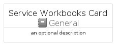
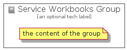

# ServiceWorkbooks


```text
azure-4/Item/General/ServiceWorkbooks
```

```text
include('azure-4/Item/General/ServiceWorkbooks')
```


| Illustration | ServiceWorkbooks | ServiceWorkbooksCard | ServiceWorkbooksGroup |
| :---: | :---: | :---: | :---: |
|  |  |  |  |


## ServiceWorkbooks

### Load remotely
```plantuml
@startuml
' configures the library
!global $LIB_BASE_LOCATION="https://raw.githubusercontent.com/tmorin/plantuml-libs/master/distribution"

' loads the library's bootstrap
!include $LIB_BASE_LOCATION/bootstrap.puml

' loads the package bootstrap
include('azure-4/bootstrap')

' loads the Item which embeds the element ServiceWorkbooks
include('azure-4/Item/General/ServiceWorkbooks')

' renders the element
ServiceWorkbooks('ServiceWorkbooks', 'Service Workbooks', 'an optional tech label')
@enduml
```

### Load locally
```plantuml
@startuml
' configures the library
!global $INCLUSION_MODE="local"
!global $LIB_BASE_LOCATION="../../.."

' loads the library's bootstrap
!include $LIB_BASE_LOCATION/bootstrap.puml

' loads the package bootstrap
include('azure-4/bootstrap')

' loads the Item which embeds the element ServiceWorkbooks
include('azure-4/Item/General/ServiceWorkbooks')

' renders the element
ServiceWorkbooks('ServiceWorkbooks', 'Service Workbooks', 'an optional tech label')
@enduml
```

## ServiceWorkbooksCard

### Load remotely
```plantuml
@startuml
' configures the library
!global $LIB_BASE_LOCATION="https://raw.githubusercontent.com/tmorin/plantuml-libs/master/distribution"

' loads the library's bootstrap
!include $LIB_BASE_LOCATION/bootstrap.puml

' loads the package bootstrap
include('azure-4/bootstrap')

' loads the Item which embeds the element ServiceWorkbooksCard
include('azure-4/Item/General/ServiceWorkbooks')

' renders the element
ServiceWorkbooksCard('ServiceWorkbooksCard', 'Service Workbooks Card', 'an optional description')
@enduml
```

### Load locally
```plantuml
@startuml
' configures the library
!global $INCLUSION_MODE="local"
!global $LIB_BASE_LOCATION="../../.."

' loads the library's bootstrap
!include $LIB_BASE_LOCATION/bootstrap.puml

' loads the package bootstrap
include('azure-4/bootstrap')

' loads the Item which embeds the element ServiceWorkbooksCard
include('azure-4/Item/General/ServiceWorkbooks')

' renders the element
ServiceWorkbooksCard('ServiceWorkbooksCard', 'Service Workbooks Card', 'an optional description')
@enduml
```

## ServiceWorkbooksGroup

### Load remotely
```plantuml
@startuml
' configures the library
!global $LIB_BASE_LOCATION="https://raw.githubusercontent.com/tmorin/plantuml-libs/master/distribution"

' loads the library's bootstrap
!include $LIB_BASE_LOCATION/bootstrap.puml

' loads the package bootstrap
include('azure-4/bootstrap')

' loads the Item which embeds the element ServiceWorkbooksGroup
include('azure-4/Item/General/ServiceWorkbooks')

' renders the element
ServiceWorkbooksGroup('ServiceWorkbooksGroup', 'Service Workbooks Group', 'an optional tech label') {
    note as note
        the content of the group
    end note
}
@enduml
```

### Load locally
```plantuml
@startuml
' configures the library
!global $INCLUSION_MODE="local"
!global $LIB_BASE_LOCATION="../../.."

' loads the library's bootstrap
!include $LIB_BASE_LOCATION/bootstrap.puml

' loads the package bootstrap
include('azure-4/bootstrap')

' loads the Item which embeds the element ServiceWorkbooksGroup
include('azure-4/Item/General/ServiceWorkbooks')

' renders the element
ServiceWorkbooksGroup('ServiceWorkbooksGroup', 'Service Workbooks Group', 'an optional tech label') {
    note as note
        the content of the group
    end note
}
@enduml
```

