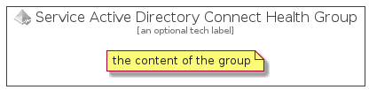

# ServiceActiveDirectoryConnectHealth


```text
azure-4/Item/Identity/ServiceActiveDirectoryConnectHealth
```

```text
include('azure-4/Item/Identity/ServiceActiveDirectoryConnectHealth')
```


| Illustration | ServiceActiveDirectoryConnectHealth | ServiceActiveDirectoryConnectHealthCard | ServiceActiveDirectoryConnectHealthGroup |
| :---: | :---: | :---: | :---: |
|  |  |  |  |


## ServiceActiveDirectoryConnectHealth

### Load remotely
```plantuml
@startuml
' configures the library
!global $LIB_BASE_LOCATION="https://raw.githubusercontent.com/tmorin/plantuml-libs/master/distribution"

' loads the library's bootstrap
!include $LIB_BASE_LOCATION/bootstrap.puml

' loads the package bootstrap
include('azure-4/bootstrap')

' loads the Item which embeds the element ServiceActiveDirectoryConnectHealth
include('azure-4/Item/Identity/ServiceActiveDirectoryConnectHealth')

' renders the element
ServiceActiveDirectoryConnectHealth('ServiceActiveDirectoryConnectHealth', 'Service Active Directory Connect Health', 'an optional tech label')
@enduml
```

### Load locally
```plantuml
@startuml
' configures the library
!global $INCLUSION_MODE="local"
!global $LIB_BASE_LOCATION="../../.."

' loads the library's bootstrap
!include $LIB_BASE_LOCATION/bootstrap.puml

' loads the package bootstrap
include('azure-4/bootstrap')

' loads the Item which embeds the element ServiceActiveDirectoryConnectHealth
include('azure-4/Item/Identity/ServiceActiveDirectoryConnectHealth')

' renders the element
ServiceActiveDirectoryConnectHealth('ServiceActiveDirectoryConnectHealth', 'Service Active Directory Connect Health', 'an optional tech label')
@enduml
```

## ServiceActiveDirectoryConnectHealthCard

### Load remotely
```plantuml
@startuml
' configures the library
!global $LIB_BASE_LOCATION="https://raw.githubusercontent.com/tmorin/plantuml-libs/master/distribution"

' loads the library's bootstrap
!include $LIB_BASE_LOCATION/bootstrap.puml

' loads the package bootstrap
include('azure-4/bootstrap')

' loads the Item which embeds the element ServiceActiveDirectoryConnectHealthCard
include('azure-4/Item/Identity/ServiceActiveDirectoryConnectHealth')

' renders the element
ServiceActiveDirectoryConnectHealthCard('ServiceActiveDirectoryConnectHealthCard', 'Service Active Directory Connect Health Card', 'an optional description')
@enduml
```

### Load locally
```plantuml
@startuml
' configures the library
!global $INCLUSION_MODE="local"
!global $LIB_BASE_LOCATION="../../.."

' loads the library's bootstrap
!include $LIB_BASE_LOCATION/bootstrap.puml

' loads the package bootstrap
include('azure-4/bootstrap')

' loads the Item which embeds the element ServiceActiveDirectoryConnectHealthCard
include('azure-4/Item/Identity/ServiceActiveDirectoryConnectHealth')

' renders the element
ServiceActiveDirectoryConnectHealthCard('ServiceActiveDirectoryConnectHealthCard', 'Service Active Directory Connect Health Card', 'an optional description')
@enduml
```

## ServiceActiveDirectoryConnectHealthGroup

### Load remotely
```plantuml
@startuml
' configures the library
!global $LIB_BASE_LOCATION="https://raw.githubusercontent.com/tmorin/plantuml-libs/master/distribution"

' loads the library's bootstrap
!include $LIB_BASE_LOCATION/bootstrap.puml

' loads the package bootstrap
include('azure-4/bootstrap')

' loads the Item which embeds the element ServiceActiveDirectoryConnectHealthGroup
include('azure-4/Item/Identity/ServiceActiveDirectoryConnectHealth')

' renders the element
ServiceActiveDirectoryConnectHealthGroup('ServiceActiveDirectoryConnectHealthGroup', 'Service Active Directory Connect Health Group', 'an optional tech label') {
    note as note
        the content of the group
    end note
}
@enduml
```

### Load locally
```plantuml
@startuml
' configures the library
!global $INCLUSION_MODE="local"
!global $LIB_BASE_LOCATION="../../.."

' loads the library's bootstrap
!include $LIB_BASE_LOCATION/bootstrap.puml

' loads the package bootstrap
include('azure-4/bootstrap')

' loads the Item which embeds the element ServiceActiveDirectoryConnectHealthGroup
include('azure-4/Item/Identity/ServiceActiveDirectoryConnectHealth')

' renders the element
ServiceActiveDirectoryConnectHealthGroup('ServiceActiveDirectoryConnectHealthGroup', 'Service Active Directory Connect Health Group', 'an optional tech label') {
    note as note
        the content of the group
    end note
}
@enduml
```

