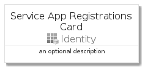
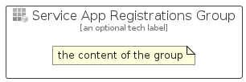

# ServiceAppRegistrations


```text
azure-4/Item/Identity/ServiceAppRegistrations
```

```text
include('azure-4/Item/Identity/ServiceAppRegistrations')
```


| Illustration | ServiceAppRegistrations | ServiceAppRegistrationsCard | ServiceAppRegistrationsGroup |
| :---: | :---: | :---: | :---: |
|  |  |  |  |


## ServiceAppRegistrations

### Load remotely
```plantuml
@startuml
' configures the library
!global $LIB_BASE_LOCATION="https://raw.githubusercontent.com/tmorin/plantuml-libs/master/distribution"

' loads the library's bootstrap
!include $LIB_BASE_LOCATION/bootstrap.puml

' loads the package bootstrap
include('azure-4/bootstrap')

' loads the Item which embeds the element ServiceAppRegistrations
include('azure-4/Item/Identity/ServiceAppRegistrations')

' renders the element
ServiceAppRegistrations('ServiceAppRegistrations', 'Service App Registrations', 'an optional tech label', 'an optional description')
@enduml
```

### Load locally
```plantuml
@startuml
' configures the library
!global $INCLUSION_MODE="local"
!global $LIB_BASE_LOCATION="../../.."

' loads the library's bootstrap
!include $LIB_BASE_LOCATION/bootstrap.puml

' loads the package bootstrap
include('azure-4/bootstrap')

' loads the Item which embeds the element ServiceAppRegistrations
include('azure-4/Item/Identity/ServiceAppRegistrations')

' renders the element
ServiceAppRegistrations('ServiceAppRegistrations', 'Service App Registrations', 'an optional tech label', 'an optional description')
@enduml
```

## ServiceAppRegistrationsCard

### Load remotely
```plantuml
@startuml
' configures the library
!global $LIB_BASE_LOCATION="https://raw.githubusercontent.com/tmorin/plantuml-libs/master/distribution"

' loads the library's bootstrap
!include $LIB_BASE_LOCATION/bootstrap.puml

' loads the package bootstrap
include('azure-4/bootstrap')

' loads the Item which embeds the element ServiceAppRegistrationsCard
include('azure-4/Item/Identity/ServiceAppRegistrations')

' renders the element
ServiceAppRegistrationsCard('ServiceAppRegistrationsCard', 'Service App Registrations Card', 'an optional description')
@enduml
```

### Load locally
```plantuml
@startuml
' configures the library
!global $INCLUSION_MODE="local"
!global $LIB_BASE_LOCATION="../../.."

' loads the library's bootstrap
!include $LIB_BASE_LOCATION/bootstrap.puml

' loads the package bootstrap
include('azure-4/bootstrap')

' loads the Item which embeds the element ServiceAppRegistrationsCard
include('azure-4/Item/Identity/ServiceAppRegistrations')

' renders the element
ServiceAppRegistrationsCard('ServiceAppRegistrationsCard', 'Service App Registrations Card', 'an optional description')
@enduml
```

## ServiceAppRegistrationsGroup

### Load remotely
```plantuml
@startuml
' configures the library
!global $LIB_BASE_LOCATION="https://raw.githubusercontent.com/tmorin/plantuml-libs/master/distribution"

' loads the library's bootstrap
!include $LIB_BASE_LOCATION/bootstrap.puml

' loads the package bootstrap
include('azure-4/bootstrap')

' loads the Item which embeds the element ServiceAppRegistrationsGroup
include('azure-4/Item/Identity/ServiceAppRegistrations')

' renders the element
ServiceAppRegistrationsGroup('ServiceAppRegistrationsGroup', 'Service App Registrations Group', 'an optional tech label') {
    note as note
        the content of the group
    end note
}
@enduml
```

### Load locally
```plantuml
@startuml
' configures the library
!global $INCLUSION_MODE="local"
!global $LIB_BASE_LOCATION="../../.."

' loads the library's bootstrap
!include $LIB_BASE_LOCATION/bootstrap.puml

' loads the package bootstrap
include('azure-4/bootstrap')

' loads the Item which embeds the element ServiceAppRegistrationsGroup
include('azure-4/Item/Identity/ServiceAppRegistrations')

' renders the element
ServiceAppRegistrationsGroup('ServiceAppRegistrationsGroup', 'Service App Registrations Group', 'an optional tech label') {
    note as note
        the content of the group
    end note
}
@enduml
```

