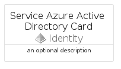
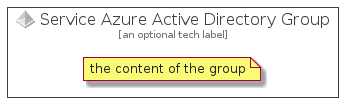

# ServiceAzureActiveDirectory


```text
azure-4/Item/Identity/ServiceAzureActiveDirectory
```

```text
include('azure-4/Item/Identity/ServiceAzureActiveDirectory')
```


| Illustration | ServiceAzureActiveDirectory | ServiceAzureActiveDirectoryCard | ServiceAzureActiveDirectoryGroup |
| :---: | :---: | :---: | :---: |
|  |  |  |  |


## ServiceAzureActiveDirectory

### Load remotely
```plantuml
@startuml
' configures the library
!global $LIB_BASE_LOCATION="https://raw.githubusercontent.com/tmorin/plantuml-libs/master/distribution"

' loads the library's bootstrap
!include $LIB_BASE_LOCATION/bootstrap.puml

' loads the package bootstrap
include('azure-4/bootstrap')

' loads the Item which embeds the element ServiceAzureActiveDirectory
include('azure-4/Item/Identity/ServiceAzureActiveDirectory')

' renders the element
ServiceAzureActiveDirectory('ServiceAzureActiveDirectory', 'Service Azure Active Directory', 'an optional tech label', 'an optional description')
@enduml
```

### Load locally
```plantuml
@startuml
' configures the library
!global $INCLUSION_MODE="local"
!global $LIB_BASE_LOCATION="../../.."

' loads the library's bootstrap
!include $LIB_BASE_LOCATION/bootstrap.puml

' loads the package bootstrap
include('azure-4/bootstrap')

' loads the Item which embeds the element ServiceAzureActiveDirectory
include('azure-4/Item/Identity/ServiceAzureActiveDirectory')

' renders the element
ServiceAzureActiveDirectory('ServiceAzureActiveDirectory', 'Service Azure Active Directory', 'an optional tech label', 'an optional description')
@enduml
```

## ServiceAzureActiveDirectoryCard

### Load remotely
```plantuml
@startuml
' configures the library
!global $LIB_BASE_LOCATION="https://raw.githubusercontent.com/tmorin/plantuml-libs/master/distribution"

' loads the library's bootstrap
!include $LIB_BASE_LOCATION/bootstrap.puml

' loads the package bootstrap
include('azure-4/bootstrap')

' loads the Item which embeds the element ServiceAzureActiveDirectoryCard
include('azure-4/Item/Identity/ServiceAzureActiveDirectory')

' renders the element
ServiceAzureActiveDirectoryCard('ServiceAzureActiveDirectoryCard', 'Service Azure Active Directory Card', 'an optional description')
@enduml
```

### Load locally
```plantuml
@startuml
' configures the library
!global $INCLUSION_MODE="local"
!global $LIB_BASE_LOCATION="../../.."

' loads the library's bootstrap
!include $LIB_BASE_LOCATION/bootstrap.puml

' loads the package bootstrap
include('azure-4/bootstrap')

' loads the Item which embeds the element ServiceAzureActiveDirectoryCard
include('azure-4/Item/Identity/ServiceAzureActiveDirectory')

' renders the element
ServiceAzureActiveDirectoryCard('ServiceAzureActiveDirectoryCard', 'Service Azure Active Directory Card', 'an optional description')
@enduml
```

## ServiceAzureActiveDirectoryGroup

### Load remotely
```plantuml
@startuml
' configures the library
!global $LIB_BASE_LOCATION="https://raw.githubusercontent.com/tmorin/plantuml-libs/master/distribution"

' loads the library's bootstrap
!include $LIB_BASE_LOCATION/bootstrap.puml

' loads the package bootstrap
include('azure-4/bootstrap')

' loads the Item which embeds the element ServiceAzureActiveDirectoryGroup
include('azure-4/Item/Identity/ServiceAzureActiveDirectory')

' renders the element
ServiceAzureActiveDirectoryGroup('ServiceAzureActiveDirectoryGroup', 'Service Azure Active Directory Group', 'an optional tech label') {
    note as note
        the content of the group
    end note
}
@enduml
```

### Load locally
```plantuml
@startuml
' configures the library
!global $INCLUSION_MODE="local"
!global $LIB_BASE_LOCATION="../../.."

' loads the library's bootstrap
!include $LIB_BASE_LOCATION/bootstrap.puml

' loads the package bootstrap
include('azure-4/bootstrap')

' loads the Item which embeds the element ServiceAzureActiveDirectoryGroup
include('azure-4/Item/Identity/ServiceAzureActiveDirectory')

' renders the element
ServiceAzureActiveDirectoryGroup('ServiceAzureActiveDirectoryGroup', 'Service Azure Active Directory Group', 'an optional tech label') {
    note as note
        the content of the group
    end note
}
@enduml
```

