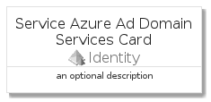
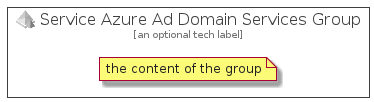

# ServiceAzureAdDomainServices


```text
azure-4/Item/Identity/ServiceAzureAdDomainServices
```

```text
include('azure-4/Item/Identity/ServiceAzureAdDomainServices')
```


| Illustration | ServiceAzureAdDomainServices | ServiceAzureAdDomainServicesCard | ServiceAzureAdDomainServicesGroup |
| :---: | :---: | :---: | :---: |
|  |  |  |  |


## ServiceAzureAdDomainServices

### Load remotely
```plantuml
@startuml
' configures the library
!global $LIB_BASE_LOCATION="https://raw.githubusercontent.com/tmorin/plantuml-libs/master/distribution"

' loads the library's bootstrap
!include $LIB_BASE_LOCATION/bootstrap.puml

' loads the package bootstrap
include('azure-4/bootstrap')

' loads the Item which embeds the element ServiceAzureAdDomainServices
include('azure-4/Item/Identity/ServiceAzureAdDomainServices')

' renders the element
ServiceAzureAdDomainServices('ServiceAzureAdDomainServices', 'Service Azure Ad Domain Services', 'an optional tech label')
@enduml
```

### Load locally
```plantuml
@startuml
' configures the library
!global $INCLUSION_MODE="local"
!global $LIB_BASE_LOCATION="../../.."

' loads the library's bootstrap
!include $LIB_BASE_LOCATION/bootstrap.puml

' loads the package bootstrap
include('azure-4/bootstrap')

' loads the Item which embeds the element ServiceAzureAdDomainServices
include('azure-4/Item/Identity/ServiceAzureAdDomainServices')

' renders the element
ServiceAzureAdDomainServices('ServiceAzureAdDomainServices', 'Service Azure Ad Domain Services', 'an optional tech label')
@enduml
```

## ServiceAzureAdDomainServicesCard

### Load remotely
```plantuml
@startuml
' configures the library
!global $LIB_BASE_LOCATION="https://raw.githubusercontent.com/tmorin/plantuml-libs/master/distribution"

' loads the library's bootstrap
!include $LIB_BASE_LOCATION/bootstrap.puml

' loads the package bootstrap
include('azure-4/bootstrap')

' loads the Item which embeds the element ServiceAzureAdDomainServicesCard
include('azure-4/Item/Identity/ServiceAzureAdDomainServices')

' renders the element
ServiceAzureAdDomainServicesCard('ServiceAzureAdDomainServicesCard', 'Service Azure Ad Domain Services Card', 'an optional description')
@enduml
```

### Load locally
```plantuml
@startuml
' configures the library
!global $INCLUSION_MODE="local"
!global $LIB_BASE_LOCATION="../../.."

' loads the library's bootstrap
!include $LIB_BASE_LOCATION/bootstrap.puml

' loads the package bootstrap
include('azure-4/bootstrap')

' loads the Item which embeds the element ServiceAzureAdDomainServicesCard
include('azure-4/Item/Identity/ServiceAzureAdDomainServices')

' renders the element
ServiceAzureAdDomainServicesCard('ServiceAzureAdDomainServicesCard', 'Service Azure Ad Domain Services Card', 'an optional description')
@enduml
```

## ServiceAzureAdDomainServicesGroup

### Load remotely
```plantuml
@startuml
' configures the library
!global $LIB_BASE_LOCATION="https://raw.githubusercontent.com/tmorin/plantuml-libs/master/distribution"

' loads the library's bootstrap
!include $LIB_BASE_LOCATION/bootstrap.puml

' loads the package bootstrap
include('azure-4/bootstrap')

' loads the Item which embeds the element ServiceAzureAdDomainServicesGroup
include('azure-4/Item/Identity/ServiceAzureAdDomainServices')

' renders the element
ServiceAzureAdDomainServicesGroup('ServiceAzureAdDomainServicesGroup', 'Service Azure Ad Domain Services Group', 'an optional tech label') {
    note as note
        the content of the group
    end note
}
@enduml
```

### Load locally
```plantuml
@startuml
' configures the library
!global $INCLUSION_MODE="local"
!global $LIB_BASE_LOCATION="../../.."

' loads the library's bootstrap
!include $LIB_BASE_LOCATION/bootstrap.puml

' loads the package bootstrap
include('azure-4/bootstrap')

' loads the Item which embeds the element ServiceAzureAdDomainServicesGroup
include('azure-4/Item/Identity/ServiceAzureAdDomainServices')

' renders the element
ServiceAzureAdDomainServicesGroup('ServiceAzureAdDomainServicesGroup', 'Service Azure Ad Domain Services Group', 'an optional tech label') {
    note as note
        the content of the group
    end note
}
@enduml
```

