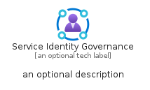
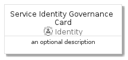
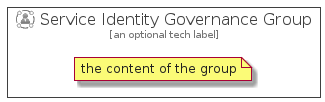

# ServiceIdentityGovernance


```text
azure-4/Item/Identity/ServiceIdentityGovernance
```

```text
include('azure-4/Item/Identity/ServiceIdentityGovernance')
```


| Illustration | ServiceIdentityGovernance | ServiceIdentityGovernanceCard | ServiceIdentityGovernanceGroup |
| :---: | :---: | :---: | :---: |
|  |  |  |  |


## ServiceIdentityGovernance

### Load remotely
```plantuml
@startuml
' configures the library
!global $LIB_BASE_LOCATION="https://github.com/tmorin/plantuml-libs/distribution"

' loads the library's bootstrap
!include $LIB_BASE_LOCATION/bootstrap.puml

' loads the package bootstrap
include('azure-4/bootstrap')

' loads the Item which embeds the element ServiceIdentityGovernance
include('azure-4/Item/Identity/ServiceIdentityGovernance')

' renders the element
ServiceIdentityGovernance('ServiceIdentityGovernance', 'Service Identity Governance', 'an optional tech label')
@enduml
```

### Load locally
```plantuml
@startuml
' configures the library
!global $INCLUSION_MODE="local"
!global $LIB_BASE_LOCATION="../../.."

' loads the library's bootstrap
!include $LIB_BASE_LOCATION/bootstrap.puml

' loads the package bootstrap
include('azure-4/bootstrap')

' loads the Item which embeds the element ServiceIdentityGovernance
include('azure-4/Item/Identity/ServiceIdentityGovernance')

' renders the element
ServiceIdentityGovernance('ServiceIdentityGovernance', 'Service Identity Governance', 'an optional tech label')
@enduml
```

## ServiceIdentityGovernanceCard

### Load remotely
```plantuml
@startuml
' configures the library
!global $LIB_BASE_LOCATION="https://github.com/tmorin/plantuml-libs/distribution"

' loads the library's bootstrap
!include $LIB_BASE_LOCATION/bootstrap.puml

' loads the package bootstrap
include('azure-4/bootstrap')

' loads the Item which embeds the element ServiceIdentityGovernanceCard
include('azure-4/Item/Identity/ServiceIdentityGovernance')

' renders the element
ServiceIdentityGovernanceCard('ServiceIdentityGovernanceCard', 'Service Identity Governance Card', 'an optional description')
@enduml
```

### Load locally
```plantuml
@startuml
' configures the library
!global $INCLUSION_MODE="local"
!global $LIB_BASE_LOCATION="../../.."

' loads the library's bootstrap
!include $LIB_BASE_LOCATION/bootstrap.puml

' loads the package bootstrap
include('azure-4/bootstrap')

' loads the Item which embeds the element ServiceIdentityGovernanceCard
include('azure-4/Item/Identity/ServiceIdentityGovernance')

' renders the element
ServiceIdentityGovernanceCard('ServiceIdentityGovernanceCard', 'Service Identity Governance Card', 'an optional description')
@enduml
```

## ServiceIdentityGovernanceGroup

### Load remotely
```plantuml
@startuml
' configures the library
!global $LIB_BASE_LOCATION="https://github.com/tmorin/plantuml-libs/distribution"

' loads the library's bootstrap
!include $LIB_BASE_LOCATION/bootstrap.puml

' loads the package bootstrap
include('azure-4/bootstrap')

' loads the Item which embeds the element ServiceIdentityGovernanceGroup
include('azure-4/Item/Identity/ServiceIdentityGovernance')

' renders the element
ServiceIdentityGovernanceGroup('ServiceIdentityGovernanceGroup', 'Service Identity Governance Group', 'an optional tech label') {
    note as note
        the content of the group
    end note
}
@enduml
```

### Load locally
```plantuml
@startuml
' configures the library
!global $INCLUSION_MODE="local"
!global $LIB_BASE_LOCATION="../../.."

' loads the library's bootstrap
!include $LIB_BASE_LOCATION/bootstrap.puml

' loads the package bootstrap
include('azure-4/bootstrap')

' loads the Item which embeds the element ServiceIdentityGovernanceGroup
include('azure-4/Item/Identity/ServiceIdentityGovernance')

' renders the element
ServiceIdentityGovernanceGroup('ServiceIdentityGovernanceGroup', 'Service Identity Governance Group', 'an optional tech label') {
    note as note
        the content of the group
    end note
}
@enduml
```

