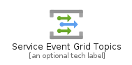
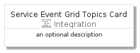
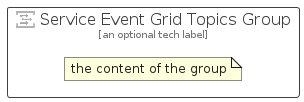

# ServiceEventGridTopics


```text
azure-4/Item/Integration/ServiceEventGridTopics
```

```text
include('azure-4/Item/Integration/ServiceEventGridTopics')
```


| Illustration | ServiceEventGridTopics | ServiceEventGridTopicsCard | ServiceEventGridTopicsGroup |
| :---: | :---: | :---: | :---: |
|  |  |  |  |


## ServiceEventGridTopics

### Load remotely
```plantuml
@startuml
' configures the library
!global $LIB_BASE_LOCATION="https://github.com/tmorin/plantuml-libs/distribution"

' loads the library's bootstrap
!include $LIB_BASE_LOCATION/bootstrap.puml

' loads the package bootstrap
include('azure-4/bootstrap')

' loads the Item which embeds the element ServiceEventGridTopics
include('azure-4/Item/Integration/ServiceEventGridTopics')

' renders the element
ServiceEventGridTopics('ServiceEventGridTopics', 'Service Event Grid Topics', 'an optional tech label')
@enduml
```

### Load locally
```plantuml
@startuml
' configures the library
!global $INCLUSION_MODE="local"
!global $LIB_BASE_LOCATION="../../.."

' loads the library's bootstrap
!include $LIB_BASE_LOCATION/bootstrap.puml

' loads the package bootstrap
include('azure-4/bootstrap')

' loads the Item which embeds the element ServiceEventGridTopics
include('azure-4/Item/Integration/ServiceEventGridTopics')

' renders the element
ServiceEventGridTopics('ServiceEventGridTopics', 'Service Event Grid Topics', 'an optional tech label')
@enduml
```

## ServiceEventGridTopicsCard

### Load remotely
```plantuml
@startuml
' configures the library
!global $LIB_BASE_LOCATION="https://github.com/tmorin/plantuml-libs/distribution"

' loads the library's bootstrap
!include $LIB_BASE_LOCATION/bootstrap.puml

' loads the package bootstrap
include('azure-4/bootstrap')

' loads the Item which embeds the element ServiceEventGridTopicsCard
include('azure-4/Item/Integration/ServiceEventGridTopics')

' renders the element
ServiceEventGridTopicsCard('ServiceEventGridTopicsCard', 'Service Event Grid Topics Card', 'an optional description')
@enduml
```

### Load locally
```plantuml
@startuml
' configures the library
!global $INCLUSION_MODE="local"
!global $LIB_BASE_LOCATION="../../.."

' loads the library's bootstrap
!include $LIB_BASE_LOCATION/bootstrap.puml

' loads the package bootstrap
include('azure-4/bootstrap')

' loads the Item which embeds the element ServiceEventGridTopicsCard
include('azure-4/Item/Integration/ServiceEventGridTopics')

' renders the element
ServiceEventGridTopicsCard('ServiceEventGridTopicsCard', 'Service Event Grid Topics Card', 'an optional description')
@enduml
```

## ServiceEventGridTopicsGroup

### Load remotely
```plantuml
@startuml
' configures the library
!global $LIB_BASE_LOCATION="https://github.com/tmorin/plantuml-libs/distribution"

' loads the library's bootstrap
!include $LIB_BASE_LOCATION/bootstrap.puml

' loads the package bootstrap
include('azure-4/bootstrap')

' loads the Item which embeds the element ServiceEventGridTopicsGroup
include('azure-4/Item/Integration/ServiceEventGridTopics')

' renders the element
ServiceEventGridTopicsGroup('ServiceEventGridTopicsGroup', 'Service Event Grid Topics Group', 'an optional tech label') {
    note as note
        the content of the group
    end note
}
@enduml
```

### Load locally
```plantuml
@startuml
' configures the library
!global $INCLUSION_MODE="local"
!global $LIB_BASE_LOCATION="../../.."

' loads the library's bootstrap
!include $LIB_BASE_LOCATION/bootstrap.puml

' loads the package bootstrap
include('azure-4/bootstrap')

' loads the Item which embeds the element ServiceEventGridTopicsGroup
include('azure-4/Item/Integration/ServiceEventGridTopics')

' renders the element
ServiceEventGridTopicsGroup('ServiceEventGridTopicsGroup', 'Service Event Grid Topics Group', 'an optional tech label') {
    note as note
        the content of the group
    end note
}
@enduml
```

