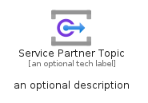
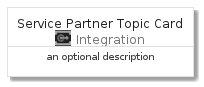
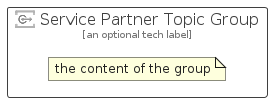

# ServicePartnerTopic


```text
azure-4/Item/Integration/ServicePartnerTopic
```

```text
include('azure-4/Item/Integration/ServicePartnerTopic')
```


| Illustration | ServicePartnerTopic | ServicePartnerTopicCard | ServicePartnerTopicGroup |
| :---: | :---: | :---: | :---: |
|  |  |  |  |


## ServicePartnerTopic

### Load remotely
```plantuml
@startuml
' configures the library
!global $LIB_BASE_LOCATION="https://raw.githubusercontent.com/tmorin/plantuml-libs/master/distribution"

' loads the library's bootstrap
!include $LIB_BASE_LOCATION/bootstrap.puml

' loads the package bootstrap
include('azure-4/bootstrap')

' loads the Item which embeds the element ServicePartnerTopic
include('azure-4/Item/Integration/ServicePartnerTopic')

' renders the element
ServicePartnerTopic('ServicePartnerTopic', 'Service Partner Topic', 'an optional tech label')
@enduml
```

### Load locally
```plantuml
@startuml
' configures the library
!global $INCLUSION_MODE="local"
!global $LIB_BASE_LOCATION="../../.."

' loads the library's bootstrap
!include $LIB_BASE_LOCATION/bootstrap.puml

' loads the package bootstrap
include('azure-4/bootstrap')

' loads the Item which embeds the element ServicePartnerTopic
include('azure-4/Item/Integration/ServicePartnerTopic')

' renders the element
ServicePartnerTopic('ServicePartnerTopic', 'Service Partner Topic', 'an optional tech label')
@enduml
```

## ServicePartnerTopicCard

### Load remotely
```plantuml
@startuml
' configures the library
!global $LIB_BASE_LOCATION="https://raw.githubusercontent.com/tmorin/plantuml-libs/master/distribution"

' loads the library's bootstrap
!include $LIB_BASE_LOCATION/bootstrap.puml

' loads the package bootstrap
include('azure-4/bootstrap')

' loads the Item which embeds the element ServicePartnerTopicCard
include('azure-4/Item/Integration/ServicePartnerTopic')

' renders the element
ServicePartnerTopicCard('ServicePartnerTopicCard', 'Service Partner Topic Card', 'an optional description')
@enduml
```

### Load locally
```plantuml
@startuml
' configures the library
!global $INCLUSION_MODE="local"
!global $LIB_BASE_LOCATION="../../.."

' loads the library's bootstrap
!include $LIB_BASE_LOCATION/bootstrap.puml

' loads the package bootstrap
include('azure-4/bootstrap')

' loads the Item which embeds the element ServicePartnerTopicCard
include('azure-4/Item/Integration/ServicePartnerTopic')

' renders the element
ServicePartnerTopicCard('ServicePartnerTopicCard', 'Service Partner Topic Card', 'an optional description')
@enduml
```

## ServicePartnerTopicGroup

### Load remotely
```plantuml
@startuml
' configures the library
!global $LIB_BASE_LOCATION="https://raw.githubusercontent.com/tmorin/plantuml-libs/master/distribution"

' loads the library's bootstrap
!include $LIB_BASE_LOCATION/bootstrap.puml

' loads the package bootstrap
include('azure-4/bootstrap')

' loads the Item which embeds the element ServicePartnerTopicGroup
include('azure-4/Item/Integration/ServicePartnerTopic')

' renders the element
ServicePartnerTopicGroup('ServicePartnerTopicGroup', 'Service Partner Topic Group', 'an optional tech label') {
    note as note
        the content of the group
    end note
}
@enduml
```

### Load locally
```plantuml
@startuml
' configures the library
!global $INCLUSION_MODE="local"
!global $LIB_BASE_LOCATION="../../.."

' loads the library's bootstrap
!include $LIB_BASE_LOCATION/bootstrap.puml

' loads the package bootstrap
include('azure-4/bootstrap')

' loads the Item which embeds the element ServicePartnerTopicGroup
include('azure-4/Item/Integration/ServicePartnerTopic')

' renders the element
ServicePartnerTopicGroup('ServicePartnerTopicGroup', 'Service Partner Topic Group', 'an optional tech label') {
    note as note
        the content of the group
    end note
}
@enduml
```

