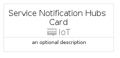
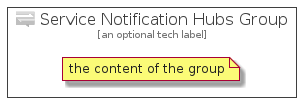

# ServiceNotificationHubs


```text
azure-4/Item/IoT/ServiceNotificationHubs
```

```text
include('azure-4/Item/IoT/ServiceNotificationHubs')
```


| Illustration | ServiceNotificationHubs | ServiceNotificationHubsCard | ServiceNotificationHubsGroup |
| :---: | :---: | :---: | :---: |
|  |  |  |  |


## ServiceNotificationHubs

### Load remotely
```plantuml
@startuml
' configures the library
!global $LIB_BASE_LOCATION="https://github.com/tmorin/plantuml-libs/distribution"

' loads the library's bootstrap
!include $LIB_BASE_LOCATION/bootstrap.puml

' loads the package bootstrap
include('azure-4/bootstrap')

' loads the Item which embeds the element ServiceNotificationHubs
include('azure-4/Item/IoT/ServiceNotificationHubs')

' renders the element
ServiceNotificationHubs('ServiceNotificationHubs', 'Service Notification Hubs', 'an optional tech label')
@enduml
```

### Load locally
```plantuml
@startuml
' configures the library
!global $INCLUSION_MODE="local"
!global $LIB_BASE_LOCATION="../../.."

' loads the library's bootstrap
!include $LIB_BASE_LOCATION/bootstrap.puml

' loads the package bootstrap
include('azure-4/bootstrap')

' loads the Item which embeds the element ServiceNotificationHubs
include('azure-4/Item/IoT/ServiceNotificationHubs')

' renders the element
ServiceNotificationHubs('ServiceNotificationHubs', 'Service Notification Hubs', 'an optional tech label')
@enduml
```

## ServiceNotificationHubsCard

### Load remotely
```plantuml
@startuml
' configures the library
!global $LIB_BASE_LOCATION="https://github.com/tmorin/plantuml-libs/distribution"

' loads the library's bootstrap
!include $LIB_BASE_LOCATION/bootstrap.puml

' loads the package bootstrap
include('azure-4/bootstrap')

' loads the Item which embeds the element ServiceNotificationHubsCard
include('azure-4/Item/IoT/ServiceNotificationHubs')

' renders the element
ServiceNotificationHubsCard('ServiceNotificationHubsCard', 'Service Notification Hubs Card', 'an optional description')
@enduml
```

### Load locally
```plantuml
@startuml
' configures the library
!global $INCLUSION_MODE="local"
!global $LIB_BASE_LOCATION="../../.."

' loads the library's bootstrap
!include $LIB_BASE_LOCATION/bootstrap.puml

' loads the package bootstrap
include('azure-4/bootstrap')

' loads the Item which embeds the element ServiceNotificationHubsCard
include('azure-4/Item/IoT/ServiceNotificationHubs')

' renders the element
ServiceNotificationHubsCard('ServiceNotificationHubsCard', 'Service Notification Hubs Card', 'an optional description')
@enduml
```

## ServiceNotificationHubsGroup

### Load remotely
```plantuml
@startuml
' configures the library
!global $LIB_BASE_LOCATION="https://github.com/tmorin/plantuml-libs/distribution"

' loads the library's bootstrap
!include $LIB_BASE_LOCATION/bootstrap.puml

' loads the package bootstrap
include('azure-4/bootstrap')

' loads the Item which embeds the element ServiceNotificationHubsGroup
include('azure-4/Item/IoT/ServiceNotificationHubs')

' renders the element
ServiceNotificationHubsGroup('ServiceNotificationHubsGroup', 'Service Notification Hubs Group', 'an optional tech label') {
    note as note
        the content of the group
    end note
}
@enduml
```

### Load locally
```plantuml
@startuml
' configures the library
!global $INCLUSION_MODE="local"
!global $LIB_BASE_LOCATION="../../.."

' loads the library's bootstrap
!include $LIB_BASE_LOCATION/bootstrap.puml

' loads the package bootstrap
include('azure-4/bootstrap')

' loads the Item which embeds the element ServiceNotificationHubsGroup
include('azure-4/Item/IoT/ServiceNotificationHubs')

' renders the element
ServiceNotificationHubsGroup('ServiceNotificationHubsGroup', 'Service Notification Hubs Group', 'an optional tech label') {
    note as note
        the content of the group
    end note
}
@enduml
```

