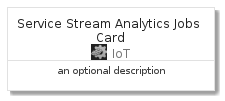
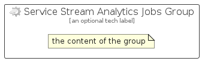

# ServiceStreamAnalyticsJobs


```text
azure-4/Item/IoT/ServiceStreamAnalyticsJobs
```

```text
include('azure-4/Item/IoT/ServiceStreamAnalyticsJobs')
```


| Illustration | ServiceStreamAnalyticsJobs | ServiceStreamAnalyticsJobsCard | ServiceStreamAnalyticsJobsGroup |
| :---: | :---: | :---: | :---: |
|  |  |  |  |


## ServiceStreamAnalyticsJobs

### Load remotely
```plantuml
@startuml
' configures the library
!global $LIB_BASE_LOCATION="https://github.com/tmorin/plantuml-libs/distribution"

' loads the library's bootstrap
!include $LIB_BASE_LOCATION/bootstrap.puml

' loads the package bootstrap
include('azure-4/bootstrap')

' loads the Item which embeds the element ServiceStreamAnalyticsJobs
include('azure-4/Item/IoT/ServiceStreamAnalyticsJobs')

' renders the element
ServiceStreamAnalyticsJobs('ServiceStreamAnalyticsJobs', 'Service Stream Analytics Jobs', 'an optional tech label')
@enduml
```

### Load locally
```plantuml
@startuml
' configures the library
!global $INCLUSION_MODE="local"
!global $LIB_BASE_LOCATION="../../.."

' loads the library's bootstrap
!include $LIB_BASE_LOCATION/bootstrap.puml

' loads the package bootstrap
include('azure-4/bootstrap')

' loads the Item which embeds the element ServiceStreamAnalyticsJobs
include('azure-4/Item/IoT/ServiceStreamAnalyticsJobs')

' renders the element
ServiceStreamAnalyticsJobs('ServiceStreamAnalyticsJobs', 'Service Stream Analytics Jobs', 'an optional tech label')
@enduml
```

## ServiceStreamAnalyticsJobsCard

### Load remotely
```plantuml
@startuml
' configures the library
!global $LIB_BASE_LOCATION="https://github.com/tmorin/plantuml-libs/distribution"

' loads the library's bootstrap
!include $LIB_BASE_LOCATION/bootstrap.puml

' loads the package bootstrap
include('azure-4/bootstrap')

' loads the Item which embeds the element ServiceStreamAnalyticsJobsCard
include('azure-4/Item/IoT/ServiceStreamAnalyticsJobs')

' renders the element
ServiceStreamAnalyticsJobsCard('ServiceStreamAnalyticsJobsCard', 'Service Stream Analytics Jobs Card', 'an optional description')
@enduml
```

### Load locally
```plantuml
@startuml
' configures the library
!global $INCLUSION_MODE="local"
!global $LIB_BASE_LOCATION="../../.."

' loads the library's bootstrap
!include $LIB_BASE_LOCATION/bootstrap.puml

' loads the package bootstrap
include('azure-4/bootstrap')

' loads the Item which embeds the element ServiceStreamAnalyticsJobsCard
include('azure-4/Item/IoT/ServiceStreamAnalyticsJobs')

' renders the element
ServiceStreamAnalyticsJobsCard('ServiceStreamAnalyticsJobsCard', 'Service Stream Analytics Jobs Card', 'an optional description')
@enduml
```

## ServiceStreamAnalyticsJobsGroup

### Load remotely
```plantuml
@startuml
' configures the library
!global $LIB_BASE_LOCATION="https://github.com/tmorin/plantuml-libs/distribution"

' loads the library's bootstrap
!include $LIB_BASE_LOCATION/bootstrap.puml

' loads the package bootstrap
include('azure-4/bootstrap')

' loads the Item which embeds the element ServiceStreamAnalyticsJobsGroup
include('azure-4/Item/IoT/ServiceStreamAnalyticsJobs')

' renders the element
ServiceStreamAnalyticsJobsGroup('ServiceStreamAnalyticsJobsGroup', 'Service Stream Analytics Jobs Group', 'an optional tech label') {
    note as note
        the content of the group
    end note
}
@enduml
```

### Load locally
```plantuml
@startuml
' configures the library
!global $INCLUSION_MODE="local"
!global $LIB_BASE_LOCATION="../../.."

' loads the library's bootstrap
!include $LIB_BASE_LOCATION/bootstrap.puml

' loads the package bootstrap
include('azure-4/bootstrap')

' loads the Item which embeds the element ServiceStreamAnalyticsJobsGroup
include('azure-4/Item/IoT/ServiceStreamAnalyticsJobs')

' renders the element
ServiceStreamAnalyticsJobsGroup('ServiceStreamAnalyticsJobsGroup', 'Service Stream Analytics Jobs Group', 'an optional tech label') {
    note as note
        the content of the group
    end note
}
@enduml
```

