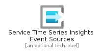
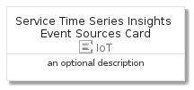
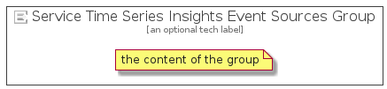

# ServiceTimeSeriesInsightsEventSources


```text
azure-4/Item/IoT/ServiceTimeSeriesInsightsEventSources
```

```text
include('azure-4/Item/IoT/ServiceTimeSeriesInsightsEventSources')
```


| Illustration | ServiceTimeSeriesInsightsEventSources | ServiceTimeSeriesInsightsEventSourcesCard | ServiceTimeSeriesInsightsEventSourcesGroup |
| :---: | :---: | :---: | :---: |
|  |  |  |  |


## ServiceTimeSeriesInsightsEventSources

### Load remotely
```plantuml
@startuml
' configures the library
!global $LIB_BASE_LOCATION="https://github.com/tmorin/plantuml-libs/distribution"

' loads the library's bootstrap
!include $LIB_BASE_LOCATION/bootstrap.puml

' loads the package bootstrap
include('azure-4/bootstrap')

' loads the Item which embeds the element ServiceTimeSeriesInsightsEventSources
include('azure-4/Item/IoT/ServiceTimeSeriesInsightsEventSources')

' renders the element
ServiceTimeSeriesInsightsEventSources('ServiceTimeSeriesInsightsEventSources', 'Service Time Series Insights Event Sources', 'an optional tech label')
@enduml
```

### Load locally
```plantuml
@startuml
' configures the library
!global $INCLUSION_MODE="local"
!global $LIB_BASE_LOCATION="../../.."

' loads the library's bootstrap
!include $LIB_BASE_LOCATION/bootstrap.puml

' loads the package bootstrap
include('azure-4/bootstrap')

' loads the Item which embeds the element ServiceTimeSeriesInsightsEventSources
include('azure-4/Item/IoT/ServiceTimeSeriesInsightsEventSources')

' renders the element
ServiceTimeSeriesInsightsEventSources('ServiceTimeSeriesInsightsEventSources', 'Service Time Series Insights Event Sources', 'an optional tech label')
@enduml
```

## ServiceTimeSeriesInsightsEventSourcesCard

### Load remotely
```plantuml
@startuml
' configures the library
!global $LIB_BASE_LOCATION="https://github.com/tmorin/plantuml-libs/distribution"

' loads the library's bootstrap
!include $LIB_BASE_LOCATION/bootstrap.puml

' loads the package bootstrap
include('azure-4/bootstrap')

' loads the Item which embeds the element ServiceTimeSeriesInsightsEventSourcesCard
include('azure-4/Item/IoT/ServiceTimeSeriesInsightsEventSources')

' renders the element
ServiceTimeSeriesInsightsEventSourcesCard('ServiceTimeSeriesInsightsEventSourcesCard', 'Service Time Series Insights Event Sources Card', 'an optional description')
@enduml
```

### Load locally
```plantuml
@startuml
' configures the library
!global $INCLUSION_MODE="local"
!global $LIB_BASE_LOCATION="../../.."

' loads the library's bootstrap
!include $LIB_BASE_LOCATION/bootstrap.puml

' loads the package bootstrap
include('azure-4/bootstrap')

' loads the Item which embeds the element ServiceTimeSeriesInsightsEventSourcesCard
include('azure-4/Item/IoT/ServiceTimeSeriesInsightsEventSources')

' renders the element
ServiceTimeSeriesInsightsEventSourcesCard('ServiceTimeSeriesInsightsEventSourcesCard', 'Service Time Series Insights Event Sources Card', 'an optional description')
@enduml
```

## ServiceTimeSeriesInsightsEventSourcesGroup

### Load remotely
```plantuml
@startuml
' configures the library
!global $LIB_BASE_LOCATION="https://github.com/tmorin/plantuml-libs/distribution"

' loads the library's bootstrap
!include $LIB_BASE_LOCATION/bootstrap.puml

' loads the package bootstrap
include('azure-4/bootstrap')

' loads the Item which embeds the element ServiceTimeSeriesInsightsEventSourcesGroup
include('azure-4/Item/IoT/ServiceTimeSeriesInsightsEventSources')

' renders the element
ServiceTimeSeriesInsightsEventSourcesGroup('ServiceTimeSeriesInsightsEventSourcesGroup', 'Service Time Series Insights Event Sources Group', 'an optional tech label') {
    note as note
        the content of the group
    end note
}
@enduml
```

### Load locally
```plantuml
@startuml
' configures the library
!global $INCLUSION_MODE="local"
!global $LIB_BASE_LOCATION="../../.."

' loads the library's bootstrap
!include $LIB_BASE_LOCATION/bootstrap.puml

' loads the package bootstrap
include('azure-4/bootstrap')

' loads the Item which embeds the element ServiceTimeSeriesInsightsEventSourcesGroup
include('azure-4/Item/IoT/ServiceTimeSeriesInsightsEventSources')

' renders the element
ServiceTimeSeriesInsightsEventSourcesGroup('ServiceTimeSeriesInsightsEventSourcesGroup', 'Service Time Series Insights Event Sources Group', 'an optional tech label') {
    note as note
        the content of the group
    end note
}
@enduml
```

