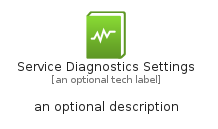
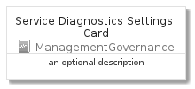
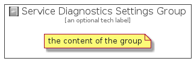

# ServiceDiagnosticsSettings


```text
azure-4/Item/ManagementGovernance/ServiceDiagnosticsSettings
```

```text
include('azure-4/Item/ManagementGovernance/ServiceDiagnosticsSettings')
```


| Illustration | ServiceDiagnosticsSettings | ServiceDiagnosticsSettingsCard | ServiceDiagnosticsSettingsGroup |
| :---: | :---: | :---: | :---: |
|  |  |  |  |


## ServiceDiagnosticsSettings

### Load remotely
```plantuml
@startuml
' configures the library
!global $LIB_BASE_LOCATION="https://github.com/tmorin/plantuml-libs/distribution"

' loads the library's bootstrap
!include $LIB_BASE_LOCATION/bootstrap.puml

' loads the package bootstrap
include('azure-4/bootstrap')

' loads the Item which embeds the element ServiceDiagnosticsSettings
include('azure-4/Item/ManagementGovernance/ServiceDiagnosticsSettings')

' renders the element
ServiceDiagnosticsSettings('ServiceDiagnosticsSettings', 'Service Diagnostics Settings', 'an optional tech label')
@enduml
```

### Load locally
```plantuml
@startuml
' configures the library
!global $INCLUSION_MODE="local"
!global $LIB_BASE_LOCATION="../../.."

' loads the library's bootstrap
!include $LIB_BASE_LOCATION/bootstrap.puml

' loads the package bootstrap
include('azure-4/bootstrap')

' loads the Item which embeds the element ServiceDiagnosticsSettings
include('azure-4/Item/ManagementGovernance/ServiceDiagnosticsSettings')

' renders the element
ServiceDiagnosticsSettings('ServiceDiagnosticsSettings', 'Service Diagnostics Settings', 'an optional tech label')
@enduml
```

## ServiceDiagnosticsSettingsCard

### Load remotely
```plantuml
@startuml
' configures the library
!global $LIB_BASE_LOCATION="https://github.com/tmorin/plantuml-libs/distribution"

' loads the library's bootstrap
!include $LIB_BASE_LOCATION/bootstrap.puml

' loads the package bootstrap
include('azure-4/bootstrap')

' loads the Item which embeds the element ServiceDiagnosticsSettingsCard
include('azure-4/Item/ManagementGovernance/ServiceDiagnosticsSettings')

' renders the element
ServiceDiagnosticsSettingsCard('ServiceDiagnosticsSettingsCard', 'Service Diagnostics Settings Card', 'an optional description')
@enduml
```

### Load locally
```plantuml
@startuml
' configures the library
!global $INCLUSION_MODE="local"
!global $LIB_BASE_LOCATION="../../.."

' loads the library's bootstrap
!include $LIB_BASE_LOCATION/bootstrap.puml

' loads the package bootstrap
include('azure-4/bootstrap')

' loads the Item which embeds the element ServiceDiagnosticsSettingsCard
include('azure-4/Item/ManagementGovernance/ServiceDiagnosticsSettings')

' renders the element
ServiceDiagnosticsSettingsCard('ServiceDiagnosticsSettingsCard', 'Service Diagnostics Settings Card', 'an optional description')
@enduml
```

## ServiceDiagnosticsSettingsGroup

### Load remotely
```plantuml
@startuml
' configures the library
!global $LIB_BASE_LOCATION="https://github.com/tmorin/plantuml-libs/distribution"

' loads the library's bootstrap
!include $LIB_BASE_LOCATION/bootstrap.puml

' loads the package bootstrap
include('azure-4/bootstrap')

' loads the Item which embeds the element ServiceDiagnosticsSettingsGroup
include('azure-4/Item/ManagementGovernance/ServiceDiagnosticsSettings')

' renders the element
ServiceDiagnosticsSettingsGroup('ServiceDiagnosticsSettingsGroup', 'Service Diagnostics Settings Group', 'an optional tech label') {
    note as note
        the content of the group
    end note
}
@enduml
```

### Load locally
```plantuml
@startuml
' configures the library
!global $INCLUSION_MODE="local"
!global $LIB_BASE_LOCATION="../../.."

' loads the library's bootstrap
!include $LIB_BASE_LOCATION/bootstrap.puml

' loads the package bootstrap
include('azure-4/bootstrap')

' loads the Item which embeds the element ServiceDiagnosticsSettingsGroup
include('azure-4/Item/ManagementGovernance/ServiceDiagnosticsSettings')

' renders the element
ServiceDiagnosticsSettingsGroup('ServiceDiagnosticsSettingsGroup', 'Service Diagnostics Settings Group', 'an optional tech label') {
    note as note
        the content of the group
    end note
}
@enduml
```

