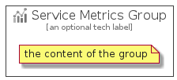

# ServiceMetrics


```text
azure-4/Item/ManagementGovernance/ServiceMetrics
```

```text
include('azure-4/Item/ManagementGovernance/ServiceMetrics')
```


| Illustration | ServiceMetrics | ServiceMetricsCard | ServiceMetricsGroup |
| :---: | :---: | :---: | :---: |
|  |  |  |  |


## ServiceMetrics

### Load remotely
```plantuml
@startuml
' configures the library
!global $LIB_BASE_LOCATION="https://raw.githubusercontent.com/tmorin/plantuml-libs/master/distribution"

' loads the library's bootstrap
!include $LIB_BASE_LOCATION/bootstrap.puml

' loads the package bootstrap
include('azure-4/bootstrap')

' loads the Item which embeds the element ServiceMetrics
include('azure-4/Item/ManagementGovernance/ServiceMetrics')

' renders the element
ServiceMetrics('ServiceMetrics', 'Service Metrics', 'an optional tech label', 'an optional description')
@enduml
```

### Load locally
```plantuml
@startuml
' configures the library
!global $INCLUSION_MODE="local"
!global $LIB_BASE_LOCATION="../../.."

' loads the library's bootstrap
!include $LIB_BASE_LOCATION/bootstrap.puml

' loads the package bootstrap
include('azure-4/bootstrap')

' loads the Item which embeds the element ServiceMetrics
include('azure-4/Item/ManagementGovernance/ServiceMetrics')

' renders the element
ServiceMetrics('ServiceMetrics', 'Service Metrics', 'an optional tech label', 'an optional description')
@enduml
```

## ServiceMetricsCard

### Load remotely
```plantuml
@startuml
' configures the library
!global $LIB_BASE_LOCATION="https://raw.githubusercontent.com/tmorin/plantuml-libs/master/distribution"

' loads the library's bootstrap
!include $LIB_BASE_LOCATION/bootstrap.puml

' loads the package bootstrap
include('azure-4/bootstrap')

' loads the Item which embeds the element ServiceMetricsCard
include('azure-4/Item/ManagementGovernance/ServiceMetrics')

' renders the element
ServiceMetricsCard('ServiceMetricsCard', 'Service Metrics Card', 'an optional description')
@enduml
```

### Load locally
```plantuml
@startuml
' configures the library
!global $INCLUSION_MODE="local"
!global $LIB_BASE_LOCATION="../../.."

' loads the library's bootstrap
!include $LIB_BASE_LOCATION/bootstrap.puml

' loads the package bootstrap
include('azure-4/bootstrap')

' loads the Item which embeds the element ServiceMetricsCard
include('azure-4/Item/ManagementGovernance/ServiceMetrics')

' renders the element
ServiceMetricsCard('ServiceMetricsCard', 'Service Metrics Card', 'an optional description')
@enduml
```

## ServiceMetricsGroup

### Load remotely
```plantuml
@startuml
' configures the library
!global $LIB_BASE_LOCATION="https://raw.githubusercontent.com/tmorin/plantuml-libs/master/distribution"

' loads the library's bootstrap
!include $LIB_BASE_LOCATION/bootstrap.puml

' loads the package bootstrap
include('azure-4/bootstrap')

' loads the Item which embeds the element ServiceMetricsGroup
include('azure-4/Item/ManagementGovernance/ServiceMetrics')

' renders the element
ServiceMetricsGroup('ServiceMetricsGroup', 'Service Metrics Group', 'an optional tech label') {
    note as note
        the content of the group
    end note
}
@enduml
```

### Load locally
```plantuml
@startuml
' configures the library
!global $INCLUSION_MODE="local"
!global $LIB_BASE_LOCATION="../../.."

' loads the library's bootstrap
!include $LIB_BASE_LOCATION/bootstrap.puml

' loads the package bootstrap
include('azure-4/bootstrap')

' loads the Item which embeds the element ServiceMetricsGroup
include('azure-4/Item/ManagementGovernance/ServiceMetrics')

' renders the element
ServiceMetricsGroup('ServiceMetricsGroup', 'Service Metrics Group', 'an optional tech label') {
    note as note
        the content of the group
    end note
}
@enduml
```

