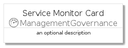
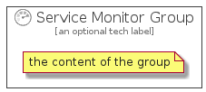

# ServiceMonitor


```text
azure-4/Item/ManagementGovernance/ServiceMonitor
```

```text
include('azure-4/Item/ManagementGovernance/ServiceMonitor')
```


| Illustration | ServiceMonitor | ServiceMonitorCard | ServiceMonitorGroup |
| :---: | :---: | :---: | :---: |
|  |  |  |  |


## ServiceMonitor

### Load remotely
```plantuml
@startuml
' configures the library
!global $LIB_BASE_LOCATION="https://github.com/tmorin/plantuml-libs/distribution"

' loads the library's bootstrap
!include $LIB_BASE_LOCATION/bootstrap.puml

' loads the package bootstrap
include('azure-4/bootstrap')

' loads the Item which embeds the element ServiceMonitor
include('azure-4/Item/ManagementGovernance/ServiceMonitor')

' renders the element
ServiceMonitor('ServiceMonitor', 'Service Monitor', 'an optional tech label')
@enduml
```

### Load locally
```plantuml
@startuml
' configures the library
!global $INCLUSION_MODE="local"
!global $LIB_BASE_LOCATION="../../.."

' loads the library's bootstrap
!include $LIB_BASE_LOCATION/bootstrap.puml

' loads the package bootstrap
include('azure-4/bootstrap')

' loads the Item which embeds the element ServiceMonitor
include('azure-4/Item/ManagementGovernance/ServiceMonitor')

' renders the element
ServiceMonitor('ServiceMonitor', 'Service Monitor', 'an optional tech label')
@enduml
```

## ServiceMonitorCard

### Load remotely
```plantuml
@startuml
' configures the library
!global $LIB_BASE_LOCATION="https://github.com/tmorin/plantuml-libs/distribution"

' loads the library's bootstrap
!include $LIB_BASE_LOCATION/bootstrap.puml

' loads the package bootstrap
include('azure-4/bootstrap')

' loads the Item which embeds the element ServiceMonitorCard
include('azure-4/Item/ManagementGovernance/ServiceMonitor')

' renders the element
ServiceMonitorCard('ServiceMonitorCard', 'Service Monitor Card', 'an optional description')
@enduml
```

### Load locally
```plantuml
@startuml
' configures the library
!global $INCLUSION_MODE="local"
!global $LIB_BASE_LOCATION="../../.."

' loads the library's bootstrap
!include $LIB_BASE_LOCATION/bootstrap.puml

' loads the package bootstrap
include('azure-4/bootstrap')

' loads the Item which embeds the element ServiceMonitorCard
include('azure-4/Item/ManagementGovernance/ServiceMonitor')

' renders the element
ServiceMonitorCard('ServiceMonitorCard', 'Service Monitor Card', 'an optional description')
@enduml
```

## ServiceMonitorGroup

### Load remotely
```plantuml
@startuml
' configures the library
!global $LIB_BASE_LOCATION="https://github.com/tmorin/plantuml-libs/distribution"

' loads the library's bootstrap
!include $LIB_BASE_LOCATION/bootstrap.puml

' loads the package bootstrap
include('azure-4/bootstrap')

' loads the Item which embeds the element ServiceMonitorGroup
include('azure-4/Item/ManagementGovernance/ServiceMonitor')

' renders the element
ServiceMonitorGroup('ServiceMonitorGroup', 'Service Monitor Group', 'an optional tech label') {
    note as note
        the content of the group
    end note
}
@enduml
```

### Load locally
```plantuml
@startuml
' configures the library
!global $INCLUSION_MODE="local"
!global $LIB_BASE_LOCATION="../../.."

' loads the library's bootstrap
!include $LIB_BASE_LOCATION/bootstrap.puml

' loads the package bootstrap
include('azure-4/bootstrap')

' loads the Item which embeds the element ServiceMonitorGroup
include('azure-4/Item/ManagementGovernance/ServiceMonitor')

' renders the element
ServiceMonitorGroup('ServiceMonitorGroup', 'Service Monitor Group', 'an optional tech label') {
    note as note
        the content of the group
    end note
}
@enduml
```

