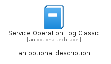
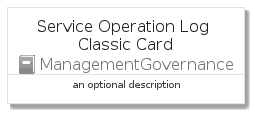
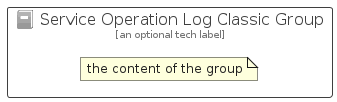

# ServiceOperationLogClassic


```text
azure-4/Item/ManagementGovernance/ServiceOperationLogClassic
```

```text
include('azure-4/Item/ManagementGovernance/ServiceOperationLogClassic')
```


| Illustration | ServiceOperationLogClassic | ServiceOperationLogClassicCard | ServiceOperationLogClassicGroup |
| :---: | :---: | :---: | :---: |
|  |  |  |  |


## ServiceOperationLogClassic

### Load remotely
```plantuml
@startuml
' configures the library
!global $LIB_BASE_LOCATION="https://github.com/tmorin/plantuml-libs/distribution"

' loads the library's bootstrap
!include $LIB_BASE_LOCATION/bootstrap.puml

' loads the package bootstrap
include('azure-4/bootstrap')

' loads the Item which embeds the element ServiceOperationLogClassic
include('azure-4/Item/ManagementGovernance/ServiceOperationLogClassic')

' renders the element
ServiceOperationLogClassic('ServiceOperationLogClassic', 'Service Operation Log Classic', 'an optional tech label')
@enduml
```

### Load locally
```plantuml
@startuml
' configures the library
!global $INCLUSION_MODE="local"
!global $LIB_BASE_LOCATION="../../.."

' loads the library's bootstrap
!include $LIB_BASE_LOCATION/bootstrap.puml

' loads the package bootstrap
include('azure-4/bootstrap')

' loads the Item which embeds the element ServiceOperationLogClassic
include('azure-4/Item/ManagementGovernance/ServiceOperationLogClassic')

' renders the element
ServiceOperationLogClassic('ServiceOperationLogClassic', 'Service Operation Log Classic', 'an optional tech label')
@enduml
```

## ServiceOperationLogClassicCard

### Load remotely
```plantuml
@startuml
' configures the library
!global $LIB_BASE_LOCATION="https://github.com/tmorin/plantuml-libs/distribution"

' loads the library's bootstrap
!include $LIB_BASE_LOCATION/bootstrap.puml

' loads the package bootstrap
include('azure-4/bootstrap')

' loads the Item which embeds the element ServiceOperationLogClassicCard
include('azure-4/Item/ManagementGovernance/ServiceOperationLogClassic')

' renders the element
ServiceOperationLogClassicCard('ServiceOperationLogClassicCard', 'Service Operation Log Classic Card', 'an optional description')
@enduml
```

### Load locally
```plantuml
@startuml
' configures the library
!global $INCLUSION_MODE="local"
!global $LIB_BASE_LOCATION="../../.."

' loads the library's bootstrap
!include $LIB_BASE_LOCATION/bootstrap.puml

' loads the package bootstrap
include('azure-4/bootstrap')

' loads the Item which embeds the element ServiceOperationLogClassicCard
include('azure-4/Item/ManagementGovernance/ServiceOperationLogClassic')

' renders the element
ServiceOperationLogClassicCard('ServiceOperationLogClassicCard', 'Service Operation Log Classic Card', 'an optional description')
@enduml
```

## ServiceOperationLogClassicGroup

### Load remotely
```plantuml
@startuml
' configures the library
!global $LIB_BASE_LOCATION="https://github.com/tmorin/plantuml-libs/distribution"

' loads the library's bootstrap
!include $LIB_BASE_LOCATION/bootstrap.puml

' loads the package bootstrap
include('azure-4/bootstrap')

' loads the Item which embeds the element ServiceOperationLogClassicGroup
include('azure-4/Item/ManagementGovernance/ServiceOperationLogClassic')

' renders the element
ServiceOperationLogClassicGroup('ServiceOperationLogClassicGroup', 'Service Operation Log Classic Group', 'an optional tech label') {
    note as note
        the content of the group
    end note
}
@enduml
```

### Load locally
```plantuml
@startuml
' configures the library
!global $INCLUSION_MODE="local"
!global $LIB_BASE_LOCATION="../../.."

' loads the library's bootstrap
!include $LIB_BASE_LOCATION/bootstrap.puml

' loads the package bootstrap
include('azure-4/bootstrap')

' loads the Item which embeds the element ServiceOperationLogClassicGroup
include('azure-4/Item/ManagementGovernance/ServiceOperationLogClassic')

' renders the element
ServiceOperationLogClassicGroup('ServiceOperationLogClassicGroup', 'Service Operation Log Classic Group', 'an optional tech label') {
    note as note
        the content of the group
    end note
}
@enduml
```

