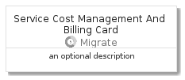

# ServiceCostManagementAndBilling


```text
azure-4/Item/Migrate/ServiceCostManagementAndBilling
```

```text
include('azure-4/Item/Migrate/ServiceCostManagementAndBilling')
```


| Illustration | ServiceCostManagementAndBilling | ServiceCostManagementAndBillingCard | ServiceCostManagementAndBillingGroup |
| :---: | :---: | :---: | :---: |
|  |  |  |  |


## ServiceCostManagementAndBilling

### Load remotely
```plantuml
@startuml
' configures the library
!global $LIB_BASE_LOCATION="https://raw.githubusercontent.com/tmorin/plantuml-libs/master/distribution"

' loads the library's bootstrap
!include $LIB_BASE_LOCATION/bootstrap.puml

' loads the package bootstrap
include('azure-4/bootstrap')

' loads the Item which embeds the element ServiceCostManagementAndBilling
include('azure-4/Item/Migrate/ServiceCostManagementAndBilling')

' renders the element
ServiceCostManagementAndBilling('ServiceCostManagementAndBilling', 'Service Cost Management And Billing', 'an optional tech label', 'an optional description')
@enduml
```

### Load locally
```plantuml
@startuml
' configures the library
!global $INCLUSION_MODE="local"
!global $LIB_BASE_LOCATION="../../.."

' loads the library's bootstrap
!include $LIB_BASE_LOCATION/bootstrap.puml

' loads the package bootstrap
include('azure-4/bootstrap')

' loads the Item which embeds the element ServiceCostManagementAndBilling
include('azure-4/Item/Migrate/ServiceCostManagementAndBilling')

' renders the element
ServiceCostManagementAndBilling('ServiceCostManagementAndBilling', 'Service Cost Management And Billing', 'an optional tech label', 'an optional description')
@enduml
```

## ServiceCostManagementAndBillingCard

### Load remotely
```plantuml
@startuml
' configures the library
!global $LIB_BASE_LOCATION="https://raw.githubusercontent.com/tmorin/plantuml-libs/master/distribution"

' loads the library's bootstrap
!include $LIB_BASE_LOCATION/bootstrap.puml

' loads the package bootstrap
include('azure-4/bootstrap')

' loads the Item which embeds the element ServiceCostManagementAndBillingCard
include('azure-4/Item/Migrate/ServiceCostManagementAndBilling')

' renders the element
ServiceCostManagementAndBillingCard('ServiceCostManagementAndBillingCard', 'Service Cost Management And Billing Card', 'an optional description')
@enduml
```

### Load locally
```plantuml
@startuml
' configures the library
!global $INCLUSION_MODE="local"
!global $LIB_BASE_LOCATION="../../.."

' loads the library's bootstrap
!include $LIB_BASE_LOCATION/bootstrap.puml

' loads the package bootstrap
include('azure-4/bootstrap')

' loads the Item which embeds the element ServiceCostManagementAndBillingCard
include('azure-4/Item/Migrate/ServiceCostManagementAndBilling')

' renders the element
ServiceCostManagementAndBillingCard('ServiceCostManagementAndBillingCard', 'Service Cost Management And Billing Card', 'an optional description')
@enduml
```

## ServiceCostManagementAndBillingGroup

### Load remotely
```plantuml
@startuml
' configures the library
!global $LIB_BASE_LOCATION="https://raw.githubusercontent.com/tmorin/plantuml-libs/master/distribution"

' loads the library's bootstrap
!include $LIB_BASE_LOCATION/bootstrap.puml

' loads the package bootstrap
include('azure-4/bootstrap')

' loads the Item which embeds the element ServiceCostManagementAndBillingGroup
include('azure-4/Item/Migrate/ServiceCostManagementAndBilling')

' renders the element
ServiceCostManagementAndBillingGroup('ServiceCostManagementAndBillingGroup', 'Service Cost Management And Billing Group', 'an optional tech label') {
    note as note
        the content of the group
    end note
}
@enduml
```

### Load locally
```plantuml
@startuml
' configures the library
!global $INCLUSION_MODE="local"
!global $LIB_BASE_LOCATION="../../.."

' loads the library's bootstrap
!include $LIB_BASE_LOCATION/bootstrap.puml

' loads the package bootstrap
include('azure-4/bootstrap')

' loads the Item which embeds the element ServiceCostManagementAndBillingGroup
include('azure-4/Item/Migrate/ServiceCostManagementAndBilling')

' renders the element
ServiceCostManagementAndBillingGroup('ServiceCostManagementAndBillingGroup', 'Service Cost Management And Billing Group', 'an optional tech label') {
    note as note
        the content of the group
    end note
}
@enduml
```

