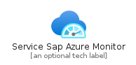
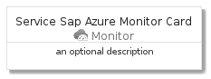
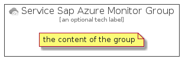

# ServiceSapAzureMonitor


```text
azure-4/Item/Monitor/ServiceSapAzureMonitor
```

```text
include('azure-4/Item/Monitor/ServiceSapAzureMonitor')
```


| Illustration | ServiceSapAzureMonitor | ServiceSapAzureMonitorCard | ServiceSapAzureMonitorGroup |
| :---: | :---: | :---: | :---: |
|  |  |  |  |


## ServiceSapAzureMonitor

### Load remotely
```plantuml
@startuml
' configures the library
!global $LIB_BASE_LOCATION="https://github.com/tmorin/plantuml-libs/distribution"

' loads the library's bootstrap
!include $LIB_BASE_LOCATION/bootstrap.puml

' loads the package bootstrap
include('azure-4/bootstrap')

' loads the Item which embeds the element ServiceSapAzureMonitor
include('azure-4/Item/Monitor/ServiceSapAzureMonitor')

' renders the element
ServiceSapAzureMonitor('ServiceSapAzureMonitor', 'Service Sap Azure Monitor', 'an optional tech label')
@enduml
```

### Load locally
```plantuml
@startuml
' configures the library
!global $INCLUSION_MODE="local"
!global $LIB_BASE_LOCATION="../../.."

' loads the library's bootstrap
!include $LIB_BASE_LOCATION/bootstrap.puml

' loads the package bootstrap
include('azure-4/bootstrap')

' loads the Item which embeds the element ServiceSapAzureMonitor
include('azure-4/Item/Monitor/ServiceSapAzureMonitor')

' renders the element
ServiceSapAzureMonitor('ServiceSapAzureMonitor', 'Service Sap Azure Monitor', 'an optional tech label')
@enduml
```

## ServiceSapAzureMonitorCard

### Load remotely
```plantuml
@startuml
' configures the library
!global $LIB_BASE_LOCATION="https://github.com/tmorin/plantuml-libs/distribution"

' loads the library's bootstrap
!include $LIB_BASE_LOCATION/bootstrap.puml

' loads the package bootstrap
include('azure-4/bootstrap')

' loads the Item which embeds the element ServiceSapAzureMonitorCard
include('azure-4/Item/Monitor/ServiceSapAzureMonitor')

' renders the element
ServiceSapAzureMonitorCard('ServiceSapAzureMonitorCard', 'Service Sap Azure Monitor Card', 'an optional description')
@enduml
```

### Load locally
```plantuml
@startuml
' configures the library
!global $INCLUSION_MODE="local"
!global $LIB_BASE_LOCATION="../../.."

' loads the library's bootstrap
!include $LIB_BASE_LOCATION/bootstrap.puml

' loads the package bootstrap
include('azure-4/bootstrap')

' loads the Item which embeds the element ServiceSapAzureMonitorCard
include('azure-4/Item/Monitor/ServiceSapAzureMonitor')

' renders the element
ServiceSapAzureMonitorCard('ServiceSapAzureMonitorCard', 'Service Sap Azure Monitor Card', 'an optional description')
@enduml
```

## ServiceSapAzureMonitorGroup

### Load remotely
```plantuml
@startuml
' configures the library
!global $LIB_BASE_LOCATION="https://github.com/tmorin/plantuml-libs/distribution"

' loads the library's bootstrap
!include $LIB_BASE_LOCATION/bootstrap.puml

' loads the package bootstrap
include('azure-4/bootstrap')

' loads the Item which embeds the element ServiceSapAzureMonitorGroup
include('azure-4/Item/Monitor/ServiceSapAzureMonitor')

' renders the element
ServiceSapAzureMonitorGroup('ServiceSapAzureMonitorGroup', 'Service Sap Azure Monitor Group', 'an optional tech label') {
    note as note
        the content of the group
    end note
}
@enduml
```

### Load locally
```plantuml
@startuml
' configures the library
!global $INCLUSION_MODE="local"
!global $LIB_BASE_LOCATION="../../.."

' loads the library's bootstrap
!include $LIB_BASE_LOCATION/bootstrap.puml

' loads the package bootstrap
include('azure-4/bootstrap')

' loads the Item which embeds the element ServiceSapAzureMonitorGroup
include('azure-4/Item/Monitor/ServiceSapAzureMonitor')

' renders the element
ServiceSapAzureMonitorGroup('ServiceSapAzureMonitorGroup', 'Service Sap Azure Monitor Group', 'an optional tech label') {
    note as note
        the content of the group
    end note
}
@enduml
```

