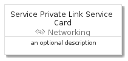

# ServicePrivateLinkService


```text
azure-4/Item/Networking/ServicePrivateLinkService
```

```text
include('azure-4/Item/Networking/ServicePrivateLinkService')
```


| Illustration | ServicePrivateLinkService | ServicePrivateLinkServiceCard | ServicePrivateLinkServiceGroup |
| :---: | :---: | :---: | :---: |
|  |  |  |  |


## ServicePrivateLinkService

### Load remotely
```plantuml
@startuml
' configures the library
!global $LIB_BASE_LOCATION="https://raw.githubusercontent.com/tmorin/plantuml-libs/master/distribution"

' loads the library's bootstrap
!include $LIB_BASE_LOCATION/bootstrap.puml

' loads the package bootstrap
include('azure-4/bootstrap')

' loads the Item which embeds the element ServicePrivateLinkService
include('azure-4/Item/Networking/ServicePrivateLinkService')

' renders the element
ServicePrivateLinkService('ServicePrivateLinkService', 'Service Private Link Service', 'an optional tech label', 'an optional description')
@enduml
```

### Load locally
```plantuml
@startuml
' configures the library
!global $INCLUSION_MODE="local"
!global $LIB_BASE_LOCATION="../../.."

' loads the library's bootstrap
!include $LIB_BASE_LOCATION/bootstrap.puml

' loads the package bootstrap
include('azure-4/bootstrap')

' loads the Item which embeds the element ServicePrivateLinkService
include('azure-4/Item/Networking/ServicePrivateLinkService')

' renders the element
ServicePrivateLinkService('ServicePrivateLinkService', 'Service Private Link Service', 'an optional tech label', 'an optional description')
@enduml
```

## ServicePrivateLinkServiceCard

### Load remotely
```plantuml
@startuml
' configures the library
!global $LIB_BASE_LOCATION="https://raw.githubusercontent.com/tmorin/plantuml-libs/master/distribution"

' loads the library's bootstrap
!include $LIB_BASE_LOCATION/bootstrap.puml

' loads the package bootstrap
include('azure-4/bootstrap')

' loads the Item which embeds the element ServicePrivateLinkServiceCard
include('azure-4/Item/Networking/ServicePrivateLinkService')

' renders the element
ServicePrivateLinkServiceCard('ServicePrivateLinkServiceCard', 'Service Private Link Service Card', 'an optional description')
@enduml
```

### Load locally
```plantuml
@startuml
' configures the library
!global $INCLUSION_MODE="local"
!global $LIB_BASE_LOCATION="../../.."

' loads the library's bootstrap
!include $LIB_BASE_LOCATION/bootstrap.puml

' loads the package bootstrap
include('azure-4/bootstrap')

' loads the Item which embeds the element ServicePrivateLinkServiceCard
include('azure-4/Item/Networking/ServicePrivateLinkService')

' renders the element
ServicePrivateLinkServiceCard('ServicePrivateLinkServiceCard', 'Service Private Link Service Card', 'an optional description')
@enduml
```

## ServicePrivateLinkServiceGroup

### Load remotely
```plantuml
@startuml
' configures the library
!global $LIB_BASE_LOCATION="https://raw.githubusercontent.com/tmorin/plantuml-libs/master/distribution"

' loads the library's bootstrap
!include $LIB_BASE_LOCATION/bootstrap.puml

' loads the package bootstrap
include('azure-4/bootstrap')

' loads the Item which embeds the element ServicePrivateLinkServiceGroup
include('azure-4/Item/Networking/ServicePrivateLinkService')

' renders the element
ServicePrivateLinkServiceGroup('ServicePrivateLinkServiceGroup', 'Service Private Link Service Group', 'an optional tech label') {
    note as note
        the content of the group
    end note
}
@enduml
```

### Load locally
```plantuml
@startuml
' configures the library
!global $INCLUSION_MODE="local"
!global $LIB_BASE_LOCATION="../../.."

' loads the library's bootstrap
!include $LIB_BASE_LOCATION/bootstrap.puml

' loads the package bootstrap
include('azure-4/bootstrap')

' loads the Item which embeds the element ServicePrivateLinkServiceGroup
include('azure-4/Item/Networking/ServicePrivateLinkService')

' renders the element
ServicePrivateLinkServiceGroup('ServicePrivateLinkServiceGroup', 'Service Private Link Service Group', 'an optional tech label') {
    note as note
        the content of the group
    end note
}
@enduml
```

