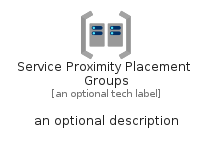
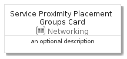
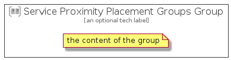

# ServiceProximityPlacementGroups


```text
azure-4/Item/Networking/ServiceProximityPlacementGroups
```

```text
include('azure-4/Item/Networking/ServiceProximityPlacementGroups')
```


| Illustration | ServiceProximityPlacementGroups | ServiceProximityPlacementGroupsCard | ServiceProximityPlacementGroupsGroup |
| :---: | :---: | :---: | :---: |
|  |  |  |  |


## ServiceProximityPlacementGroups

### Load remotely
```plantuml
@startuml
' configures the library
!global $LIB_BASE_LOCATION="https://raw.githubusercontent.com/tmorin/plantuml-libs/master/distribution"

' loads the library's bootstrap
!include $LIB_BASE_LOCATION/bootstrap.puml

' loads the package bootstrap
include('azure-4/bootstrap')

' loads the Item which embeds the element ServiceProximityPlacementGroups
include('azure-4/Item/Networking/ServiceProximityPlacementGroups')

' renders the element
ServiceProximityPlacementGroups('ServiceProximityPlacementGroups', 'Service Proximity Placement Groups', 'an optional tech label')
@enduml
```

### Load locally
```plantuml
@startuml
' configures the library
!global $INCLUSION_MODE="local"
!global $LIB_BASE_LOCATION="../../.."

' loads the library's bootstrap
!include $LIB_BASE_LOCATION/bootstrap.puml

' loads the package bootstrap
include('azure-4/bootstrap')

' loads the Item which embeds the element ServiceProximityPlacementGroups
include('azure-4/Item/Networking/ServiceProximityPlacementGroups')

' renders the element
ServiceProximityPlacementGroups('ServiceProximityPlacementGroups', 'Service Proximity Placement Groups', 'an optional tech label')
@enduml
```

## ServiceProximityPlacementGroupsCard

### Load remotely
```plantuml
@startuml
' configures the library
!global $LIB_BASE_LOCATION="https://raw.githubusercontent.com/tmorin/plantuml-libs/master/distribution"

' loads the library's bootstrap
!include $LIB_BASE_LOCATION/bootstrap.puml

' loads the package bootstrap
include('azure-4/bootstrap')

' loads the Item which embeds the element ServiceProximityPlacementGroupsCard
include('azure-4/Item/Networking/ServiceProximityPlacementGroups')

' renders the element
ServiceProximityPlacementGroupsCard('ServiceProximityPlacementGroupsCard', 'Service Proximity Placement Groups Card', 'an optional description')
@enduml
```

### Load locally
```plantuml
@startuml
' configures the library
!global $INCLUSION_MODE="local"
!global $LIB_BASE_LOCATION="../../.."

' loads the library's bootstrap
!include $LIB_BASE_LOCATION/bootstrap.puml

' loads the package bootstrap
include('azure-4/bootstrap')

' loads the Item which embeds the element ServiceProximityPlacementGroupsCard
include('azure-4/Item/Networking/ServiceProximityPlacementGroups')

' renders the element
ServiceProximityPlacementGroupsCard('ServiceProximityPlacementGroupsCard', 'Service Proximity Placement Groups Card', 'an optional description')
@enduml
```

## ServiceProximityPlacementGroupsGroup

### Load remotely
```plantuml
@startuml
' configures the library
!global $LIB_BASE_LOCATION="https://raw.githubusercontent.com/tmorin/plantuml-libs/master/distribution"

' loads the library's bootstrap
!include $LIB_BASE_LOCATION/bootstrap.puml

' loads the package bootstrap
include('azure-4/bootstrap')

' loads the Item which embeds the element ServiceProximityPlacementGroupsGroup
include('azure-4/Item/Networking/ServiceProximityPlacementGroups')

' renders the element
ServiceProximityPlacementGroupsGroup('ServiceProximityPlacementGroupsGroup', 'Service Proximity Placement Groups Group', 'an optional tech label') {
    note as note
        the content of the group
    end note
}
@enduml
```

### Load locally
```plantuml
@startuml
' configures the library
!global $INCLUSION_MODE="local"
!global $LIB_BASE_LOCATION="../../.."

' loads the library's bootstrap
!include $LIB_BASE_LOCATION/bootstrap.puml

' loads the package bootstrap
include('azure-4/bootstrap')

' loads the Item which embeds the element ServiceProximityPlacementGroupsGroup
include('azure-4/Item/Networking/ServiceProximityPlacementGroups')

' renders the element
ServiceProximityPlacementGroupsGroup('ServiceProximityPlacementGroupsGroup', 'Service Proximity Placement Groups Group', 'an optional tech label') {
    note as note
        the content of the group
    end note
}
@enduml
```

