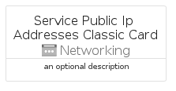
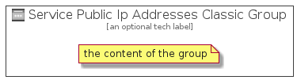

# ServicePublicIpAddressesClassic


```text
azure-4/Item/Networking/ServicePublicIpAddressesClassic
```

```text
include('azure-4/Item/Networking/ServicePublicIpAddressesClassic')
```


| Illustration | ServicePublicIpAddressesClassic | ServicePublicIpAddressesClassicCard | ServicePublicIpAddressesClassicGroup |
| :---: | :---: | :---: | :---: |
|  |  |  |  |


## ServicePublicIpAddressesClassic

### Load remotely
```plantuml
@startuml
' configures the library
!global $LIB_BASE_LOCATION="https://raw.githubusercontent.com/tmorin/plantuml-libs/master/distribution"

' loads the library's bootstrap
!include $LIB_BASE_LOCATION/bootstrap.puml

' loads the package bootstrap
include('azure-4/bootstrap')

' loads the Item which embeds the element ServicePublicIpAddressesClassic
include('azure-4/Item/Networking/ServicePublicIpAddressesClassic')

' renders the element
ServicePublicIpAddressesClassic('ServicePublicIpAddressesClassic', 'Service Public Ip Addresses Classic', 'an optional tech label', 'an optional description')
@enduml
```

### Load locally
```plantuml
@startuml
' configures the library
!global $INCLUSION_MODE="local"
!global $LIB_BASE_LOCATION="../../.."

' loads the library's bootstrap
!include $LIB_BASE_LOCATION/bootstrap.puml

' loads the package bootstrap
include('azure-4/bootstrap')

' loads the Item which embeds the element ServicePublicIpAddressesClassic
include('azure-4/Item/Networking/ServicePublicIpAddressesClassic')

' renders the element
ServicePublicIpAddressesClassic('ServicePublicIpAddressesClassic', 'Service Public Ip Addresses Classic', 'an optional tech label', 'an optional description')
@enduml
```

## ServicePublicIpAddressesClassicCard

### Load remotely
```plantuml
@startuml
' configures the library
!global $LIB_BASE_LOCATION="https://raw.githubusercontent.com/tmorin/plantuml-libs/master/distribution"

' loads the library's bootstrap
!include $LIB_BASE_LOCATION/bootstrap.puml

' loads the package bootstrap
include('azure-4/bootstrap')

' loads the Item which embeds the element ServicePublicIpAddressesClassicCard
include('azure-4/Item/Networking/ServicePublicIpAddressesClassic')

' renders the element
ServicePublicIpAddressesClassicCard('ServicePublicIpAddressesClassicCard', 'Service Public Ip Addresses Classic Card', 'an optional description')
@enduml
```

### Load locally
```plantuml
@startuml
' configures the library
!global $INCLUSION_MODE="local"
!global $LIB_BASE_LOCATION="../../.."

' loads the library's bootstrap
!include $LIB_BASE_LOCATION/bootstrap.puml

' loads the package bootstrap
include('azure-4/bootstrap')

' loads the Item which embeds the element ServicePublicIpAddressesClassicCard
include('azure-4/Item/Networking/ServicePublicIpAddressesClassic')

' renders the element
ServicePublicIpAddressesClassicCard('ServicePublicIpAddressesClassicCard', 'Service Public Ip Addresses Classic Card', 'an optional description')
@enduml
```

## ServicePublicIpAddressesClassicGroup

### Load remotely
```plantuml
@startuml
' configures the library
!global $LIB_BASE_LOCATION="https://raw.githubusercontent.com/tmorin/plantuml-libs/master/distribution"

' loads the library's bootstrap
!include $LIB_BASE_LOCATION/bootstrap.puml

' loads the package bootstrap
include('azure-4/bootstrap')

' loads the Item which embeds the element ServicePublicIpAddressesClassicGroup
include('azure-4/Item/Networking/ServicePublicIpAddressesClassic')

' renders the element
ServicePublicIpAddressesClassicGroup('ServicePublicIpAddressesClassicGroup', 'Service Public Ip Addresses Classic Group', 'an optional tech label') {
    note as note
        the content of the group
    end note
}
@enduml
```

### Load locally
```plantuml
@startuml
' configures the library
!global $INCLUSION_MODE="local"
!global $LIB_BASE_LOCATION="../../.."

' loads the library's bootstrap
!include $LIB_BASE_LOCATION/bootstrap.puml

' loads the package bootstrap
include('azure-4/bootstrap')

' loads the Item which embeds the element ServicePublicIpAddressesClassicGroup
include('azure-4/Item/Networking/ServicePublicIpAddressesClassic')

' renders the element
ServicePublicIpAddressesClassicGroup('ServicePublicIpAddressesClassicGroup', 'Service Public Ip Addresses Classic Group', 'an optional tech label') {
    note as note
        the content of the group
    end note
}
@enduml
```

