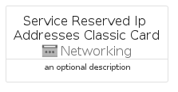
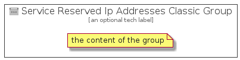

# ServiceReservedIpAddressesClassic


```text
azure-4/Item/Networking/ServiceReservedIpAddressesClassic
```

```text
include('azure-4/Item/Networking/ServiceReservedIpAddressesClassic')
```


| Illustration | ServiceReservedIpAddressesClassic | ServiceReservedIpAddressesClassicCard | ServiceReservedIpAddressesClassicGroup |
| :---: | :---: | :---: | :---: |
|  |  |  |  |


## ServiceReservedIpAddressesClassic

### Load remotely
```plantuml
@startuml
' configures the library
!global $LIB_BASE_LOCATION="https://raw.githubusercontent.com/tmorin/plantuml-libs/master/distribution"

' loads the library's bootstrap
!include $LIB_BASE_LOCATION/bootstrap.puml

' loads the package bootstrap
include('azure-4/bootstrap')

' loads the Item which embeds the element ServiceReservedIpAddressesClassic
include('azure-4/Item/Networking/ServiceReservedIpAddressesClassic')

' renders the element
ServiceReservedIpAddressesClassic('ServiceReservedIpAddressesClassic', 'Service Reserved Ip Addresses Classic', 'an optional tech label', 'an optional description')
@enduml
```

### Load locally
```plantuml
@startuml
' configures the library
!global $INCLUSION_MODE="local"
!global $LIB_BASE_LOCATION="../../.."

' loads the library's bootstrap
!include $LIB_BASE_LOCATION/bootstrap.puml

' loads the package bootstrap
include('azure-4/bootstrap')

' loads the Item which embeds the element ServiceReservedIpAddressesClassic
include('azure-4/Item/Networking/ServiceReservedIpAddressesClassic')

' renders the element
ServiceReservedIpAddressesClassic('ServiceReservedIpAddressesClassic', 'Service Reserved Ip Addresses Classic', 'an optional tech label', 'an optional description')
@enduml
```

## ServiceReservedIpAddressesClassicCard

### Load remotely
```plantuml
@startuml
' configures the library
!global $LIB_BASE_LOCATION="https://raw.githubusercontent.com/tmorin/plantuml-libs/master/distribution"

' loads the library's bootstrap
!include $LIB_BASE_LOCATION/bootstrap.puml

' loads the package bootstrap
include('azure-4/bootstrap')

' loads the Item which embeds the element ServiceReservedIpAddressesClassicCard
include('azure-4/Item/Networking/ServiceReservedIpAddressesClassic')

' renders the element
ServiceReservedIpAddressesClassicCard('ServiceReservedIpAddressesClassicCard', 'Service Reserved Ip Addresses Classic Card', 'an optional description')
@enduml
```

### Load locally
```plantuml
@startuml
' configures the library
!global $INCLUSION_MODE="local"
!global $LIB_BASE_LOCATION="../../.."

' loads the library's bootstrap
!include $LIB_BASE_LOCATION/bootstrap.puml

' loads the package bootstrap
include('azure-4/bootstrap')

' loads the Item which embeds the element ServiceReservedIpAddressesClassicCard
include('azure-4/Item/Networking/ServiceReservedIpAddressesClassic')

' renders the element
ServiceReservedIpAddressesClassicCard('ServiceReservedIpAddressesClassicCard', 'Service Reserved Ip Addresses Classic Card', 'an optional description')
@enduml
```

## ServiceReservedIpAddressesClassicGroup

### Load remotely
```plantuml
@startuml
' configures the library
!global $LIB_BASE_LOCATION="https://raw.githubusercontent.com/tmorin/plantuml-libs/master/distribution"

' loads the library's bootstrap
!include $LIB_BASE_LOCATION/bootstrap.puml

' loads the package bootstrap
include('azure-4/bootstrap')

' loads the Item which embeds the element ServiceReservedIpAddressesClassicGroup
include('azure-4/Item/Networking/ServiceReservedIpAddressesClassic')

' renders the element
ServiceReservedIpAddressesClassicGroup('ServiceReservedIpAddressesClassicGroup', 'Service Reserved Ip Addresses Classic Group', 'an optional tech label') {
    note as note
        the content of the group
    end note
}
@enduml
```

### Load locally
```plantuml
@startuml
' configures the library
!global $INCLUSION_MODE="local"
!global $LIB_BASE_LOCATION="../../.."

' loads the library's bootstrap
!include $LIB_BASE_LOCATION/bootstrap.puml

' loads the package bootstrap
include('azure-4/bootstrap')

' loads the Item which embeds the element ServiceReservedIpAddressesClassicGroup
include('azure-4/Item/Networking/ServiceReservedIpAddressesClassic')

' renders the element
ServiceReservedIpAddressesClassicGroup('ServiceReservedIpAddressesClassicGroup', 'Service Reserved Ip Addresses Classic Group', 'an optional tech label') {
    note as note
        the content of the group
    end note
}
@enduml
```

