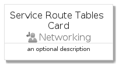
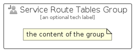

# ServiceRouteTables


```text
azure-4/Item/Networking/ServiceRouteTables
```

```text
include('azure-4/Item/Networking/ServiceRouteTables')
```


| Illustration | ServiceRouteTables | ServiceRouteTablesCard | ServiceRouteTablesGroup |
| :---: | :---: | :---: | :---: |
|  |  |  |  |


## ServiceRouteTables

### Load remotely
```plantuml
@startuml
' configures the library
!global $LIB_BASE_LOCATION="https://raw.githubusercontent.com/tmorin/plantuml-libs/master/distribution"

' loads the library's bootstrap
!include $LIB_BASE_LOCATION/bootstrap.puml

' loads the package bootstrap
include('azure-4/bootstrap')

' loads the Item which embeds the element ServiceRouteTables
include('azure-4/Item/Networking/ServiceRouteTables')

' renders the element
ServiceRouteTables('ServiceRouteTables', 'Service Route Tables', 'an optional tech label', 'an optional description')
@enduml
```

### Load locally
```plantuml
@startuml
' configures the library
!global $INCLUSION_MODE="local"
!global $LIB_BASE_LOCATION="../../.."

' loads the library's bootstrap
!include $LIB_BASE_LOCATION/bootstrap.puml

' loads the package bootstrap
include('azure-4/bootstrap')

' loads the Item which embeds the element ServiceRouteTables
include('azure-4/Item/Networking/ServiceRouteTables')

' renders the element
ServiceRouteTables('ServiceRouteTables', 'Service Route Tables', 'an optional tech label', 'an optional description')
@enduml
```

## ServiceRouteTablesCard

### Load remotely
```plantuml
@startuml
' configures the library
!global $LIB_BASE_LOCATION="https://raw.githubusercontent.com/tmorin/plantuml-libs/master/distribution"

' loads the library's bootstrap
!include $LIB_BASE_LOCATION/bootstrap.puml

' loads the package bootstrap
include('azure-4/bootstrap')

' loads the Item which embeds the element ServiceRouteTablesCard
include('azure-4/Item/Networking/ServiceRouteTables')

' renders the element
ServiceRouteTablesCard('ServiceRouteTablesCard', 'Service Route Tables Card', 'an optional description')
@enduml
```

### Load locally
```plantuml
@startuml
' configures the library
!global $INCLUSION_MODE="local"
!global $LIB_BASE_LOCATION="../../.."

' loads the library's bootstrap
!include $LIB_BASE_LOCATION/bootstrap.puml

' loads the package bootstrap
include('azure-4/bootstrap')

' loads the Item which embeds the element ServiceRouteTablesCard
include('azure-4/Item/Networking/ServiceRouteTables')

' renders the element
ServiceRouteTablesCard('ServiceRouteTablesCard', 'Service Route Tables Card', 'an optional description')
@enduml
```

## ServiceRouteTablesGroup

### Load remotely
```plantuml
@startuml
' configures the library
!global $LIB_BASE_LOCATION="https://raw.githubusercontent.com/tmorin/plantuml-libs/master/distribution"

' loads the library's bootstrap
!include $LIB_BASE_LOCATION/bootstrap.puml

' loads the package bootstrap
include('azure-4/bootstrap')

' loads the Item which embeds the element ServiceRouteTablesGroup
include('azure-4/Item/Networking/ServiceRouteTables')

' renders the element
ServiceRouteTablesGroup('ServiceRouteTablesGroup', 'Service Route Tables Group', 'an optional tech label') {
    note as note
        the content of the group
    end note
}
@enduml
```

### Load locally
```plantuml
@startuml
' configures the library
!global $INCLUSION_MODE="local"
!global $LIB_BASE_LOCATION="../../.."

' loads the library's bootstrap
!include $LIB_BASE_LOCATION/bootstrap.puml

' loads the package bootstrap
include('azure-4/bootstrap')

' loads the Item which embeds the element ServiceRouteTablesGroup
include('azure-4/Item/Networking/ServiceRouteTables')

' renders the element
ServiceRouteTablesGroup('ServiceRouteTablesGroup', 'Service Route Tables Group', 'an optional tech label') {
    note as note
        the content of the group
    end note
}
@enduml
```

