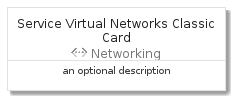
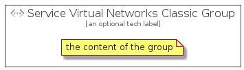

# ServiceVirtualNetworksClassic


```text
azure-4/Item/Networking/ServiceVirtualNetworksClassic
```

```text
include('azure-4/Item/Networking/ServiceVirtualNetworksClassic')
```


| Illustration | ServiceVirtualNetworksClassic | ServiceVirtualNetworksClassicCard | ServiceVirtualNetworksClassicGroup |
| :---: | :---: | :---: | :---: |
|  |  |  |  |


## ServiceVirtualNetworksClassic

### Load remotely
```plantuml
@startuml
' configures the library
!global $LIB_BASE_LOCATION="https://raw.githubusercontent.com/tmorin/plantuml-libs/master/distribution"

' loads the library's bootstrap
!include $LIB_BASE_LOCATION/bootstrap.puml

' loads the package bootstrap
include('azure-4/bootstrap')

' loads the Item which embeds the element ServiceVirtualNetworksClassic
include('azure-4/Item/Networking/ServiceVirtualNetworksClassic')

' renders the element
ServiceVirtualNetworksClassic('ServiceVirtualNetworksClassic', 'Service Virtual Networks Classic', 'an optional tech label')
@enduml
```

### Load locally
```plantuml
@startuml
' configures the library
!global $INCLUSION_MODE="local"
!global $LIB_BASE_LOCATION="../../.."

' loads the library's bootstrap
!include $LIB_BASE_LOCATION/bootstrap.puml

' loads the package bootstrap
include('azure-4/bootstrap')

' loads the Item which embeds the element ServiceVirtualNetworksClassic
include('azure-4/Item/Networking/ServiceVirtualNetworksClassic')

' renders the element
ServiceVirtualNetworksClassic('ServiceVirtualNetworksClassic', 'Service Virtual Networks Classic', 'an optional tech label')
@enduml
```

## ServiceVirtualNetworksClassicCard

### Load remotely
```plantuml
@startuml
' configures the library
!global $LIB_BASE_LOCATION="https://raw.githubusercontent.com/tmorin/plantuml-libs/master/distribution"

' loads the library's bootstrap
!include $LIB_BASE_LOCATION/bootstrap.puml

' loads the package bootstrap
include('azure-4/bootstrap')

' loads the Item which embeds the element ServiceVirtualNetworksClassicCard
include('azure-4/Item/Networking/ServiceVirtualNetworksClassic')

' renders the element
ServiceVirtualNetworksClassicCard('ServiceVirtualNetworksClassicCard', 'Service Virtual Networks Classic Card', 'an optional description')
@enduml
```

### Load locally
```plantuml
@startuml
' configures the library
!global $INCLUSION_MODE="local"
!global $LIB_BASE_LOCATION="../../.."

' loads the library's bootstrap
!include $LIB_BASE_LOCATION/bootstrap.puml

' loads the package bootstrap
include('azure-4/bootstrap')

' loads the Item which embeds the element ServiceVirtualNetworksClassicCard
include('azure-4/Item/Networking/ServiceVirtualNetworksClassic')

' renders the element
ServiceVirtualNetworksClassicCard('ServiceVirtualNetworksClassicCard', 'Service Virtual Networks Classic Card', 'an optional description')
@enduml
```

## ServiceVirtualNetworksClassicGroup

### Load remotely
```plantuml
@startuml
' configures the library
!global $LIB_BASE_LOCATION="https://raw.githubusercontent.com/tmorin/plantuml-libs/master/distribution"

' loads the library's bootstrap
!include $LIB_BASE_LOCATION/bootstrap.puml

' loads the package bootstrap
include('azure-4/bootstrap')

' loads the Item which embeds the element ServiceVirtualNetworksClassicGroup
include('azure-4/Item/Networking/ServiceVirtualNetworksClassic')

' renders the element
ServiceVirtualNetworksClassicGroup('ServiceVirtualNetworksClassicGroup', 'Service Virtual Networks Classic Group', 'an optional tech label') {
    note as note
        the content of the group
    end note
}
@enduml
```

### Load locally
```plantuml
@startuml
' configures the library
!global $INCLUSION_MODE="local"
!global $LIB_BASE_LOCATION="../../.."

' loads the library's bootstrap
!include $LIB_BASE_LOCATION/bootstrap.puml

' loads the package bootstrap
include('azure-4/bootstrap')

' loads the Item which embeds the element ServiceVirtualNetworksClassicGroup
include('azure-4/Item/Networking/ServiceVirtualNetworksClassic')

' renders the element
ServiceVirtualNetworksClassicGroup('ServiceVirtualNetworksClassicGroup', 'Service Virtual Networks Classic Group', 'an optional tech label') {
    note as note
        the content of the group
    end note
}
@enduml
```

