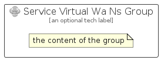

# ServiceVirtualWaNs


```text
azure-4/Item/Networking/ServiceVirtualWaNs
```

```text
include('azure-4/Item/Networking/ServiceVirtualWaNs')
```


| Illustration | ServiceVirtualWaNs | ServiceVirtualWaNsCard | ServiceVirtualWaNsGroup |
| :---: | :---: | :---: | :---: |
|  |  |  |  |


## ServiceVirtualWaNs

### Load remotely
```plantuml
@startuml
' configures the library
!global $LIB_BASE_LOCATION="https://github.com/tmorin/plantuml-libs/distribution"

' loads the library's bootstrap
!include $LIB_BASE_LOCATION/bootstrap.puml

' loads the package bootstrap
include('azure-4/bootstrap')

' loads the Item which embeds the element ServiceVirtualWaNs
include('azure-4/Item/Networking/ServiceVirtualWaNs')

' renders the element
ServiceVirtualWaNs('ServiceVirtualWaNs', 'Service Virtual Wa Ns', 'an optional tech label')
@enduml
```

### Load locally
```plantuml
@startuml
' configures the library
!global $INCLUSION_MODE="local"
!global $LIB_BASE_LOCATION="../../.."

' loads the library's bootstrap
!include $LIB_BASE_LOCATION/bootstrap.puml

' loads the package bootstrap
include('azure-4/bootstrap')

' loads the Item which embeds the element ServiceVirtualWaNs
include('azure-4/Item/Networking/ServiceVirtualWaNs')

' renders the element
ServiceVirtualWaNs('ServiceVirtualWaNs', 'Service Virtual Wa Ns', 'an optional tech label')
@enduml
```

## ServiceVirtualWaNsCard

### Load remotely
```plantuml
@startuml
' configures the library
!global $LIB_BASE_LOCATION="https://github.com/tmorin/plantuml-libs/distribution"

' loads the library's bootstrap
!include $LIB_BASE_LOCATION/bootstrap.puml

' loads the package bootstrap
include('azure-4/bootstrap')

' loads the Item which embeds the element ServiceVirtualWaNsCard
include('azure-4/Item/Networking/ServiceVirtualWaNs')

' renders the element
ServiceVirtualWaNsCard('ServiceVirtualWaNsCard', 'Service Virtual Wa Ns Card', 'an optional description')
@enduml
```

### Load locally
```plantuml
@startuml
' configures the library
!global $INCLUSION_MODE="local"
!global $LIB_BASE_LOCATION="../../.."

' loads the library's bootstrap
!include $LIB_BASE_LOCATION/bootstrap.puml

' loads the package bootstrap
include('azure-4/bootstrap')

' loads the Item which embeds the element ServiceVirtualWaNsCard
include('azure-4/Item/Networking/ServiceVirtualWaNs')

' renders the element
ServiceVirtualWaNsCard('ServiceVirtualWaNsCard', 'Service Virtual Wa Ns Card', 'an optional description')
@enduml
```

## ServiceVirtualWaNsGroup

### Load remotely
```plantuml
@startuml
' configures the library
!global $LIB_BASE_LOCATION="https://github.com/tmorin/plantuml-libs/distribution"

' loads the library's bootstrap
!include $LIB_BASE_LOCATION/bootstrap.puml

' loads the package bootstrap
include('azure-4/bootstrap')

' loads the Item which embeds the element ServiceVirtualWaNsGroup
include('azure-4/Item/Networking/ServiceVirtualWaNs')

' renders the element
ServiceVirtualWaNsGroup('ServiceVirtualWaNsGroup', 'Service Virtual Wa Ns Group', 'an optional tech label') {
    note as note
        the content of the group
    end note
}
@enduml
```

### Load locally
```plantuml
@startuml
' configures the library
!global $INCLUSION_MODE="local"
!global $LIB_BASE_LOCATION="../../.."

' loads the library's bootstrap
!include $LIB_BASE_LOCATION/bootstrap.puml

' loads the package bootstrap
include('azure-4/bootstrap')

' loads the Item which embeds the element ServiceVirtualWaNsGroup
include('azure-4/Item/Networking/ServiceVirtualWaNs')

' renders the element
ServiceVirtualWaNsGroup('ServiceVirtualWaNsGroup', 'Service Virtual Wa Ns Group', 'an optional tech label') {
    note as note
        the content of the group
    end note
}
@enduml
```

