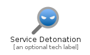
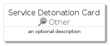
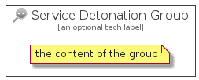

# ServiceDetonation


```text
azure-4/Item/Other/ServiceDetonation
```

```text
include('azure-4/Item/Other/ServiceDetonation')
```


| Illustration | ServiceDetonation | ServiceDetonationCard | ServiceDetonationGroup |
| :---: | :---: | :---: | :---: |
|  |  |  |  |


## ServiceDetonation

### Load remotely
```plantuml
@startuml
' configures the library
!global $LIB_BASE_LOCATION="https://raw.githubusercontent.com/tmorin/plantuml-libs/master/distribution"

' loads the library's bootstrap
!include $LIB_BASE_LOCATION/bootstrap.puml

' loads the package bootstrap
include('azure-4/bootstrap')

' loads the Item which embeds the element ServiceDetonation
include('azure-4/Item/Other/ServiceDetonation')

' renders the element
ServiceDetonation('ServiceDetonation', 'Service Detonation', 'an optional tech label', 'an optional description')
@enduml
```

### Load locally
```plantuml
@startuml
' configures the library
!global $INCLUSION_MODE="local"
!global $LIB_BASE_LOCATION="../../.."

' loads the library's bootstrap
!include $LIB_BASE_LOCATION/bootstrap.puml

' loads the package bootstrap
include('azure-4/bootstrap')

' loads the Item which embeds the element ServiceDetonation
include('azure-4/Item/Other/ServiceDetonation')

' renders the element
ServiceDetonation('ServiceDetonation', 'Service Detonation', 'an optional tech label', 'an optional description')
@enduml
```

## ServiceDetonationCard

### Load remotely
```plantuml
@startuml
' configures the library
!global $LIB_BASE_LOCATION="https://raw.githubusercontent.com/tmorin/plantuml-libs/master/distribution"

' loads the library's bootstrap
!include $LIB_BASE_LOCATION/bootstrap.puml

' loads the package bootstrap
include('azure-4/bootstrap')

' loads the Item which embeds the element ServiceDetonationCard
include('azure-4/Item/Other/ServiceDetonation')

' renders the element
ServiceDetonationCard('ServiceDetonationCard', 'Service Detonation Card', 'an optional description')
@enduml
```

### Load locally
```plantuml
@startuml
' configures the library
!global $INCLUSION_MODE="local"
!global $LIB_BASE_LOCATION="../../.."

' loads the library's bootstrap
!include $LIB_BASE_LOCATION/bootstrap.puml

' loads the package bootstrap
include('azure-4/bootstrap')

' loads the Item which embeds the element ServiceDetonationCard
include('azure-4/Item/Other/ServiceDetonation')

' renders the element
ServiceDetonationCard('ServiceDetonationCard', 'Service Detonation Card', 'an optional description')
@enduml
```

## ServiceDetonationGroup

### Load remotely
```plantuml
@startuml
' configures the library
!global $LIB_BASE_LOCATION="https://raw.githubusercontent.com/tmorin/plantuml-libs/master/distribution"

' loads the library's bootstrap
!include $LIB_BASE_LOCATION/bootstrap.puml

' loads the package bootstrap
include('azure-4/bootstrap')

' loads the Item which embeds the element ServiceDetonationGroup
include('azure-4/Item/Other/ServiceDetonation')

' renders the element
ServiceDetonationGroup('ServiceDetonationGroup', 'Service Detonation Group', 'an optional tech label') {
    note as note
        the content of the group
    end note
}
@enduml
```

### Load locally
```plantuml
@startuml
' configures the library
!global $INCLUSION_MODE="local"
!global $LIB_BASE_LOCATION="../../.."

' loads the library's bootstrap
!include $LIB_BASE_LOCATION/bootstrap.puml

' loads the package bootstrap
include('azure-4/bootstrap')

' loads the Item which embeds the element ServiceDetonationGroup
include('azure-4/Item/Other/ServiceDetonation')

' renders the element
ServiceDetonationGroup('ServiceDetonationGroup', 'Service Detonation Group', 'an optional tech label') {
    note as note
        the content of the group
    end note
}
@enduml
```

