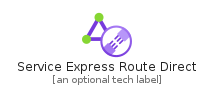
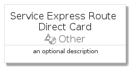
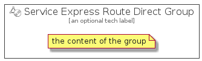

# ServiceExpressRouteDirect


```text
azure-4/Item/Other/ServiceExpressRouteDirect
```

```text
include('azure-4/Item/Other/ServiceExpressRouteDirect')
```


| Illustration | ServiceExpressRouteDirect | ServiceExpressRouteDirectCard | ServiceExpressRouteDirectGroup |
| :---: | :---: | :---: | :---: |
|  |  |  |  |


## ServiceExpressRouteDirect

### Load remotely
```plantuml
@startuml
' configures the library
!global $LIB_BASE_LOCATION="https://raw.githubusercontent.com/tmorin/plantuml-libs/master/distribution"

' loads the library's bootstrap
!include $LIB_BASE_LOCATION/bootstrap.puml

' loads the package bootstrap
include('azure-4/bootstrap')

' loads the Item which embeds the element ServiceExpressRouteDirect
include('azure-4/Item/Other/ServiceExpressRouteDirect')

' renders the element
ServiceExpressRouteDirect('ServiceExpressRouteDirect', 'Service Express Route Direct', 'an optional tech label')
@enduml
```

### Load locally
```plantuml
@startuml
' configures the library
!global $INCLUSION_MODE="local"
!global $LIB_BASE_LOCATION="../../.."

' loads the library's bootstrap
!include $LIB_BASE_LOCATION/bootstrap.puml

' loads the package bootstrap
include('azure-4/bootstrap')

' loads the Item which embeds the element ServiceExpressRouteDirect
include('azure-4/Item/Other/ServiceExpressRouteDirect')

' renders the element
ServiceExpressRouteDirect('ServiceExpressRouteDirect', 'Service Express Route Direct', 'an optional tech label')
@enduml
```

## ServiceExpressRouteDirectCard

### Load remotely
```plantuml
@startuml
' configures the library
!global $LIB_BASE_LOCATION="https://raw.githubusercontent.com/tmorin/plantuml-libs/master/distribution"

' loads the library's bootstrap
!include $LIB_BASE_LOCATION/bootstrap.puml

' loads the package bootstrap
include('azure-4/bootstrap')

' loads the Item which embeds the element ServiceExpressRouteDirectCard
include('azure-4/Item/Other/ServiceExpressRouteDirect')

' renders the element
ServiceExpressRouteDirectCard('ServiceExpressRouteDirectCard', 'Service Express Route Direct Card', 'an optional description')
@enduml
```

### Load locally
```plantuml
@startuml
' configures the library
!global $INCLUSION_MODE="local"
!global $LIB_BASE_LOCATION="../../.."

' loads the library's bootstrap
!include $LIB_BASE_LOCATION/bootstrap.puml

' loads the package bootstrap
include('azure-4/bootstrap')

' loads the Item which embeds the element ServiceExpressRouteDirectCard
include('azure-4/Item/Other/ServiceExpressRouteDirect')

' renders the element
ServiceExpressRouteDirectCard('ServiceExpressRouteDirectCard', 'Service Express Route Direct Card', 'an optional description')
@enduml
```

## ServiceExpressRouteDirectGroup

### Load remotely
```plantuml
@startuml
' configures the library
!global $LIB_BASE_LOCATION="https://raw.githubusercontent.com/tmorin/plantuml-libs/master/distribution"

' loads the library's bootstrap
!include $LIB_BASE_LOCATION/bootstrap.puml

' loads the package bootstrap
include('azure-4/bootstrap')

' loads the Item which embeds the element ServiceExpressRouteDirectGroup
include('azure-4/Item/Other/ServiceExpressRouteDirect')

' renders the element
ServiceExpressRouteDirectGroup('ServiceExpressRouteDirectGroup', 'Service Express Route Direct Group', 'an optional tech label') {
    note as note
        the content of the group
    end note
}
@enduml
```

### Load locally
```plantuml
@startuml
' configures the library
!global $INCLUSION_MODE="local"
!global $LIB_BASE_LOCATION="../../.."

' loads the library's bootstrap
!include $LIB_BASE_LOCATION/bootstrap.puml

' loads the package bootstrap
include('azure-4/bootstrap')

' loads the Item which embeds the element ServiceExpressRouteDirectGroup
include('azure-4/Item/Other/ServiceExpressRouteDirect')

' renders the element
ServiceExpressRouteDirectGroup('ServiceExpressRouteDirectGroup', 'Service Express Route Direct Group', 'an optional tech label') {
    note as note
        the content of the group
    end note
}
@enduml
```

