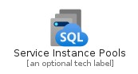
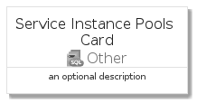
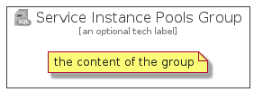

# ServiceInstancePools


```text
azure-4/Item/Other/ServiceInstancePools
```

```text
include('azure-4/Item/Other/ServiceInstancePools')
```


| Illustration | ServiceInstancePools | ServiceInstancePoolsCard | ServiceInstancePoolsGroup |
| :---: | :---: | :---: | :---: |
|  |  |  |  |


## ServiceInstancePools

### Load remotely
```plantuml
@startuml
' configures the library
!global $LIB_BASE_LOCATION="https://github.com/tmorin/plantuml-libs/distribution"

' loads the library's bootstrap
!include $LIB_BASE_LOCATION/bootstrap.puml

' loads the package bootstrap
include('azure-4/bootstrap')

' loads the Item which embeds the element ServiceInstancePools
include('azure-4/Item/Other/ServiceInstancePools')

' renders the element
ServiceInstancePools('ServiceInstancePools', 'Service Instance Pools', 'an optional tech label')
@enduml
```

### Load locally
```plantuml
@startuml
' configures the library
!global $INCLUSION_MODE="local"
!global $LIB_BASE_LOCATION="../../.."

' loads the library's bootstrap
!include $LIB_BASE_LOCATION/bootstrap.puml

' loads the package bootstrap
include('azure-4/bootstrap')

' loads the Item which embeds the element ServiceInstancePools
include('azure-4/Item/Other/ServiceInstancePools')

' renders the element
ServiceInstancePools('ServiceInstancePools', 'Service Instance Pools', 'an optional tech label')
@enduml
```

## ServiceInstancePoolsCard

### Load remotely
```plantuml
@startuml
' configures the library
!global $LIB_BASE_LOCATION="https://github.com/tmorin/plantuml-libs/distribution"

' loads the library's bootstrap
!include $LIB_BASE_LOCATION/bootstrap.puml

' loads the package bootstrap
include('azure-4/bootstrap')

' loads the Item which embeds the element ServiceInstancePoolsCard
include('azure-4/Item/Other/ServiceInstancePools')

' renders the element
ServiceInstancePoolsCard('ServiceInstancePoolsCard', 'Service Instance Pools Card', 'an optional description')
@enduml
```

### Load locally
```plantuml
@startuml
' configures the library
!global $INCLUSION_MODE="local"
!global $LIB_BASE_LOCATION="../../.."

' loads the library's bootstrap
!include $LIB_BASE_LOCATION/bootstrap.puml

' loads the package bootstrap
include('azure-4/bootstrap')

' loads the Item which embeds the element ServiceInstancePoolsCard
include('azure-4/Item/Other/ServiceInstancePools')

' renders the element
ServiceInstancePoolsCard('ServiceInstancePoolsCard', 'Service Instance Pools Card', 'an optional description')
@enduml
```

## ServiceInstancePoolsGroup

### Load remotely
```plantuml
@startuml
' configures the library
!global $LIB_BASE_LOCATION="https://github.com/tmorin/plantuml-libs/distribution"

' loads the library's bootstrap
!include $LIB_BASE_LOCATION/bootstrap.puml

' loads the package bootstrap
include('azure-4/bootstrap')

' loads the Item which embeds the element ServiceInstancePoolsGroup
include('azure-4/Item/Other/ServiceInstancePools')

' renders the element
ServiceInstancePoolsGroup('ServiceInstancePoolsGroup', 'Service Instance Pools Group', 'an optional tech label') {
    note as note
        the content of the group
    end note
}
@enduml
```

### Load locally
```plantuml
@startuml
' configures the library
!global $INCLUSION_MODE="local"
!global $LIB_BASE_LOCATION="../../.."

' loads the library's bootstrap
!include $LIB_BASE_LOCATION/bootstrap.puml

' loads the package bootstrap
include('azure-4/bootstrap')

' loads the Item which embeds the element ServiceInstancePoolsGroup
include('azure-4/Item/Other/ServiceInstancePools')

' renders the element
ServiceInstancePoolsGroup('ServiceInstancePoolsGroup', 'Service Instance Pools Group', 'an optional tech label') {
    note as note
        the content of the group
    end note
}
@enduml
```

