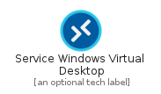
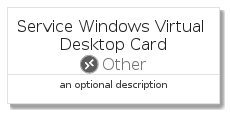

# ServiceWindowsVirtualDesktop


```text
azure-4/Item/Other/ServiceWindowsVirtualDesktop
```

```text
include('azure-4/Item/Other/ServiceWindowsVirtualDesktop')
```


| Illustration | ServiceWindowsVirtualDesktop | ServiceWindowsVirtualDesktopCard | ServiceWindowsVirtualDesktopGroup |
| :---: | :---: | :---: | :---: |
|  |  |  |  |


## ServiceWindowsVirtualDesktop

### Load remotely
```plantuml
@startuml
' configures the library
!global $LIB_BASE_LOCATION="https://raw.githubusercontent.com/tmorin/plantuml-libs/master/distribution"

' loads the library's bootstrap
!include $LIB_BASE_LOCATION/bootstrap.puml

' loads the package bootstrap
include('azure-4/bootstrap')

' loads the Item which embeds the element ServiceWindowsVirtualDesktop
include('azure-4/Item/Other/ServiceWindowsVirtualDesktop')

' renders the element
ServiceWindowsVirtualDesktop('ServiceWindowsVirtualDesktop', 'Service Windows Virtual Desktop', 'an optional tech label', 'an optional description')
@enduml
```

### Load locally
```plantuml
@startuml
' configures the library
!global $INCLUSION_MODE="local"
!global $LIB_BASE_LOCATION="../../.."

' loads the library's bootstrap
!include $LIB_BASE_LOCATION/bootstrap.puml

' loads the package bootstrap
include('azure-4/bootstrap')

' loads the Item which embeds the element ServiceWindowsVirtualDesktop
include('azure-4/Item/Other/ServiceWindowsVirtualDesktop')

' renders the element
ServiceWindowsVirtualDesktop('ServiceWindowsVirtualDesktop', 'Service Windows Virtual Desktop', 'an optional tech label', 'an optional description')
@enduml
```

## ServiceWindowsVirtualDesktopCard

### Load remotely
```plantuml
@startuml
' configures the library
!global $LIB_BASE_LOCATION="https://raw.githubusercontent.com/tmorin/plantuml-libs/master/distribution"

' loads the library's bootstrap
!include $LIB_BASE_LOCATION/bootstrap.puml

' loads the package bootstrap
include('azure-4/bootstrap')

' loads the Item which embeds the element ServiceWindowsVirtualDesktopCard
include('azure-4/Item/Other/ServiceWindowsVirtualDesktop')

' renders the element
ServiceWindowsVirtualDesktopCard('ServiceWindowsVirtualDesktopCard', 'Service Windows Virtual Desktop Card', 'an optional description')
@enduml
```

### Load locally
```plantuml
@startuml
' configures the library
!global $INCLUSION_MODE="local"
!global $LIB_BASE_LOCATION="../../.."

' loads the library's bootstrap
!include $LIB_BASE_LOCATION/bootstrap.puml

' loads the package bootstrap
include('azure-4/bootstrap')

' loads the Item which embeds the element ServiceWindowsVirtualDesktopCard
include('azure-4/Item/Other/ServiceWindowsVirtualDesktop')

' renders the element
ServiceWindowsVirtualDesktopCard('ServiceWindowsVirtualDesktopCard', 'Service Windows Virtual Desktop Card', 'an optional description')
@enduml
```

## ServiceWindowsVirtualDesktopGroup

### Load remotely
```plantuml
@startuml
' configures the library
!global $LIB_BASE_LOCATION="https://raw.githubusercontent.com/tmorin/plantuml-libs/master/distribution"

' loads the library's bootstrap
!include $LIB_BASE_LOCATION/bootstrap.puml

' loads the package bootstrap
include('azure-4/bootstrap')

' loads the Item which embeds the element ServiceWindowsVirtualDesktopGroup
include('azure-4/Item/Other/ServiceWindowsVirtualDesktop')

' renders the element
ServiceWindowsVirtualDesktopGroup('ServiceWindowsVirtualDesktopGroup', 'Service Windows Virtual Desktop Group', 'an optional tech label') {
    note as note
        the content of the group
    end note
}
@enduml
```

### Load locally
```plantuml
@startuml
' configures the library
!global $INCLUSION_MODE="local"
!global $LIB_BASE_LOCATION="../../.."

' loads the library's bootstrap
!include $LIB_BASE_LOCATION/bootstrap.puml

' loads the package bootstrap
include('azure-4/bootstrap')

' loads the Item which embeds the element ServiceWindowsVirtualDesktopGroup
include('azure-4/Item/Other/ServiceWindowsVirtualDesktop')

' renders the element
ServiceWindowsVirtualDesktopGroup('ServiceWindowsVirtualDesktopGroup', 'Service Windows Virtual Desktop Group', 'an optional tech label') {
    note as note
        the content of the group
    end note
}
@enduml
```

