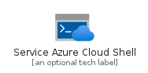
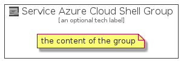

# ServiceAzureCloudShell


```text
azure-4/Item/Preview/ServiceAzureCloudShell
```

```text
include('azure-4/Item/Preview/ServiceAzureCloudShell')
```


| Illustration | ServiceAzureCloudShell | ServiceAzureCloudShellCard | ServiceAzureCloudShellGroup |
| :---: | :---: | :---: | :---: |
|  |  |  |  |


## ServiceAzureCloudShell

### Load remotely
```plantuml
@startuml
' configures the library
!global $LIB_BASE_LOCATION="https://raw.githubusercontent.com/tmorin/plantuml-libs/master/distribution"

' loads the library's bootstrap
!include $LIB_BASE_LOCATION/bootstrap.puml

' loads the package bootstrap
include('azure-4/bootstrap')

' loads the Item which embeds the element ServiceAzureCloudShell
include('azure-4/Item/Preview/ServiceAzureCloudShell')

' renders the element
ServiceAzureCloudShell('ServiceAzureCloudShell', 'Service Azure Cloud Shell', 'an optional tech label')
@enduml
```

### Load locally
```plantuml
@startuml
' configures the library
!global $INCLUSION_MODE="local"
!global $LIB_BASE_LOCATION="../../.."

' loads the library's bootstrap
!include $LIB_BASE_LOCATION/bootstrap.puml

' loads the package bootstrap
include('azure-4/bootstrap')

' loads the Item which embeds the element ServiceAzureCloudShell
include('azure-4/Item/Preview/ServiceAzureCloudShell')

' renders the element
ServiceAzureCloudShell('ServiceAzureCloudShell', 'Service Azure Cloud Shell', 'an optional tech label')
@enduml
```

## ServiceAzureCloudShellCard

### Load remotely
```plantuml
@startuml
' configures the library
!global $LIB_BASE_LOCATION="https://raw.githubusercontent.com/tmorin/plantuml-libs/master/distribution"

' loads the library's bootstrap
!include $LIB_BASE_LOCATION/bootstrap.puml

' loads the package bootstrap
include('azure-4/bootstrap')

' loads the Item which embeds the element ServiceAzureCloudShellCard
include('azure-4/Item/Preview/ServiceAzureCloudShell')

' renders the element
ServiceAzureCloudShellCard('ServiceAzureCloudShellCard', 'Service Azure Cloud Shell Card', 'an optional description')
@enduml
```

### Load locally
```plantuml
@startuml
' configures the library
!global $INCLUSION_MODE="local"
!global $LIB_BASE_LOCATION="../../.."

' loads the library's bootstrap
!include $LIB_BASE_LOCATION/bootstrap.puml

' loads the package bootstrap
include('azure-4/bootstrap')

' loads the Item which embeds the element ServiceAzureCloudShellCard
include('azure-4/Item/Preview/ServiceAzureCloudShell')

' renders the element
ServiceAzureCloudShellCard('ServiceAzureCloudShellCard', 'Service Azure Cloud Shell Card', 'an optional description')
@enduml
```

## ServiceAzureCloudShellGroup

### Load remotely
```plantuml
@startuml
' configures the library
!global $LIB_BASE_LOCATION="https://raw.githubusercontent.com/tmorin/plantuml-libs/master/distribution"

' loads the library's bootstrap
!include $LIB_BASE_LOCATION/bootstrap.puml

' loads the package bootstrap
include('azure-4/bootstrap')

' loads the Item which embeds the element ServiceAzureCloudShellGroup
include('azure-4/Item/Preview/ServiceAzureCloudShell')

' renders the element
ServiceAzureCloudShellGroup('ServiceAzureCloudShellGroup', 'Service Azure Cloud Shell Group', 'an optional tech label') {
    note as note
        the content of the group
    end note
}
@enduml
```

### Load locally
```plantuml
@startuml
' configures the library
!global $INCLUSION_MODE="local"
!global $LIB_BASE_LOCATION="../../.."

' loads the library's bootstrap
!include $LIB_BASE_LOCATION/bootstrap.puml

' loads the package bootstrap
include('azure-4/bootstrap')

' loads the Item which embeds the element ServiceAzureCloudShellGroup
include('azure-4/Item/Preview/ServiceAzureCloudShell')

' renders the element
ServiceAzureCloudShellGroup('ServiceAzureCloudShellGroup', 'Service Azure Cloud Shell Group', 'an optional tech label') {
    note as note
        the content of the group
    end note
}
@enduml
```

