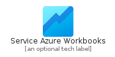
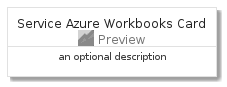
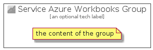

# ServiceAzureWorkbooks


```text
azure-4/Item/Preview/ServiceAzureWorkbooks
```

```text
include('azure-4/Item/Preview/ServiceAzureWorkbooks')
```


| Illustration | ServiceAzureWorkbooks | ServiceAzureWorkbooksCard | ServiceAzureWorkbooksGroup |
| :---: | :---: | :---: | :---: |
|  |  |  |  |


## ServiceAzureWorkbooks

### Load remotely
```plantuml
@startuml
' configures the library
!global $LIB_BASE_LOCATION="https://raw.githubusercontent.com/tmorin/plantuml-libs/master/distribution"

' loads the library's bootstrap
!include $LIB_BASE_LOCATION/bootstrap.puml

' loads the package bootstrap
include('azure-4/bootstrap')

' loads the Item which embeds the element ServiceAzureWorkbooks
include('azure-4/Item/Preview/ServiceAzureWorkbooks')

' renders the element
ServiceAzureWorkbooks('ServiceAzureWorkbooks', 'Service Azure Workbooks', 'an optional tech label')
@enduml
```

### Load locally
```plantuml
@startuml
' configures the library
!global $INCLUSION_MODE="local"
!global $LIB_BASE_LOCATION="../../.."

' loads the library's bootstrap
!include $LIB_BASE_LOCATION/bootstrap.puml

' loads the package bootstrap
include('azure-4/bootstrap')

' loads the Item which embeds the element ServiceAzureWorkbooks
include('azure-4/Item/Preview/ServiceAzureWorkbooks')

' renders the element
ServiceAzureWorkbooks('ServiceAzureWorkbooks', 'Service Azure Workbooks', 'an optional tech label')
@enduml
```

## ServiceAzureWorkbooksCard

### Load remotely
```plantuml
@startuml
' configures the library
!global $LIB_BASE_LOCATION="https://raw.githubusercontent.com/tmorin/plantuml-libs/master/distribution"

' loads the library's bootstrap
!include $LIB_BASE_LOCATION/bootstrap.puml

' loads the package bootstrap
include('azure-4/bootstrap')

' loads the Item which embeds the element ServiceAzureWorkbooksCard
include('azure-4/Item/Preview/ServiceAzureWorkbooks')

' renders the element
ServiceAzureWorkbooksCard('ServiceAzureWorkbooksCard', 'Service Azure Workbooks Card', 'an optional description')
@enduml
```

### Load locally
```plantuml
@startuml
' configures the library
!global $INCLUSION_MODE="local"
!global $LIB_BASE_LOCATION="../../.."

' loads the library's bootstrap
!include $LIB_BASE_LOCATION/bootstrap.puml

' loads the package bootstrap
include('azure-4/bootstrap')

' loads the Item which embeds the element ServiceAzureWorkbooksCard
include('azure-4/Item/Preview/ServiceAzureWorkbooks')

' renders the element
ServiceAzureWorkbooksCard('ServiceAzureWorkbooksCard', 'Service Azure Workbooks Card', 'an optional description')
@enduml
```

## ServiceAzureWorkbooksGroup

### Load remotely
```plantuml
@startuml
' configures the library
!global $LIB_BASE_LOCATION="https://raw.githubusercontent.com/tmorin/plantuml-libs/master/distribution"

' loads the library's bootstrap
!include $LIB_BASE_LOCATION/bootstrap.puml

' loads the package bootstrap
include('azure-4/bootstrap')

' loads the Item which embeds the element ServiceAzureWorkbooksGroup
include('azure-4/Item/Preview/ServiceAzureWorkbooks')

' renders the element
ServiceAzureWorkbooksGroup('ServiceAzureWorkbooksGroup', 'Service Azure Workbooks Group', 'an optional tech label') {
    note as note
        the content of the group
    end note
}
@enduml
```

### Load locally
```plantuml
@startuml
' configures the library
!global $INCLUSION_MODE="local"
!global $LIB_BASE_LOCATION="../../.."

' loads the library's bootstrap
!include $LIB_BASE_LOCATION/bootstrap.puml

' loads the package bootstrap
include('azure-4/bootstrap')

' loads the Item which embeds the element ServiceAzureWorkbooksGroup
include('azure-4/Item/Preview/ServiceAzureWorkbooks')

' renders the element
ServiceAzureWorkbooksGroup('ServiceAzureWorkbooksGroup', 'Service Azure Workbooks Group', 'an optional tech label') {
    note as note
        the content of the group
    end note
}
@enduml
```

