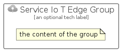

# ServiceIoTEdge


```text
azure-4/Item/Preview/ServiceIoTEdge
```

```text
include('azure-4/Item/Preview/ServiceIoTEdge')
```


| Illustration | ServiceIoTEdge | ServiceIoTEdgeCard | ServiceIoTEdgeGroup |
| :---: | :---: | :---: | :---: |
|  |  |  |  |


## ServiceIoTEdge

### Load remotely
```plantuml
@startuml
' configures the library
!global $LIB_BASE_LOCATION="https://raw.githubusercontent.com/tmorin/plantuml-libs/master/distribution"

' loads the library's bootstrap
!include $LIB_BASE_LOCATION/bootstrap.puml

' loads the package bootstrap
include('azure-4/bootstrap')

' loads the Item which embeds the element ServiceIoTEdge
include('azure-4/Item/Preview/ServiceIoTEdge')

' renders the element
ServiceIoTEdge('ServiceIoTEdge', 'Service Io T Edge', 'an optional tech label', 'an optional description')
@enduml
```

### Load locally
```plantuml
@startuml
' configures the library
!global $INCLUSION_MODE="local"
!global $LIB_BASE_LOCATION="../../.."

' loads the library's bootstrap
!include $LIB_BASE_LOCATION/bootstrap.puml

' loads the package bootstrap
include('azure-4/bootstrap')

' loads the Item which embeds the element ServiceIoTEdge
include('azure-4/Item/Preview/ServiceIoTEdge')

' renders the element
ServiceIoTEdge('ServiceIoTEdge', 'Service Io T Edge', 'an optional tech label', 'an optional description')
@enduml
```

## ServiceIoTEdgeCard

### Load remotely
```plantuml
@startuml
' configures the library
!global $LIB_BASE_LOCATION="https://raw.githubusercontent.com/tmorin/plantuml-libs/master/distribution"

' loads the library's bootstrap
!include $LIB_BASE_LOCATION/bootstrap.puml

' loads the package bootstrap
include('azure-4/bootstrap')

' loads the Item which embeds the element ServiceIoTEdgeCard
include('azure-4/Item/Preview/ServiceIoTEdge')

' renders the element
ServiceIoTEdgeCard('ServiceIoTEdgeCard', 'Service Io T Edge Card', 'an optional description')
@enduml
```

### Load locally
```plantuml
@startuml
' configures the library
!global $INCLUSION_MODE="local"
!global $LIB_BASE_LOCATION="../../.."

' loads the library's bootstrap
!include $LIB_BASE_LOCATION/bootstrap.puml

' loads the package bootstrap
include('azure-4/bootstrap')

' loads the Item which embeds the element ServiceIoTEdgeCard
include('azure-4/Item/Preview/ServiceIoTEdge')

' renders the element
ServiceIoTEdgeCard('ServiceIoTEdgeCard', 'Service Io T Edge Card', 'an optional description')
@enduml
```

## ServiceIoTEdgeGroup

### Load remotely
```plantuml
@startuml
' configures the library
!global $LIB_BASE_LOCATION="https://raw.githubusercontent.com/tmorin/plantuml-libs/master/distribution"

' loads the library's bootstrap
!include $LIB_BASE_LOCATION/bootstrap.puml

' loads the package bootstrap
include('azure-4/bootstrap')

' loads the Item which embeds the element ServiceIoTEdgeGroup
include('azure-4/Item/Preview/ServiceIoTEdge')

' renders the element
ServiceIoTEdgeGroup('ServiceIoTEdgeGroup', 'Service Io T Edge Group', 'an optional tech label') {
    note as note
        the content of the group
    end note
}
@enduml
```

### Load locally
```plantuml
@startuml
' configures the library
!global $INCLUSION_MODE="local"
!global $LIB_BASE_LOCATION="../../.."

' loads the library's bootstrap
!include $LIB_BASE_LOCATION/bootstrap.puml

' loads the package bootstrap
include('azure-4/bootstrap')

' loads the Item which embeds the element ServiceIoTEdgeGroup
include('azure-4/Item/Preview/ServiceIoTEdge')

' renders the element
ServiceIoTEdgeGroup('ServiceIoTEdgeGroup', 'Service Io T Edge Group', 'an optional tech label') {
    note as note
        the content of the group
    end note
}
@enduml
```

