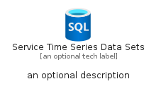
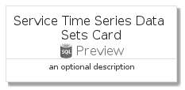
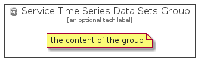

# ServiceTimeSeriesDataSets


```text
azure-4/Item/Preview/ServiceTimeSeriesDataSets
```

```text
include('azure-4/Item/Preview/ServiceTimeSeriesDataSets')
```


| Illustration | ServiceTimeSeriesDataSets | ServiceTimeSeriesDataSetsCard | ServiceTimeSeriesDataSetsGroup |
| :---: | :---: | :---: | :---: |
|  |  |  |  |


## ServiceTimeSeriesDataSets

### Load remotely
```plantuml
@startuml
' configures the library
!global $LIB_BASE_LOCATION="https://github.com/tmorin/plantuml-libs/distribution"

' loads the library's bootstrap
!include $LIB_BASE_LOCATION/bootstrap.puml

' loads the package bootstrap
include('azure-4/bootstrap')

' loads the Item which embeds the element ServiceTimeSeriesDataSets
include('azure-4/Item/Preview/ServiceTimeSeriesDataSets')

' renders the element
ServiceTimeSeriesDataSets('ServiceTimeSeriesDataSets', 'Service Time Series Data Sets', 'an optional tech label')
@enduml
```

### Load locally
```plantuml
@startuml
' configures the library
!global $INCLUSION_MODE="local"
!global $LIB_BASE_LOCATION="../../.."

' loads the library's bootstrap
!include $LIB_BASE_LOCATION/bootstrap.puml

' loads the package bootstrap
include('azure-4/bootstrap')

' loads the Item which embeds the element ServiceTimeSeriesDataSets
include('azure-4/Item/Preview/ServiceTimeSeriesDataSets')

' renders the element
ServiceTimeSeriesDataSets('ServiceTimeSeriesDataSets', 'Service Time Series Data Sets', 'an optional tech label')
@enduml
```

## ServiceTimeSeriesDataSetsCard

### Load remotely
```plantuml
@startuml
' configures the library
!global $LIB_BASE_LOCATION="https://github.com/tmorin/plantuml-libs/distribution"

' loads the library's bootstrap
!include $LIB_BASE_LOCATION/bootstrap.puml

' loads the package bootstrap
include('azure-4/bootstrap')

' loads the Item which embeds the element ServiceTimeSeriesDataSetsCard
include('azure-4/Item/Preview/ServiceTimeSeriesDataSets')

' renders the element
ServiceTimeSeriesDataSetsCard('ServiceTimeSeriesDataSetsCard', 'Service Time Series Data Sets Card', 'an optional description')
@enduml
```

### Load locally
```plantuml
@startuml
' configures the library
!global $INCLUSION_MODE="local"
!global $LIB_BASE_LOCATION="../../.."

' loads the library's bootstrap
!include $LIB_BASE_LOCATION/bootstrap.puml

' loads the package bootstrap
include('azure-4/bootstrap')

' loads the Item which embeds the element ServiceTimeSeriesDataSetsCard
include('azure-4/Item/Preview/ServiceTimeSeriesDataSets')

' renders the element
ServiceTimeSeriesDataSetsCard('ServiceTimeSeriesDataSetsCard', 'Service Time Series Data Sets Card', 'an optional description')
@enduml
```

## ServiceTimeSeriesDataSetsGroup

### Load remotely
```plantuml
@startuml
' configures the library
!global $LIB_BASE_LOCATION="https://github.com/tmorin/plantuml-libs/distribution"

' loads the library's bootstrap
!include $LIB_BASE_LOCATION/bootstrap.puml

' loads the package bootstrap
include('azure-4/bootstrap')

' loads the Item which embeds the element ServiceTimeSeriesDataSetsGroup
include('azure-4/Item/Preview/ServiceTimeSeriesDataSets')

' renders the element
ServiceTimeSeriesDataSetsGroup('ServiceTimeSeriesDataSetsGroup', 'Service Time Series Data Sets Group', 'an optional tech label') {
    note as note
        the content of the group
    end note
}
@enduml
```

### Load locally
```plantuml
@startuml
' configures the library
!global $INCLUSION_MODE="local"
!global $LIB_BASE_LOCATION="../../.."

' loads the library's bootstrap
!include $LIB_BASE_LOCATION/bootstrap.puml

' loads the package bootstrap
include('azure-4/bootstrap')

' loads the Item which embeds the element ServiceTimeSeriesDataSetsGroup
include('azure-4/Item/Preview/ServiceTimeSeriesDataSets')

' renders the element
ServiceTimeSeriesDataSetsGroup('ServiceTimeSeriesDataSetsGroup', 'Service Time Series Data Sets Group', 'an optional tech label') {
    note as note
        the content of the group
    end note
}
@enduml
```

