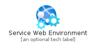
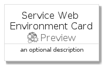
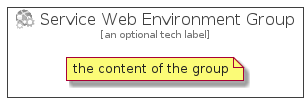

# ServiceWebEnvironment


```text
azure-4/Item/Preview/ServiceWebEnvironment
```

```text
include('azure-4/Item/Preview/ServiceWebEnvironment')
```


| Illustration | ServiceWebEnvironment | ServiceWebEnvironmentCard | ServiceWebEnvironmentGroup |
| :---: | :---: | :---: | :---: |
|  |  |  |  |


## ServiceWebEnvironment

### Load remotely
```plantuml
@startuml
' configures the library
!global $LIB_BASE_LOCATION="https://raw.githubusercontent.com/tmorin/plantuml-libs/master/distribution"

' loads the library's bootstrap
!include $LIB_BASE_LOCATION/bootstrap.puml

' loads the package bootstrap
include('azure-4/bootstrap')

' loads the Item which embeds the element ServiceWebEnvironment
include('azure-4/Item/Preview/ServiceWebEnvironment')

' renders the element
ServiceWebEnvironment('ServiceWebEnvironment', 'Service Web Environment', 'an optional tech label')
@enduml
```

### Load locally
```plantuml
@startuml
' configures the library
!global $INCLUSION_MODE="local"
!global $LIB_BASE_LOCATION="../../.."

' loads the library's bootstrap
!include $LIB_BASE_LOCATION/bootstrap.puml

' loads the package bootstrap
include('azure-4/bootstrap')

' loads the Item which embeds the element ServiceWebEnvironment
include('azure-4/Item/Preview/ServiceWebEnvironment')

' renders the element
ServiceWebEnvironment('ServiceWebEnvironment', 'Service Web Environment', 'an optional tech label')
@enduml
```

## ServiceWebEnvironmentCard

### Load remotely
```plantuml
@startuml
' configures the library
!global $LIB_BASE_LOCATION="https://raw.githubusercontent.com/tmorin/plantuml-libs/master/distribution"

' loads the library's bootstrap
!include $LIB_BASE_LOCATION/bootstrap.puml

' loads the package bootstrap
include('azure-4/bootstrap')

' loads the Item which embeds the element ServiceWebEnvironmentCard
include('azure-4/Item/Preview/ServiceWebEnvironment')

' renders the element
ServiceWebEnvironmentCard('ServiceWebEnvironmentCard', 'Service Web Environment Card', 'an optional description')
@enduml
```

### Load locally
```plantuml
@startuml
' configures the library
!global $INCLUSION_MODE="local"
!global $LIB_BASE_LOCATION="../../.."

' loads the library's bootstrap
!include $LIB_BASE_LOCATION/bootstrap.puml

' loads the package bootstrap
include('azure-4/bootstrap')

' loads the Item which embeds the element ServiceWebEnvironmentCard
include('azure-4/Item/Preview/ServiceWebEnvironment')

' renders the element
ServiceWebEnvironmentCard('ServiceWebEnvironmentCard', 'Service Web Environment Card', 'an optional description')
@enduml
```

## ServiceWebEnvironmentGroup

### Load remotely
```plantuml
@startuml
' configures the library
!global $LIB_BASE_LOCATION="https://raw.githubusercontent.com/tmorin/plantuml-libs/master/distribution"

' loads the library's bootstrap
!include $LIB_BASE_LOCATION/bootstrap.puml

' loads the package bootstrap
include('azure-4/bootstrap')

' loads the Item which embeds the element ServiceWebEnvironmentGroup
include('azure-4/Item/Preview/ServiceWebEnvironment')

' renders the element
ServiceWebEnvironmentGroup('ServiceWebEnvironmentGroup', 'Service Web Environment Group', 'an optional tech label') {
    note as note
        the content of the group
    end note
}
@enduml
```

### Load locally
```plantuml
@startuml
' configures the library
!global $INCLUSION_MODE="local"
!global $LIB_BASE_LOCATION="../../.."

' loads the library's bootstrap
!include $LIB_BASE_LOCATION/bootstrap.puml

' loads the package bootstrap
include('azure-4/bootstrap')

' loads the Item which embeds the element ServiceWebEnvironmentGroup
include('azure-4/Item/Preview/ServiceWebEnvironment')

' renders the element
ServiceWebEnvironmentGroup('ServiceWebEnvironmentGroup', 'Service Web Environment Group', 'an optional tech label') {
    note as note
        the content of the group
    end note
}
@enduml
```

