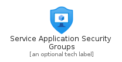
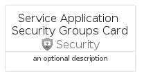
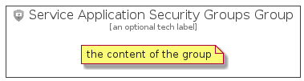

# ServiceApplicationSecurityGroups


```text
azure-4/Item/Security/ServiceApplicationSecurityGroups
```

```text
include('azure-4/Item/Security/ServiceApplicationSecurityGroups')
```


| Illustration | ServiceApplicationSecurityGroups | ServiceApplicationSecurityGroupsCard | ServiceApplicationSecurityGroupsGroup |
| :---: | :---: | :---: | :---: |
|  |  |  |  |


## ServiceApplicationSecurityGroups

### Load remotely
```plantuml
@startuml
' configures the library
!global $LIB_BASE_LOCATION="https://raw.githubusercontent.com/tmorin/plantuml-libs/master/distribution"

' loads the library's bootstrap
!include $LIB_BASE_LOCATION/bootstrap.puml

' loads the package bootstrap
include('azure-4/bootstrap')

' loads the Item which embeds the element ServiceApplicationSecurityGroups
include('azure-4/Item/Security/ServiceApplicationSecurityGroups')

' renders the element
ServiceApplicationSecurityGroups('ServiceApplicationSecurityGroups', 'Service Application Security Groups', 'an optional tech label', 'an optional description')
@enduml
```

### Load locally
```plantuml
@startuml
' configures the library
!global $INCLUSION_MODE="local"
!global $LIB_BASE_LOCATION="../../.."

' loads the library's bootstrap
!include $LIB_BASE_LOCATION/bootstrap.puml

' loads the package bootstrap
include('azure-4/bootstrap')

' loads the Item which embeds the element ServiceApplicationSecurityGroups
include('azure-4/Item/Security/ServiceApplicationSecurityGroups')

' renders the element
ServiceApplicationSecurityGroups('ServiceApplicationSecurityGroups', 'Service Application Security Groups', 'an optional tech label', 'an optional description')
@enduml
```

## ServiceApplicationSecurityGroupsCard

### Load remotely
```plantuml
@startuml
' configures the library
!global $LIB_BASE_LOCATION="https://raw.githubusercontent.com/tmorin/plantuml-libs/master/distribution"

' loads the library's bootstrap
!include $LIB_BASE_LOCATION/bootstrap.puml

' loads the package bootstrap
include('azure-4/bootstrap')

' loads the Item which embeds the element ServiceApplicationSecurityGroupsCard
include('azure-4/Item/Security/ServiceApplicationSecurityGroups')

' renders the element
ServiceApplicationSecurityGroupsCard('ServiceApplicationSecurityGroupsCard', 'Service Application Security Groups Card', 'an optional description')
@enduml
```

### Load locally
```plantuml
@startuml
' configures the library
!global $INCLUSION_MODE="local"
!global $LIB_BASE_LOCATION="../../.."

' loads the library's bootstrap
!include $LIB_BASE_LOCATION/bootstrap.puml

' loads the package bootstrap
include('azure-4/bootstrap')

' loads the Item which embeds the element ServiceApplicationSecurityGroupsCard
include('azure-4/Item/Security/ServiceApplicationSecurityGroups')

' renders the element
ServiceApplicationSecurityGroupsCard('ServiceApplicationSecurityGroupsCard', 'Service Application Security Groups Card', 'an optional description')
@enduml
```

## ServiceApplicationSecurityGroupsGroup

### Load remotely
```plantuml
@startuml
' configures the library
!global $LIB_BASE_LOCATION="https://raw.githubusercontent.com/tmorin/plantuml-libs/master/distribution"

' loads the library's bootstrap
!include $LIB_BASE_LOCATION/bootstrap.puml

' loads the package bootstrap
include('azure-4/bootstrap')

' loads the Item which embeds the element ServiceApplicationSecurityGroupsGroup
include('azure-4/Item/Security/ServiceApplicationSecurityGroups')

' renders the element
ServiceApplicationSecurityGroupsGroup('ServiceApplicationSecurityGroupsGroup', 'Service Application Security Groups Group', 'an optional tech label') {
    note as note
        the content of the group
    end note
}
@enduml
```

### Load locally
```plantuml
@startuml
' configures the library
!global $INCLUSION_MODE="local"
!global $LIB_BASE_LOCATION="../../.."

' loads the library's bootstrap
!include $LIB_BASE_LOCATION/bootstrap.puml

' loads the package bootstrap
include('azure-4/bootstrap')

' loads the Item which embeds the element ServiceApplicationSecurityGroupsGroup
include('azure-4/Item/Security/ServiceApplicationSecurityGroups')

' renders the element
ServiceApplicationSecurityGroupsGroup('ServiceApplicationSecurityGroupsGroup', 'Service Application Security Groups Group', 'an optional tech label') {
    note as note
        the content of the group
    end note
}
@enduml
```

