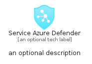
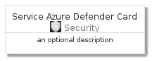
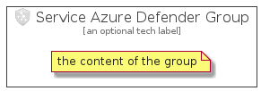

# ServiceAzureDefender


```text
azure-4/Item/Security/ServiceAzureDefender
```

```text
include('azure-4/Item/Security/ServiceAzureDefender')
```


| Illustration | ServiceAzureDefender | ServiceAzureDefenderCard | ServiceAzureDefenderGroup |
| :---: | :---: | :---: | :---: |
|  |  |  |  |


## ServiceAzureDefender

### Load remotely
```plantuml
@startuml
' configures the library
!global $LIB_BASE_LOCATION="https://raw.githubusercontent.com/tmorin/plantuml-libs/master/distribution"

' loads the library's bootstrap
!include $LIB_BASE_LOCATION/bootstrap.puml

' loads the package bootstrap
include('azure-4/bootstrap')

' loads the Item which embeds the element ServiceAzureDefender
include('azure-4/Item/Security/ServiceAzureDefender')

' renders the element
ServiceAzureDefender('ServiceAzureDefender', 'Service Azure Defender', 'an optional tech label', 'an optional description')
@enduml
```

### Load locally
```plantuml
@startuml
' configures the library
!global $INCLUSION_MODE="local"
!global $LIB_BASE_LOCATION="../../.."

' loads the library's bootstrap
!include $LIB_BASE_LOCATION/bootstrap.puml

' loads the package bootstrap
include('azure-4/bootstrap')

' loads the Item which embeds the element ServiceAzureDefender
include('azure-4/Item/Security/ServiceAzureDefender')

' renders the element
ServiceAzureDefender('ServiceAzureDefender', 'Service Azure Defender', 'an optional tech label', 'an optional description')
@enduml
```

## ServiceAzureDefenderCard

### Load remotely
```plantuml
@startuml
' configures the library
!global $LIB_BASE_LOCATION="https://raw.githubusercontent.com/tmorin/plantuml-libs/master/distribution"

' loads the library's bootstrap
!include $LIB_BASE_LOCATION/bootstrap.puml

' loads the package bootstrap
include('azure-4/bootstrap')

' loads the Item which embeds the element ServiceAzureDefenderCard
include('azure-4/Item/Security/ServiceAzureDefender')

' renders the element
ServiceAzureDefenderCard('ServiceAzureDefenderCard', 'Service Azure Defender Card', 'an optional description')
@enduml
```

### Load locally
```plantuml
@startuml
' configures the library
!global $INCLUSION_MODE="local"
!global $LIB_BASE_LOCATION="../../.."

' loads the library's bootstrap
!include $LIB_BASE_LOCATION/bootstrap.puml

' loads the package bootstrap
include('azure-4/bootstrap')

' loads the Item which embeds the element ServiceAzureDefenderCard
include('azure-4/Item/Security/ServiceAzureDefender')

' renders the element
ServiceAzureDefenderCard('ServiceAzureDefenderCard', 'Service Azure Defender Card', 'an optional description')
@enduml
```

## ServiceAzureDefenderGroup

### Load remotely
```plantuml
@startuml
' configures the library
!global $LIB_BASE_LOCATION="https://raw.githubusercontent.com/tmorin/plantuml-libs/master/distribution"

' loads the library's bootstrap
!include $LIB_BASE_LOCATION/bootstrap.puml

' loads the package bootstrap
include('azure-4/bootstrap')

' loads the Item which embeds the element ServiceAzureDefenderGroup
include('azure-4/Item/Security/ServiceAzureDefender')

' renders the element
ServiceAzureDefenderGroup('ServiceAzureDefenderGroup', 'Service Azure Defender Group', 'an optional tech label') {
    note as note
        the content of the group
    end note
}
@enduml
```

### Load locally
```plantuml
@startuml
' configures the library
!global $INCLUSION_MODE="local"
!global $LIB_BASE_LOCATION="../../.."

' loads the library's bootstrap
!include $LIB_BASE_LOCATION/bootstrap.puml

' loads the package bootstrap
include('azure-4/bootstrap')

' loads the Item which embeds the element ServiceAzureDefenderGroup
include('azure-4/Item/Security/ServiceAzureDefender')

' renders the element
ServiceAzureDefenderGroup('ServiceAzureDefenderGroup', 'Service Azure Defender Group', 'an optional tech label') {
    note as note
        the content of the group
    end note
}
@enduml
```

